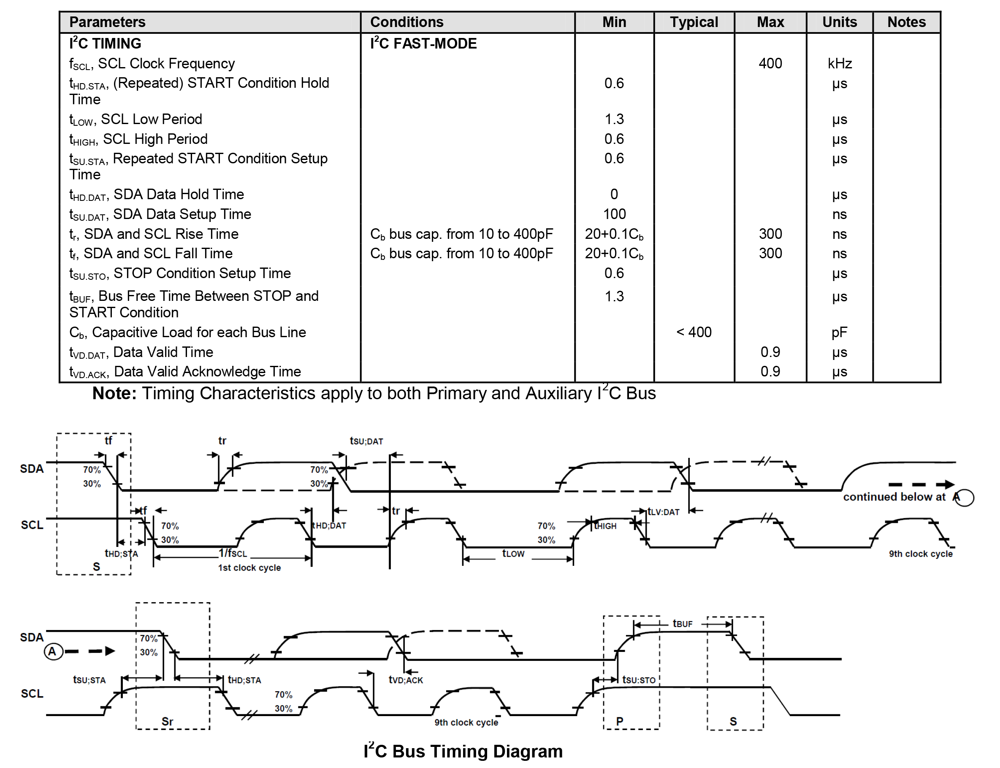
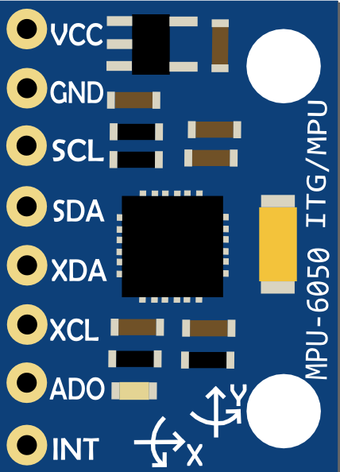

## InvenSense // MPU-6050  :rocket: 
Sono riportate di seguito alcune delle caratteristiche principali della pittaforma inerziale ed alcune conoscenze necessarie per un utilizzo basilare del sensore. Si tratta di informazioni estratte dal [datasheet](docs/MPU-60x0-Datasheet.pdf) e dal [documento di descrizione dei registri](docs/MPU-60x0-Register-Map.pdf).

#### Gyroscope Features
* Digital-output X-, Y-, and Z-Axis angular rate sensors (gyroscopes) with a user-programmable fullscale range of ±250, ±500, ±1000, and ±2000°/sec
* Integrated 16-bit ADCs enable simultaneous sampling of gyros
* External sync signal connected to the FSYNC pin supports image, video and GPS synchronization
* Enhanced bias and sensitivity temperature stability reduces the need for user calibration
* Improved low-frequency noise performance
* Digitally-programmable low-pass filter
* Gyroscope operating current: 3.6mA
* Standby current: 5µA

#### Accelerometer Features
* Digital-output triple-axis accelerometer with a programmable full scale range of ±2g, ±4g, ±8g and ±16g
* Integrated 16-bit ADCs enable simultaneous sampling of accelerometers while requiring no external
multiplexer
* Orientation detection and signaling
* User-programmable interrupts
* High-G interrupt
* Accelerometer normal operating current: 500µA
* Low power accelerometer mode current: 10µA at 1.25Hz, 20µA at 5Hz, 60µA at 20Hz, 110µA at 40Hz

#### Additional Features
* VDD supply voltage range of 2.375V-3.46V
* 9-Axis MotionFusion by the on-chip Digital Motion Processor (DMP)
* Auxiliary master I2C bus for reading data from external sensors (e.g., magnetometer)
* 400KHz Fast Mode I2C for communicating with all registers
* 3.9mA operating current when all 6 motion sensing axes and the DMP are enabled
* Digital-output temperature sensor
* User-programmable digital filters for gyroscope, accelerometer, and temp sensor
* 10,000 g shock tolerant

#### I²C Timing Characterization
<p align="center">
    
</p>


Oltre alle caratteristiche principali, le caratteristiche fisiche e le indicazioni di utilizzo, bisogna fare riferimento alla struttura interna dei registri del sensore per poter implementare un software che lo utilizzi correttamente. 
Per le operazioni di configurazione iniziale e per eseguire le diverse letture dal sensore sarà necessario infatti interagire con i registri a partire dalla conoscenza di: indirizzo base del modulo sul bus I²C, indirizzi dei registri su con cui sarà necessario comunicare.

L'indirizzo con il quale il modulo viene identificato sul bus I²C è, di default, **0x68** e si può trovare anche nel registro `WHO_AM_I`, indirizzato con **0x75**.

#### Configurazione 

Per una prima configurazione basilare, i registri con cui interagire sono i seguenti

* `PWR_MGMT_1` - *Power Management 1* | addr: `0x6B`
> This register allows the user to configure the power mode and clock source. It also provides a bit for resetting the entire device, and a bit for disabling the temperature sensor.
* `CONFIG` - *Configuration* | addr: `0x1A`
> This register configures the external Frame Synchronization (FSYNC) pin sampling and the Digital Low Pass Filter (DLPF) setting for both the gyroscopes and accelerometers.
* `GYRO_CONFIG` - *Gyroscope Configuration* | addr: `0x1B`
> This register is used to trigger gyroscope self-test and configure the gyroscopes’ full scale range
* `ACCEL_CONFIG` - *Accelerometer Configuration* | addr: `0x1C`
> This register is used to trigger accelerometer self test and configure the accelerometer full scale range. 
* `SMPRT_DIV` - *Sample Rate Divider* | addr: `0x19`
> This register specifies the divider from the gyroscope output rate used to generate the Sample Rate for the MPU-60X0.

#### Acquisizione Dati

Dopo la configurazione, per interagire con il modulo e prelevare i dati di accelerometro e giroscopio si farà uso dei seguenti registri (dai quali effettuare operazioni di lettura):

* `INT_STATUS` - *Interrupt Status* | addr: `0x3A`
> This register shows the interrupt status of each interrupt generation source. Each bit will clear after the register is read.
* `ACCEL_[X/Y/Z]OUT_[L/H]` - *Accelerometer Measurements* | addrs: `0x3B`, `0x3C`, `0x3D`, `0x3E`, `0x3F`, `0x40` 
> These registers store the most recent accelerometer measurements. Accelerometer measurements are written to these registers at the Sample Rate as defined in Register 25 (`SMPRT_DIV`).
* `GYRO_[X/Y/Z]OUT_[L/H]` - *Gyroscope Measurements* | addrs: `0x43`, `0x44`, `0x45`, `0x46`, `0x47`, `0x48` 
> These registers store the most recent gyroscope measurements.
Gyroscope measurements are written to these registers at the Sample Rate as defined in Register 25 (`SMPRT_DIV`).


### :closed_book: MPU6050 Library
Per l'utilizzo di questo modulo si implementa una *libreria* per gestire i parametri di configurazione e mediare le operazioni di lettura e scrittura sul bus I²C.

La libreria consiste di un file header `.h` ed un file di codice sorgente **c**: `MPU6050_lib.c`

Nel file header vengono definiti, come costanti, gli indirizzi del modulo MPU6050 e quelli dei registri principali con cui interagire:
```c
#define MPU_ADDR		0x68
#define WHO_AM_I_REG		0x75
#define PWR_MAGT_1_REG		0x6B
#define CONFIG_REG		0x1A
#define GYRO_CONFIG_REG		0x1B
#define ACCEL_CONFIG_REG	0x1C
#define SMPLRT_DIV_REG		0x19
#define INT_STATUS_REG		0x3A
#define ACCEL_XOUT_H_REG	0x3B
#define GYRO_XOUT_H_REG		0x43
```
inoltre, vi sono una serie di `enum` che rappresentano i valori costanti di configurazione che si trovano nel datasheet, come ad esempio:
```c
enum PM_CLKSEL_ENUM{
	INTERNAL_8MHz		= 0x00,		// Internal 8MHz oscillator
	X_AXIS_REF		= 0x01,		// PLL with X axis gyroscope reference
	Y_AXIS_REF		= 0x02,		// PLL with Y axis gyroscope reference
	Z_AXIS_REF		= 0x03,		// PLL with Z axis gyroscope reference
	EXT_32_768KHz		= 0x04,		// PLL with external 32.768kHz reference
	EXT_19_2MHz		= 0x05,		// PLL with external 19.2MHz reference
	TIM_GENT_INREST		= 0x07		// Stops the clock and keeps the timing generator in reset
};
```
che saranno utilizzati per la configurazione iniziale della IMU.

Per conservare i valori dei dati, lungo i tre assi, di accelerometro e giroscopio si utilizzano delle strutture come:
```c
typedef struct{
    int16_t x;
    int16_t y;
    int16_t z;
}RawData_Def;
```
Ed infine si definisce un set di funzioni per garantire le funzionalità basilari:
```c
// Initilization - Configuration
void MPU6050_Init(I2C_HandleTypeDef *hi2c, MPU_ConfigTypeDef *config);
// Get Raw Data from the sensor
void MPU6050_Read_RawData(RawData_Def *accel_rawDef, RawData_Def *gyro_rawDef);
// Get Scaled Data from the raw data
void MPU6050_Read_ScaledData(ScaledData_Def *accel_scaledDef, ScaledData_Def *gyro_scaledDef);
// Get Accel scaled data
void MPU6050_Get_Accel_Scale(ScaledData_Def *accel_scaledDef);
// Get Gyro scaled data
void MPU6050_Get_Gyro_Scale(ScaledData_Def *gyro_scaledDef);

// I2C Read from Register
void I2C_Read(uint8_t REG_ADDR, uint8_t *i2c_data_rx, uint8_t data_size);
// I2C Write 8 Bit to Register
void I2C_Write8(uint8_t REG_ADDR, uint8_t data);
```

Queste saranno, evidentemente, implementate nel file di codice sorgente **C** come ad esempio:

```c
void MPU6050_Read_RawData(RawData_Def *accel_rawDef, RawData_Def *gyro_rawDef){
	uint8_t i2cBuf[2];
	uint8_t AcceArr[6], GyroArr[6];

	I2C_Read(INT_STATUS_REG, &i2cBuf[1],1);

	if( i2cBuf[1] && 0x01){
		//Accel Raw Data
		I2C_Read(ACCEL_XOUT_H_REG, AcceArr,6);
		accel_rawDef->x = ((AcceArr[0]<<8) + AcceArr[1]); // x-Axis
		accel_rawDef->y = ((AcceArr[2]<<8) + AcceArr[3]); // y-Axis
		accel_rawDef->z = ((AcceArr[4]<<8) + AcceArr[5]); // z-Axis

		//Gyro Raw Data
		I2C_Read(GYRO_XOUT_H_REG, GyroArr,6);
		gyro_rawDef->x = ((GyroArr[0]<<8) + GyroArr[1]); // x-Axis
		gyro_rawDef->y = ((GyroArr[2]<<8) + GyroArr[3]); // y-Axis
		gyro_rawDef->z = ((GyroArr[4]<<8) + GyroArr[5]); // z-Axis
	}
}
```

Infine, è importante analizzare in questo contesto le funzione necessarie all'interazione sul bus I²C:
```c
// I2C Read
void I2C_Read(uint8_t REG_ADDR, uint8_t *i2c_data_rx, uint8_t data_size){
	uint8_t i2c_data_tx[2];
	i2c_data_tx[0] = REG_ADDR;

	HAL_I2C_Master_Transmit(&i2cHandler, MPU_ADDR<<1, i2c_data_tx, 1, 10);
	HAL_I2C_Master_Receive(&i2cHandler, MPU_ADDR<<1, i2c_data_rx, data_size, 100);
}

// I2C Write 8 bit
void I2C_Write8(uint8_t REG_ADDR, uint8_t data){
	uint8_t i2c_data_tx[2];
	i2c_data_tx[0] = REG_ADDR;
	i2c_data_tx[1] = data;

	HAL_I2C_Master_Transmit(&i2cHandler, MPU_ADDR<<1, i2c_data_tx, 2, 100);
}
```
che incapsulano le funzioni esportate dalla libreria **HAL** per la trasmissione e ricezione di dati sul bus I²C.

Per ulteriori dettagli implementativi consultare direttamente il codice sorgente presente nella relativa cartella di progetto *STM32Cube*.

***

:information_source: Si noti che, per un utilizzo accurato di un sensore di questo tipo sarebbe necessario affrontare una prima fase di calibrazione; da effettuare in maniera accurata per come descritto nella documentazione ufficiale, avvalendosi di registri dedicati a tale scopo.

***

:information_source: Il sensore viene utilizzato nel package mostrato in figura.
<p align="center">
	
</p>
Questa scheda integra al suo interno un regolatore di tensione (che permette di abbassare una eventuale tensione di 5V in ingresso fino a 3.3V) e le resistenze di pull-up sulle linee SCL e SDA. È presente inoltre un LED che segnala la corretta alimentazione e, facilmente, si possono connettere dispositivi I²C (utilizzando i pin SCL e SDA) o dispositivi esterni (tramite i pin XCL e XDA).

***
</br>

:link: [InvenSens MPU-6050](https://invensense.tdk.com/products/motion-tracking/6-axis/mpu-6050/)</br>
:link: [DataSheet](docs/MPU-60x0-Datasheet.pdf)</br>
:link: [Register Map and Description](docs/MPU-60x0-Register-Map.pdf)