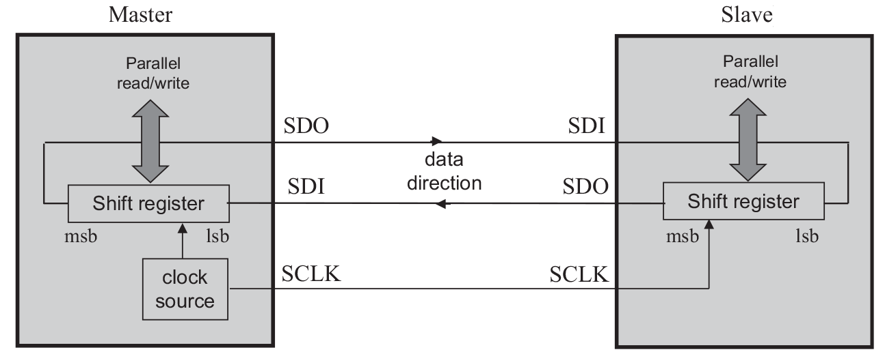
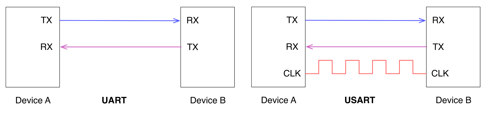
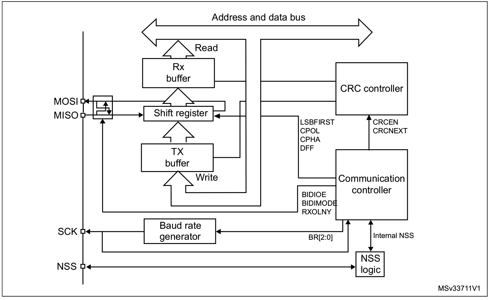
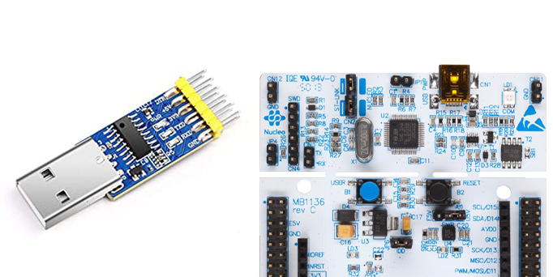
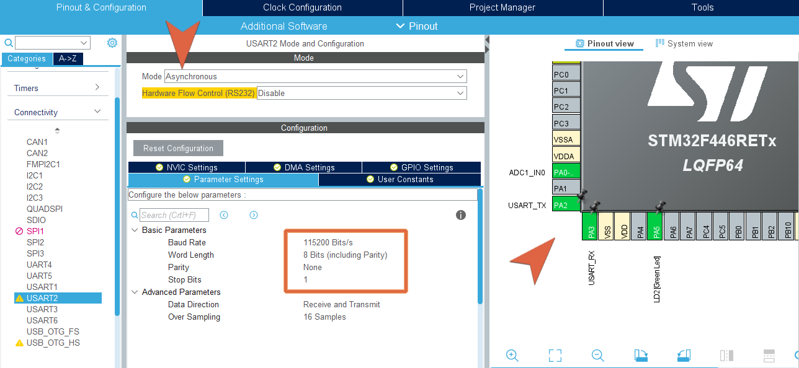

# Comunicazione Seriale

</br>

## Overview
Di seguito un compendio relativo alle principali interfacce di comunicazione seriale - **UART**, **I²C** e **SPI**  - per la comunicazione con diversi dispositivi e sensori.

- [Comunicazione Seriale](#comunicazione-seriale)
  - [Overview](#overview)
  - [Requisiti Teorici](#requisiti-teorici)
  - [UART e USART](#uart-e-usart)
    - [UART/USART nei microcontrollori STM32](#uartusart-nei-microcontrollori-stm32)
  - [I2C](#i2c)
    - [I2C nei microcontrollori STM32](#i2c-nei-microcontrollori-stm32)
  - [SPI](#spi)
    - [SPI nei microcontrollori STM32](#spi-nei-microcontrollori-stm32)
  - [Comunicazione USART in STM32Cube](#comunicazione-usart-in-stm32cube)
    - [Invio dati acquisiti da ADC via UART](#invio-dati-acquisiti-da-adc-via-uart)
    - [UART in modalità interrupt](#uart-in-modalità-interrupt)
    - [Ricezione UART con DMA](#ricezione-uart-con-dma)
  - [Comunicazione I2C in STM32Cube](#comunicazione-i2c-in-stm32cube)
  - [Comunicazione SPI in STM32Cube](#comunicazione-spi-in-stm32cube)
  - [Esercizi](#esercizi)


## Requisiti Teorici
Una comunicazione di tipo seriale utilizza in maniera efficiente un singolo filo per il trasferimento di dati, sotto forma di bit, in maniera sequenziale.

I diversi protocolli di comunicazione seriale risolvono i principali problemi che riguardano la comunicazione tra due dispositivi; ad esempio stabilire, da parte del ricevitore, quando comincia e finisce un singolo bit o un'intera sequenza.

Un approccio utilizzato da diversi protocolli consiste nell'utilizzare un *segnale di clock* "accoppiato" ai dati, in questo modo si riesce a stabilire dunque una sincronizzazione tra dati e clock ed il tipo di comunicazione si dice **sincrona**: ad ogni impulso del *segnale di clock* il trasmettitore invia un bit e il ricevitore si sincronizza su uno dei fronti del *segnale di clock* per effettuare la lettura.


Il *segnale di clock* stabilisce quanto veloce vengono trasferiti i dati, con la sua frequenza, e quanto dura l'intera trasmissione. 

Nel caso in cui entrambi i dispositivi, che vogliono comunicare, siano già d'accordo sulla velocità e sul tempo di trasmissione di un singolo bit si può evitare di utilizzare un *segnale di clock* e concordare tra i due una comunicazione **asincrona**.


Diversi dispositivi possono essere interconnessi in diversi modi per realizzare delle comunicazioni di tipo seriale; si possono realizzare, ad esempio, anche delle "reti" con la classica architettura *master-slave*, in cui assume il ruolo di master il dispositivo che gestisce il clock. Secondo questa logica funzionano sistemi di comunicazione quali **SPI** e **I2C**.

<p align="center">
     
</p>

## UART e USART
Sebbene la comunicazione seriale **sincrona** sia utilizzata con moltissimi dispositivi, la gestione di un segnale (*il clock*) che ha bisogno sia di una linea dedicata che di una certa banda a disposizione risulta essere un peso, che ha indotto quindi allo sviluppo di criteri di comunicazione **asincroni**. Questi offrono anche il vantaggio di essere affidabili su lunghe distanze, rispetto alle quali un *segnale di clock* potrebbe degradarsi e far perdere la sincronizzazione. 

La logica di funzionamento si basa sullo stabilire la durata di trasmissione di un singolo bit ed evitare l'utilizzo di un clock di sincronizzazione. Questo meccanismo viene realizzato tramite un dispositivo hardware dedicato chiamato **UART** (**U**niversal **A**synchronous **R**eceiver-**T**ransmitter), che è presente in ogni microcontrollore e permette la comunicazione con una miriade di dispositivi.

Nella forma più semplice, una comunicazione **UART** utilizza una sola connessione per la trasmissione (indicata con **TX**) ed una sola per la ricezione (indicata con **RX**). È importante stabilire il *data rate* con cui operano il trasmettitore ed il ricevitore, e questo valore prende il nome di *baud rate*.

Oltre a questo valore ci sono una serie di altri parametri che entrano in gioco quando si vuole inviare un flusso di dati con comunicazione **UART**, i principali sono i seguenti:
- **Data bits**: Numero di bits per singolo valore trasmesso (default: 8);
- **Stop bits**: Numero di bits usati per identificare la fine, lo stop, del flusso dati (default: 1);
- **Parity bit**: Presenza ed eventuale tipologia del bit di parità.

Per la gestione della **UART** in un microcontrollore entrano in gioco altri parametri di configurazione importanti, che permettono di mettere in pratica anche diverse modalità di funzionamento.

Spesso, questo metodo di comunicazione viene accompagnato anche da un segnale di clock, dando luogo ad una comunicazione chiamata **USART** (**U**niversal **S**ynchronous/**A**synchronous **R**eceiver-**T**ransmitter).
<p align="center">
     
</p>

Mentre per la comunicazione **UART** un segnale di clock viene generato internamente nel microcontrollore -a partire dalla conoscenza del *baud rate* ed appena si identifica il primo bit del flusso dati- per la **USART** non vi è bisogno di specificare alcun *baud rate*: il segnale di clock viaggia su un canale dedicato e ciò permette di ottenere anche risultati migliori, arrivando in alcuni casi a trasferimenti con *rate* di 4 Mbps. Questa però porta con sé gli svantaggi legati alla presenza di un segnale di clock.

### UART/USART nei microcontrollori STM32
Ogni microcontrollore della famiglia STM32 esporta almeno una porta di comunicazione **UART**, nel caso del microcontrollore utilizzato per queste esercitazioni si hanno a disposizione due **UART** (UART4 e UART5) e quattro **USART** (USART1, USART2, USART3 e USART6). 

La gestione di questo tipo di comunicazione passa, ovviamente, per l'utilizzo di opportuni registri che permettono di configurare sia una comunicazione **USART** che una comunicazione **UART**, a seconda dei campi utilizzati. Di seguito, ed anche in fase di implementazione, si utilizzeranno spesso in maniera equivalente le due parole, specificando la distinzione tra le due solo se necessario.

Per quanto riguarda la configurazione del *baud rate*, si ricorre ovviamente al clock del sistema, che deve essere opportunamente scalato per essere adeguato, sulla periferica **UART**, e permettere di ottenere il *rate* desiderato.

<p align="center">
    
</p>

I valori che permettono di definire il *baud rate* e tutti gli altri parametri di configurazione si ritrovano all'interno di un set di registri, che si ritrovano completamente descritti nel [reference manual](https://www.st.com/resource/en/reference_manual/dm00135183-stm32f446xx-advanced-arm-based-32-bit-mcus-stmicroelectronics.pdf) del microcontrollore, insieme alla descrizione delle modalità di utilizzo e dei meccanismi di configurazione.

:information_source: Per il microcontrollore STM32F446RE, la comunicazione **USART2** passa attraverso i pin PA_2 e PA_3, questi mettono in comunicazione internamente il microcontrollore ed il modulo ST-Link. Sono utilizzati quindi per instaurare una comunicazione tra i due elementi e dunque per mettere in comunicazione il microcontrollore con il PC, tramite porta USB. Questa comunicazione è utilizzata implicitamente in tutte le fasi di programmazione e debugging del microcontrollore.  Dunque, finché si farà uso del modulo ST-Link sarà impossibile utilizzare questi pin per altri scopi.

La comunicazione mediante **UART** si può mettere in pratica in tre modalità: *polling*, *interrupt* o *DMA mode*.

- *Polling Mode*
> The main application, or one of its threads, synchronously waits for the data transmission and reception. This is the most simple form of data communication using this peripheral, and it can be used when the transmit rate is not too much low and when the UART is not used as critical peripheral in our application 
- *Interrupt Mode*
> The main application is freed from waiting for the completion of data transmission and reception. The data transfer routines terminate as soon as they complete to configure the peripheral. When the data transmission ends, a subsequent interrupt will signal the main code about this.

## I2C
L'acronimo **I²C** sta per "**I**nter **I**ntegrated **C**ircuit" ed è anch'esso un protocollo di comunicazione seriale che opera in accordo a relazioni di tipo *master-slave*. 

Per funzionare utilizza fisicamente due fili, ciò significa che i dati viaggiano esclusivamente in una direzione alla volta.

Come suggerito dal suo nome, viene utilizzato per interconnessioni su distanze abbastanza ravvicinate, possibilmente con tutti i dispositivi sullo stesso integrato, e permette di connettere, contemporaneamente, ad un solo *master* diversi dispositivi *slaves*, utilizzando un unico bus.

Il meccanismo per l'individuazione dei diversi dispositivi *slaves*, si basa su un sistema di indirizzamento in accordo al quale ogni dispositivo possiede un indirizzo univoco per il bus **I²C**.

La comunicazione, che è *half-duplex*, avviene su due linee, ed avviene con una logica sincrona utilizzando due diversi segnali:
* **SCL** (**S**erial **CL**ock)
* **SDA** (**S**erial **DA**ta)

<p align="center">
     
</p>

Oltre ai valori in bit propri del dato da trasferire, sul bus **I²C** si trovano una serie di segnali che operano come delimitatori speciali per identificare uno *start* ed uno *stop* del trasferimento di un flusso dati: il protocollo, in base al quale si mettono in comunicazione un dispositivo principale (*master*) e gli altri (*slaves*) connessi tramite bus **I²C**, prevede l'invio di un segnale di *start* seguito dall'indirizzo (in genere a 7 bit) della periferica con cui comunicare; inoltre si specifica tramite un singolo bit se si vuole effettuare una lettura (con un bit ad 1) o una scrittura (con un bit a 0).

Se la periferica *slave* con l'indirizzo indicato esiste sul bus **I²C**, questa risponderà con un ACK ed il *master* potrà avviare la trasmissione o mettersi in ricezione.

### I2C nei microcontrollori STM32
Nel microcontrollore utilizzato vi sono quattro bus per interfacciamento **I²C**, che possono operare sia in modalità *master* che *slave*; tre di questi bus possono lavorare, oltre che nella modalità standard (fino a 100KHz) in una particolare modalità veloce (fino a 400KHz).

Tra le caratteristiche principali vi sono la possibilità di indirizzare con valori a 7 bit o 10 bit ed un circuito hardware integrato per il controllo d'errore.

Per avere una indicazione precisa sul funzionamento delle diverse modalità, è bene studiare il [manuale di riferimento](https://www.st.com/resource/en/reference_manual/dm00135183-stm32f446xx-advanced-arm-based-32-bit-mcus-stmicroelectronics.pdf) del microcontrollore su cui vi è una descrizione delle due modalità di utilizzo principali:
- *Master mode*: 
> The **I²C** interface initiates a data transfer and generates the clock signal. A serial data transfer always begins with a start condition and ends with a stop condition. Both start and stop conditions are generated in master mode by software.
- *Slave mode*:
> In Slave mode, the interface is capable of recognizing its own addresses (7 or 10-bit), and the General Call address. The General Call address detection may be enabled or disabled
by software. 

Sia i dati che gli indirizzi sono trasferiti come singoli bytes, specificando come primo valore il MSB (Most Significant Bit).

<p align="center">
    
</p>
</br>

## SPI
Ogni microcontrollore STM32 fornisce almeno un'interfaccia **SPI** (**S**erial **P**eripheral **I**nterface), che permette di sviluppare applicazioni in logica *master-slave* utilizzando un *master* e differenti dispositivi, esterni al microcontrollore, che fungono da *slaves*. Come per la comunicazione **I<sup>2</sup>C**, questo permette di espandere di molto le possibilità comunicative del microcontrollore, che tramite una singola periferica, ad esempio **SPI**, può comunicare con molti dispositivi esterni.

Si tratta di un sistema *sincrono* che permette comunicazione *full-duplex* o *half-duplex* di più dispositivi su uno stesso bus. Quando il *master* inizia una comunicazione seleziona uno dei dispositivi *slave* e gli invia un byte per cominciare a lo scambio di dati; tipicamente si utilizza un byte fantoccio (*dummy byte*) per far partire la comunicazione.

Il protocollo **SPI** funziona utilizzando principalmente 4 segnali:
* **SCLK** (**S**erial **CL**o**K**)
> This signal is used to generate the clock to synchronize data transfer over the **SPI** bus. It is generated by the master device, and this means that in an **SPI** bus every transfer is always
started by the master. 
* **MOSI** (**M**aster **O**utput **S**lave **I**nput)
> It is used to send data from the master device to a slave one. 
* **MISO** (**M**aster **I**nput **S**lave **O**utput)
> It is used to send data from a slave device to the master.
* **SSn** (**S**lave **S**elect on line **n**)
> In a typical **SPI** bus there exist 'n' separated lines used to address the specific **SPI** devices involved in a transaction.  In a typical **SPI** bus only one slave device can be active at same time by asserting low its **SS** line.

<p align="center">
     
</p>

Intrinsecamente, grazie alla presenza delle due linee (**MOSI** e **MISO**), la comunicazione **SPI** è di tipo *full-duplex*; vi è però in genera la possibilità di utilizzarlo anche in *half-duplex* o *simplex*. Se si mettono in comunicazione un solo master con un solo slave sul bus **SPI**, il segnale **SS** può essere omesso ed in genere le due linee, **MISO** e **MOSI**, si fondono su una unica linea chiamata **SISO** (**S**lave **I**n/**S**lave **O**ut).

La comunicazione **SPI** è perfetta per applicazioni che trattano il processamento digitale di segnali, in cui si instaura una comunicazione che prevede scambi di dati in maniera rapida e con ricorrenze temporali ben precise.

In generale, questo standard di comunicazione è abbastanza efficace ed efficiente, inoltre, molti dispositivi **SPI** risultano essere di facile utilizzo. Tra gli svantaggi vi è però la mancata conoscenza dello stato del ricevitore (mancanza di meccanismo di *ack*) e la difficoltà a strutturare un sistema più complesso, con un solo *master* e molti *slaves* messi in comunicazione in luoghi fisicamente distanti tra loro.

### SPI nei microcontrollori STM32
Nel microcontrollore STM32F446RE è possibile utilizzare fino a 4 interfacce **SPI**, sia in modalità *master* che *slaves* e sia in modalità *full-duplex* che *simplex*.

Le interfacce SPI1 e SPI4 garantiscono una comunicazione fino a 45Mbit/s mentre SPI2 e SPI3 operano fino ad un massimo di 22.5Mbit/s. Questa velocità di comunicazione dipende, ovviamente, dal clock di sistema e da parametri di *prescaling* che vengono selezionati in fase di configurazione.

La periferica **SPI** offre un sistema CRC hardware ed inoltre può essere utilizzata per la comunicazione con schede SD esterne.

Come modalità particolari di utilizzo, c'è la possibilità di operare in modalità **TI** e in modalità **I2S**, quest'ultima particolarmente utile in contesti di elaborazione acustica.

<p align="center">
    
</p>

Visto che si tratta di una comunicazione sincrona, è di fondamentale importanza il segnale **SCK**, che sincronizza i dati che viaggiano sulle varie linee. Inoltre, la comunicazione può avvenire in diversi formati che dipendono dalla *fase del clock* e dalla sua *polarità*. Questi parametri devono essere concordati da *master* e *slave* per poter comunicare correttamente; è possibile configurare la comunicazione in quattro diverse modalità, in base alla scelta di *polarità* e *fase* del clock.

|Mode|CPOL|CPHA|
|:--:|:--:|:--:|
|  0 |  0 |  0 |
|  1 |  0 |  1 |
|  2 |  1 |  0 |
|  3 |  1 |  1 |
 
* At **CPOL** = 0 the base value of the clock is zero, i.e. the active state is 1 and idle state is 0.
    * For **CPHA** = 0, data is captured on the **SCK** rising edge and data is output on a falling edge.
    * For **CPHA** = 1, data is captured on the **SCK** falling edge and data is output on a rising edge.
* At **CPOL** = 1 the base value of the clock is one, i.e. the active state is 0 and idle state is 1.
    * For **CPHA** = 0, data is captured on **SCK** falling edge and data is output on a rising edge.
    * For **CPHA** = 1, data is captured on **SCK** rising edge and data is output on a falling edge.

<p align="center">
    
</p>

Per ulteriori informazioni, oltre che la documentazione del microcontrollore, è possibile studiare la [guida rilasciata da Motorola](https://web.archive.org/web/20150413003534/http://www.ee.nmt.edu/~teare/ee308l/datasheets/S12SPIV3.pdf), riguardo allo standard di comunicazione **SPI**.
***

## Comunicazione USART in STM32Cube

Nell'ambiente di sviluppo di *STM32Cube* è possibile realizzare comunicazione di tipo **UART** a diversi livelli di astrazione, come sarà mostrato di seguito. Si partirà con un esempio mostrato utilizzando direttamente i registri (per comprenderne il funzionamento) e successivamente utilizzando il driver **HAL**.

Nell'esempio si farà uso delle porte **USART** che si trovano su PA_2 e PA_3 per comunicare con il pc, tramite porta USB; se non si dispone di un convertitore UART/USB esterno si farà quindi uso della comunicazione implicita fornita dal modulo ST-Link.

<p align="center" width="30%">
    
</p>
</br>

Lo scopo di un primo semplice esercizio è quello di mandare dei caratteri al PC; le fasi indispensabili per procedere a tale scopo sono le seguenti:
1. Attivazione del segnale di clock su periferica **USART** e **GPIO**
```c
RCC->APB1ENR |= (0x01 << 17); // Abilitazione USART2 clock
RCC->AHB1ENR |= (0x01 << 0);  // Abilitazione GPIOA clock
```
2. Configurazione dei pin PA_2 e PA_3 in modalità veloce e *alternate function mode*
```c
GPIOA->MODER &= ~(0x0F << 4);  // Clear MODER GPIOA2/3
GPIOA->MODER |= (0x0A << 4);   // Set Alternate function mode
GPIOA->OSPEEDR |= (0x0A << 4); // Set Fast Speed

GPIOA->AFR[0] |= (0b111 << 8);
GPIOA->AFR[0] |= (0b111 << 12);
```
 &nbsp; si noti che i registri **AFRL** e **AFRH** sono implementati utilizzando un array di due elementi: `AFR[0]` e `AFR[1]`. </br> &nbsp; Per la loro configurazione fare riferimento al datasheet ed alle tabelle, come [quella estratta](docs/AlternateFunctionTab.pdf) e messa nella sottocartella *docs*.

3. Configurazione della lunghezza di trasmissione, dei valori di parità e di altri eventuali parametri
```c
USART2->CR1 |= (0b0 << 12); // 1 Start bit, 8 Data bits, n Stop bit (DEFAULT)
USART2->CR1 |= (0b0 << 9); // Even parity
```
4. Abilitazione di trasmissione/ricezione sulla porta **USART** desiderata
```c
USART2->CR1 |= (0b1 << 3); // Transmitter enable
USART2->CR1 |= (0b1 << 2); // Receiver enable
```
5. Calcolo dei valori per determinare il *baud rate* desiderato e configurazione con i registri
```c
USART2->BRR |= (22 << 4); // Mantissa - Configurato come valore decimale
USART2->BRR |= (13 << 0); // Fraction - Configurato come valore decimale
```
6. Avvio della comunicazione tramite abilitazione della **USART**
```c
USART2->CR1 |= (0b1 << 13);
```

A questo punto è possibile procedere all'invio dei dati facendo uso dei registri:
- **USART_DR** (**D**ata **R**egister)
> Che contiene il valore che si vuole trasmettere (oppure il valore appena ricevuto); 
- **USART_SR** (**S**tatus **R**egister)
> Usato in lettura per individuare diversi stati come, ad esempio, la fine della trasmissione.

Il programma implementato si trova nella cartella di progetto `uart_simpleTX`.

### Invio dati acquisiti da ADC via UART

Ovviamente, è possibile fare uso delle funzioni e strutture del driver **HAL** per instaurare una comunicazione **UART**, in questa ottica implementativa si passa per una prima configurazione con *STM32CubeMX*.

<p align="center">
    
</p>

Come applicazione d'esempio si realizza la comunicazione tra MCU e PC scambiandosi, come valori, le successive letture di una valore analogico tramite **ADC** (usando un **timer** per dare una precisa frequenza alla lettura).

La generazione del codice agirà configurando una particolare struttura, come per tutte le periferiche gestite con la libreria **HAL**. La struttura in questione è 
```c
typedef struct {
    uint32_t BaudRate;      // The connection Speed
    uint32_t WordLength;    // The number of data bits transmitted or received in a frame
    uint32_t StopBits;      // The number of stop bits transmitte
    uint32_t Parity;        // Indicates the parity mode
    uint32_t Mode;          // Specifies RX o TX mode
    uint32_t HwFlowCtl;     // it specifies whether the RS232 Hardware Flow Control mode is enabled or disabled.
    uint32_t OverSampling;  // Specification about oversampling method
} UART_InitTypeDef;
```
e la sua configurazione è la seguente:
```c
huart2.Instance = USART2;
huart2.Init.BaudRate = 115200;
huart2.Init.WordLength = UART_WORDLENGTH_8B;
huart2.Init.StopBits = UART_STOPBITS_1;
huart2.Init.Parity = UART_PARITY_NONE;
huart2.Init.Mode = UART_MODE_TX_RX;
huart2.Init.HwFlowCtl = UART_HWCONTROL_NONE;
huart2.Init.OverSampling = UART_OVERSAMPLING_16;
```

Per mettere in pratica una comunicazione seriale di questo tipo, la libreria **HAL** offre diverse funzioni, a seconda che si voglia usare una modalità *polling* o *interrupt*. Per la prima, si fa utilizzo della funzione:
```c
HAL_StatusTypeDef HAL_UART_Transmit(UART_HandleTypeDef *huart, uint8_t *pData, uint16_t Size, uint32_t Timeout);
```
in cui `huart` è il puntatore ad una istanza della struttura mostrata precedentemente; `pData` è il puntatore ad un array che contiene la sequenza di bytes da inviare; `Size` è la dimensione di quest'array ed infine `Timeout` è il massimo tempo di attesa per il completamento della comunicazione (per aspettare in maniera indefinita si può usare la costante `HAL_MAX_DELAY`).

Questa funzione permette di inviare i dati contenuti nell'array specificato, in maniera equivalente esisterà una funzione per mettersi in ricezione in *polling*:
```c
HAL_StatusTypeDef HAL_UART_Receive(UART_HandleTypeDef *huart, uint8_t *pData, uint16_t Size, uint32_t Timeout);
```

Per inviare i dati con una frequenza di 1Hz, si dovrà fare, in questo caso, una cosa del genere nel ciclo di vita principale del programma:
```c
while (1){
    // Temperature value "printed" on uart_data for serial output
    sprintf(uart_data_buff, "\r%.3f°C\n", temp);
    // Polling TX - a transmission every second
    HAL_UART_Transmit(&huart2, (uint8_t *)uart_data_buff, sizeof(uart_data_buff), HAL_MAX_DELAY);
    HAL_Delay(1000);
}
```
utilizzando un particolare accorgimento per inviare l'intero numero `float` sotto forma di bytes (come una stringa di caratteri che rappresentano il numero). L'alternativa sarebbe stata trasformare in maniera più "manuale" il valore decimale in una valore ad 8 bit, mettendo magari nell'array, in maniera separata, parte intera e parte decimale. In entrambi i casi si lascia al ricevitore l'onere di ricostruire il valore ricevuto.

Si faccia attenzione al fatto che, per utilizzare la funzione `sprintf()` è necessario attivare un campo di configurazione della sezione *Tool Setting* del progetto; come illustrato nello screenshot seguente.

<p align="center">
    
</p>

### UART in modalità interrupt

Per usare invece la periferica **UART** in *modalità interrupt* è necessario utilizzare la interrupt associata a tale periferica ed intercettata dalla funzione `USARTx_IRQHandler()`. All'interno di questa funzione deve essere invocata `HAL_UART_IRQHandler()`, che si occuperà di invocare tutte le funzioni relative alle attività della periferica **UART**, gestendola in questa modalità *interrupt*.

Oltre a queste si farà uso delle funzioni per abilitare la periferica in questa modalità:
```c
HAL_StatusTypeDef HAL_UART_Transmit_IT(UART_HandleTypeDef *huart, uint8_t *pData, uint16_t Size);
```
o
```c
HAL_StatusTypeDef HAL_UART_Receive_IT (UART_HandleTypeDef * huart, uint8_t * pData, uint16_t Size)
```
a seconda che si voglia effettuare la trasmissione o la ricezione. 

L'utilizzo di questa periferica con il meccanismo delle *interrupt* non è immediato, in quanto sono diversi i segnali che farebbero scattare un *interrupt* per una comunicazione **UART**, tra cui anche le segnalazioni di stato e di errore:
- *IRQs generate in trasmissione*: Transmission Complete, Clear to Send or Transmit Data Register empty interrupt;
- *IRQs generate in ricezione*: Idle Line detection, Overrun error, Receive Data register not empty, Parity error, LIN break detection, Noise Flag (only in multi buffer communication) and
Framing Error (only in multi buffer communication).

Ovviamente la gestione di tutti questi eventi d'errore è mediata dalla configurazione di alcuni bit di controllo che devono essere controllati nel programma per gestire opportunamente sia la trasmissione che la ricezione con le *interrupts*. 

Tendenzialmente, la fase di ricezione è quella che più si presta ad essere utilizzata con il meccanismo delle *interrutps* e ne viene mostrato un esempio: si mostra un'applicazione che riceve un singolo carattere, interpretato come un numero, tramite comunicazione **UART**.

Si implementa la funzione:
```c
void read_UART_input() {
	if(UartReady == SET) {
		UartReady = RESET;
		HAL_UART_Receive_IT(&huart2, (uint8_t*)readBuf, 1);
		read_value = atoi(readBuf);
	}
}
```
che viene invocata nel ciclo di vita principale del programma, ma non è bloccante per il sistema, infatti il microcontrollore può continuare ad eseguire altre operazioni mentre attende di ricevere un carattere. 

Si noti che, la non ripetuta invocazione della funzione 
`HAL_UART_Receive_IT` è garantita dall'utilizzo adeguato della flag `UartReady`, definita come tipo `ITStatus`, si tratta di una `enum` definita per essere usata in queste situazioni con i valori **SET** (=1) e **RESET** (=0).

### Ricezione UART con DMA

> :dart:
In molti tra i più moderni microcontrollori è presente una caratteristica considerata "di livello avanzato": si tratta del *controller DMA*. È un'unità hardware programmabile che permette alle periferiche interne al microcontrollore di accedere in maniera *diretta* alla memoria senza la necesittà di dover passare attraverso l'utilizzo della CPU. Questo permette, evidentemente, di migliorare l'efficienza della stessa unità di calcolo -demansionandola rispetto ad operazioni di trasferimento dati tra SRAM e periferiche- e di aumentar le performance delle periferiche in comunicazione con l'esterno, come ad esempio la periferica **UART**.

Noti tutti gli aspetti teorici relativi al *controller DMA*, è possibile utilizzarlo in maniera -relativamente- semplice grazie alle strutture fornite dal driver **HAL**.  Di seguito, un esempio di utilizzo di questo modulo insieme alla perifericha **UART** utilizzando una serie di strutture e funzioni, come:

```c
typedef struct {
    DMA_Stream_TypeDef *Instance;           // Register base address
    DMA_InitTypeDef Init;                   // DMA communication parameters
    HAL_LockTypeDef Lock;                   // DMA locking object
    __IO HAL_DMA_StateTypeDef State;        // DMA transfer state
    void *Parent;                           // Parent object state
    void (* XferCpltCallback)( struct __DMA_HandleTypeDef * hdma);
    void (* XferHalfCpltCallback)( struct __DMA_HandleTypeDef * hdma);
    void (* XferM1CpltCallback)( struct __DMA_HandleTypeDef * hdma);
    void (* XferErrorCallback)( struct __DMA_HandleTypeDef * hdma);
    __IO uint32_t ErrorCode;                // DMA Error code
    uint32_t StreamBaseAddress;             // DMA Stream Base Address
    uint32_t StreamIndex;                   //!< DMA Stream Index
} DMA_HandleTypeDef;
```
in cui vi sono alcuni campi come: `Instance` che punta al controller da utilizzare, `Init` che punta ad una istanza di una struttura di configurazione (`DMA_InitTypeDef`) e `Parent` che è un puntatore utilizzato per tener traccia delle periferiche associata al *controller DMA*. Nel caso di utilizzo del *DMA* con periferica **UART**, il putatore `Parent` sarà legato ad una istanza di `UART_HandleTypeDef`.

Altra struttura è, equivalentemente ad altre periferiche,

```c
typedef struct {
    uint32_t Channel;
    uint32_t Direction;
    uint32_t PeriphInc;
    uint32_t MemInc;
    uint32_t PeriphDataAlignment;
    uint32_t MemDataAlignment;
    uint32_t Mode;
    uint32_t Priority;
    uint32_t FIFOMode;
    uint32_t FIFOThreshold;
    uint32_t MemBurst;
    uint32_t PeriphBurst;
} DMA_InitTypeDef;
```
in cui alcuni campi di interesse sono:
* `Channel`: che specifica il canale *DMA* da utilizzare, tramite le costanti `DMA_CHANNEL_0`, `DMA_CHANNEL_1` fino `DMA_CHANNEL_7`;
* `Direction`: utile per definire la direzione del trasferimento che deve effettuare il controller;
* `Mode`: variabile utilizzata per specificare la modalità di utilizzo del controller, che può essere `DMA_NORMAL` o `DMA_CIRCULAR`.


A seguito della configurazione del modulo *DMA*, per utilizzarlo correttamente è indispensabile:
1. configurare indirizzo di memoria e periferica da far gestire al controller;
2. specificare la quantità di dati da trasferire;
3. abilitare il controller *DMA*;
4. abilitare la periferica associata al funzionamento in *DMA-mode*.

Grazie al driver **HAL**, tutte le prime operazioni si eseguono con la chiamata alla funzione seguente:
```c
HAL_StatusTypeDef HAL_DMA_Start(DMA_HandleTypeDef *hdma, uint32_t SrcAddress, uint32_t DstAddress, uint32_t DataLength);
```

Per procedere alla implementazione software è necessario individuare *channel/stream* del controller *DMA* da utilizzare per la periferica desiderata, che potrebbe variare per diversi microcontrollori. Nel caso del modulo STM32-F446RE, volendo utilizzare il modulo *DMA* con la periferica **UART2** si fa riferimento a quanto indicato di seguito:
|UART2 TX | UART2 RX |
|:-:|:-:|
|DMA1/CH4/Stream 6|DMA1/CH4/Stream 5|

La configurazione della periferica **UART** e del *controller DMA* avviene completamente utilizzando l'interfaccia di *CubeMX*, configurando il *controller DMA1* nel pannello di gestione del modulo **UART2** ed attivando inoltre le necessarie interrupts.

<p align="center">
    
</p>

<p align="center">
    
</p>


A seguito della configurazione è necessario esclusivamente legare la periferica al controller tramite la chiamata a
```c
__HAL_LINKDMA(&huart2, hdmarx, hdma_usart2_rx);
```
e, successivamente, utilizzare in maniera adeguata la funzione
```c
HAL_UART_Receive_DMA(&huart2, data, 3);
```
per comandare la ricezione da periferica **UART** tramtie *DMA*. Si noti che, connettendo il controller alla periferica tramite interfaccia grafica di *CubeMX*, non è più necessario implementare una serie di chiamate a strutture e funzioni di configurazione, che si troveranno nel file `stm32f4xx_hal_msp.c` .
> :monocle_face: `stm32f4xx_hal_msp.c` (MSP = MCU Support package): this file defines all
initialization functions to configure the peripheral instances according to the user
configuration (pin allocation, enabling of clock, use of DMA and Interrupts).

Nel progetto `uart_DMA` è possibile analizzare il codice utilizzato per realizzare una semplice applicazione di ricezione dati tramite **UART** sfruttando il *controller DMA*. Si presti attenzione anche alle *IRQ* gestite, in accordo alla strutturazione dei file di *STM32Cube*, nel file `stm32f4xx_it.c` .

> :monocle_face: `stm32f4xx_it.c` (IT = InTerrupt): this file defines all interrupts handlers and interrupts service routine

***

## Comunicazione I2C in STM32Cube
Di seguito si mostra un esempio di comunicazione **I²C** tra il microcontrollore ed un modulo esterno che è il sensore [MPU-6050](https://invensense.tdk.com/products/motion-tracking/6-axis/mpu-6050/) della InvenSense. 

Per poter utilizzare questo sensore (come si farebbe per qualsiasi altro modulo **I²C**) è necessario approfondire la documentazione rilasciata dalla casa produttrice, nella quale si trovano tutte le informazioni fisiche/elettriche e quelle relative all'utilizzo del sensore con un protocollo **I²C**.

Prima di passare allo studio di questo modulo si identificano le principali strutture e funzioni necessarie a utilizzare una comunicazione **I²C** facendo uso della libreria **HAL**. Struttura principale è:
```c
typedef struct {
    I2C_TypeDef         *Instance;  // I²C registers base address
    I2C_InitTypeDef     Init;       // I²C communication parameters
    uint8_t             *pBuffPtr;  // Pointer to I²C transfer buffer
    uint16_t            XferSize;   // I²C transfer size
    __IO uint16_t       XferCount;  // I²C transfer counter
    DMA_HandleTypeDef   *hdmatx;    // I²C Tx DMA handle parameters
    DMA_HandleTypeDef   *hdmarx;    // I²C Rx DMA handle parameters
    HAL_LockTypeDef     Lock;       // I²C locking object
    __IO HAL_I2C_StateTypeDef   State;      // I²C communication state
    __IO HAL_I2C_ModeTypeDef    Mode;       // I²C communication mode
    __IO uint32_t               ErrorCode;  // I²C Error code
} I2C_HandleTypeDef;
```
in cui, tra i vari campi, si ha: il puntatore all'istanza della periferica **I²C** da utilizzare (`*Instance`), l'istanza delle struttura utilizzata per la specifica della configurazione della periferica (`Init`), il puntatore al buffer interno usato per lo store temporaneo dei dati da trasferire (`pBuffPtr`) ed altri campi utili a gestire gli errori ed eventualmente comunicare con il modulo DMA.

La struttura per la configurazione è invece la seguente:
```c
typedef struct {
    uint32_t ClockSpeed;        // Specifies the clock frequency
    uint32_t DutyCycle;         // Specifies the I²C fast mode duty cycle.
    uint32_t OwnAddress1;       // Specifies the first device own address.
    uint32_t OwnAddress2;       // Specifies the second device own address if dual addressing mode is selected
    uint32_t AddressingMode;    // Specifies if 7-bit or 10-bit addressing mode is selected.
    uint32_t DualAddressMode;   // Specifies if dual addressing mode is selected.
    uint32_t GeneralCallMode;   // Specifies if general call mode is selected.
    uint32_t NoStretchMode;     // Specifies if nostretch mode is selected.
} I2C_InitTypeDef;
```
in cui si trovano tutti i parametri per la configurazione delle caratteristiche che dovrà avere la comunicazione **I²C** che si vuole instaurare.

Il set di funzioni per operare con il bus **I²C** è molto vasto, vi sono infatti tutta una serie di funzioni necessarie per gestire le possibili **ISR** generate (in trasmissione e ricezione) sia in modalità *master* che in modalità *slave*. Si riportano di seguito solo le funzioni principali per utilizzare in modalità master il microcontrollore e si rimanda alla [descrizione completa del driver **HAL**](https://www.st.com/resource/en/user_manual/dm00105879-description-of-stm32f4-hal-and-ll-drivers-stmicroelectronics.pdf) per approfondire le altre.

Funzione base è sicuramente
```c
HAL_StatusTypeDef HAL_I2C_Init(I2C_HandleTypeDef *hi2c);
```
usata evidentemente per inizializzare il bus **I²C**. Si hanno inoltre una serie di funzioni per gestire invio e ricezione da parte del master:
```c
HAL_StatusTypeDef HAL_I2C_Master_Transmit(I2C_HandleTypeDef *hi2c, uint16_t DevAddress, uint8_t *pData, uint16_t Size, uint32_t Timeout);
```
```c
HAL_StatusTypeDef HAL_I2C_Master_Receive(I2C_HandleTypeDef *hi2c, uint16_t DevAddress, uint8_t *pData, uint16_t Size, uint32_t Timeout);
```
che possono essere usate anche in modalità interrupt:
```c
HAL_StatusTypeDef HAL_I2C_Master_Transmit_IT(I2C_HandleTypeDef *hi2c, uint16_t DevAddress, uint8_t *pData, uint16_t Size);
```
```c
HAL_StatusTypeDef HAL_I2C_Master_Receive_IT(I2C_HandleTypeDef *hi2c, uint16_t DevAddress, uint8_t *pData, uint16_t Size);
```

Ovviamente, le funzioni operano concettualmente come quelle già mostrate per altre periferiche (ad esempio per le periferiche **UART**); in questo caso si ha un campo particolare che è l'indirizzo del dispositivo cui si vuole con comunicare `DevAddress`, oltre che il puntatore ad un array che conterrà il dato che si desidera inviare o ricevere.

:rocket: Noti gli strumenti software per gestire il funzionamento del bus e del protocollo **I²C**, è possibile studiare i dettagli relativi al sensore che si desidera utilizzare, per poi procedere alla scrittura del programma che leggerà i valori da esso fornito. Il sensore in questione, MPU-6050, è una *IMU* a *6 DOF*, che si trova incapsulata su un modulo pronto per la connessione **I²C**; questo viene connesso alla scheda di sviluppo come indicato.

<p align="center">
    
</p>

Tutte le informazioni necessarie all'implementazione di un programma che realizzi una corretta comunicazione con il sensore si ricavano a seguito dello studio del [datasheet](docs/MPU-60x0-Datasheet.pdf) e della [documentazione relativa ai registri contenuti nel modulo MPU-6050](docs/MPU-60x0-Register-Map.pdf). 

In un contesto del genere è sensato implementare una *libreria* che si occupi di gestire il sensore e mediare la comunicazione **I²C**, come infatti specificato nel file [MPU-6050.md](MPU-6050.md). Grazie alla libreria illustrata è possibile strutturare il `main.c` in modo che vengano invocate le funzioni esportate dalla libreria stessa per la configurazione e la lettura dei dati dal sensore. Prima però è indispensabile configurare la periferica **I²C**, sfruttando l'interfaccia di configurazione di *CubeMX*.

<p align="center">
    
</p>

Con la configurazione illustrata si genera il codice che si può individuare nel metodo `MX_I2C1_Init()`:
```c
hi2c1.Instance = I2C1;
hi2c1.Init.ClockSpeed = 100000;
hi2c1.Init.DutyCycle = I2C_DUTYCYCLE_2;
hi2c1.Init.OwnAddress1 = 0;
hi2c1.Init.AddressingMode = I2C_ADDRESSINGMODE_7BIT;
hi2c1.Init.DualAddressMode = I2C_DUALADDRESS_DISABLE;
hi2c1.Init.OwnAddress2 = 0;
hi2c1.Init.GeneralCallMode = I2C_GENERALCALL_DISABLE;
hi2c1.Init.NoStretchMode = I2C_NOSTRETCH_DISABLE;
```

A questo punto, nel main è possibile leggere i dati proveniente dal sensore connesso tramite bus **I²C**, ovviamente a seguito di un adeguata configurazione:
```c
/* Configure Accel and Gyro parameters */
Mpu_Config.Accel_Full_Scale = AFS_SEL_4g;
Mpu_Config.Clock_Source = INTERNAL_8MHz;
Mpu_Config.Config_Dlpf = DLPF_184A_188G_Hz;
Mpu_Config.Gyro_Full_Scale = FS_SEL_500;
Mpu_Config.Sleep_Mode_Bit = 0;  //1: sleep mode, 0: normal mode
MPU6050_Init(&hi2c1, &Mpu_Config); // Initialization - Configuration

/* Infinite loop */
while (1){
    MPU6050_Read_RawData(&Accel_Raw, &Gyro_Raw);
    MPU6050_Read_ScaledData(&Accel_Scaled, &Gyro_Scaled);

    HAL_GPIO_TogglePin(GPIOA, GPIO_PIN_5);
    HAL_Delay(1000);
}
```

***

## Comunicazione SPI in STM32Cube
Per utilizzare la periferica **SPI** in ambiente *STM32Cube*, la libreria **HAL** definisce una struttura **C**, `SPI_HandleTypeDef`, che contiene i seguenti campi:
```c
typedef struct __SPI_HandleTypeDef {
    SPI_TypeDef         *Instance;      // SPI registers base address
    SPI_InitTypeDef     Init;           // SPI communication parameters
    uint8_t             *pTxBuffPtr;    // Pointer to SPI Tx transfer Buffer
    uint16_t            TxXferSize;     // SPI Tx Transfer size
    __IO uint16_t       TxXferCount;    // SPI Tx Transfer Counter
    uint8_t             *pRxBuffPtr;    // Pointer to SPI Rx transfer Buffer
    uint16_t            RxXferSize;     // SPI Rx Transfer size
    __IO uint16_t       RxXferCount;    // SPI Rx Transfer Counter
    DMA_HandleTypeDef   *hdmatx;        // SPI Tx DMA Handle parameters
    DMA_HandleTypeDef   *hdmarx;        // SPI Rx DMA Handle parameters
    HAL_LockTypeDef     Lock;           // Locking object
    __IO HAL_SPI_StateTypeDef   State;      // SPI communication state
    __IO uint32_t               ErrorCode;  // SPI Error code
} SPI_HandleTypeDef;
```

in cui i campi principali sono: `Instance`, che punta all'istanza della periferica **SPI** utilizzata, ad esempio `SPI1` (descritta a sua volta in una struttura); `Init`, che è la struttura con i parametri di configurazione e poi `pTxBuffPtr` e `pRxBuffPtr`, puntatori a buffer interni usati per trasmissione e ricezione dati **SPI** (utilizzati in modalità interrupt).

La struttura di configurazione, con la solita logica già presentata per le altre periferiche, è la seguente:
```c
typedef struct {
    uint32_t Mode;          // Specifies the SPI operating mode.
    uint32_t Direction;     // Specifies the SPI bidirectional mode state.
    uint32_t DataSize;      // Specifies the SPI data size.
    uint32_t CLKPolarity;   // Specifies the serial clock steady state.
    uint32_t CLKPhase;      // Specifies the clock active edge for the bit capture.
    uint32_t NSS;           // Specifies whether the NSS signal is managed by hardware (NSS pin) or by software
    uint32_t BaudRatePrescaler;     // Specifies the Baud Rate prescaler value
    uint32_t FirstBit;              // Specifies whether data transfers start from MSB or LSB bit.
    uint32_t TIMode;                // Specifies if the TI mode is enabled or not.
    uint32_t CRCCalculation;        // Specifies if the CRC calculation is enabled or not.
    uint32_t CRCPolynomial;         // Specifies the polynomial used for the CRC calculation.
} SPI_InitTypeDef;
```

Come al solito, le modalità di utilizzo sono principalmente due: la *modalità polling* e la *modalità interrupt*; che vengono messe in pratica tramite le funzioni:

```c
HAL_StatusTypeDef HAL_SPI_Transmit(SPI_HandleTypeDef *hspi, uint8_t *pData, uint16_t Size, uint32_t Timeout);
```

```c
HAL_StatusTypeDef HAL_SPI_Receive(SPI_HandleTypeDef *hspi, uint8_t *pData, uint16_t Size, uint32_t Timeout);
```
```c
HAL_StatusTypeDef HAL_SPI_Transmit_IT(SPI_HandleTypeDef *hspi, uint8_t *pData, uint16_t Size);
```

```c
HAL_StatusTypeDef HAL_SPI_Receive_IT(SPI_HandleTypeDef *hspi, uint8_t *pData, uint16_t Size);
```

In più, nel caso di comunicazione **SPI** *full-duplex*, si utilizzano le funzioni particolari:
```c
HAL_StatusTypeDef HAL_SPI_TransmitReceive(SPI_HandleTypeDef *hspi, uint8_t *pTxData, uint8_t *pRxData, uint16_t Size, uint32_t Timeout);
```
```c
HAL_StatusTypeDef HAL_SPI_TransmitReceive_IT(SPI_HandleTypeDef *hspi, uint8_t *pTxData, uint8_t *pRxData, uint16_t Size);
```

Per quanto riguarda la *modalità interrupt*, si utilizza il classico meccanismo per cui la **ISR** invoca al suo interno la funzione `HAL_SPI_IRQHandler()`, che si occuperà in automatico di invocare una tra diverse *callback* come ad esempio `HAL_SPI_TxCpltCallback()` o `HAL_SPI_RxCpltCallback()`, dipendentemente dall'evento scatanante la **ISR**.

:twisted_rightwards_arrows: Per un esempio di utilizzo di periferica esterna **SPI**, si fa uso di uno *Shift Register*, descritto un po' più dettagliatamente nel file [74HC595-ShiftRegister.md](74HC595-ShiftRegister.md), in cui si riportano anche le specifiche ed i riferimenti del dispositivo utilizzato: il modello **SN74HC595** della Texas Instruments.

<p align="center">
    
</p>

Nell'esempio seguente si userà lo *Shift Register*, connettendolo all'interfaccia *SPI1* del microcontrollore, usando alcune delle sue uscite parallele per gestire un LED RGB.

Il valore che viene mandato al dispositivo, tramite **SPI**, sarà ogni volta una variabile senza segno ad 8 bit (`uint8_t`) che rappresenta il colore da accendere sul LED RGB. Le tre linee del LED sono infatti connesse a tre uscite dello *Shift Register* e, ad esempio, e viene mandato il valore binario `00000010`, in uscita si avrà solo **QB** posta al valore alto e tutte le altre rimaste a 0. In base alla connessione effettuata, mostrata in figura, si accenderà il rosso del LED RGB. Per un valore invece di `00101010`, si attiveranno tutti e tre i colori, formando il bianco.
```c
/* Define Colours- Shift Register Outputs
* QA -> NO
* QB -> RED
* QC -> NO
* QD -> GREEN
* QE -> NO
* QF -> BLU
*
* Q-H G F E D C B A
* 0b0 0 0 0 0 0 0 0
* */

#define RED 0b00000010
#define GRE 0b00001000
#define BLU 0b00100000
#define ORA 0b00001010
#define VIO 0b00100010
#define LBL 0b00101000
#define WHI 0b00101010
```
Per la configurazione della periferica **SPI** si fa uso di *CubeMX*, utilizzando i pin PA_5 e PA_7 per **SCK** e **MOSI** ed un GPIO sulla porta B (PB_6) per il segnale **RCLK** dello *Shift Register*. Si configura la modalità di trasmissione per gestire la sola trasmissione del *master* e si utilizza un *prescalar* per rallentare la velocità di trasmissione, poiché nell'esempio mostrato non sarà necessario lavorare con rate elevati.

<p align="center">
    

</p> 

Per gestire l'output sullo *Shift Register* si implementa una funzione che incapsula il metodo di trasmissione esportato dalla libreria **HAL**. Si noti inoltre che si utilizza il pin PB_6 con la logica di funzionamento con cui opera il segnale **RCLK** dello *Shift Register*: dopo aver trasmesso il dato via **SPI**, all'occorrenza del fronte di salita del pin PB_6 il dato viene caricato nello *Shift Register*, quindi mandato in output sulle uscite dello stesso.

```c
void ShiftReg_out(uint8_t *data, uint16_t size){
	  HAL_GPIO_WritePin(GPIOB, GPIO_PIN_6, GPIO_PIN_RESET);
	  HAL_SPI_Transmit(&hspi1, data, size, 100);
	  HAL_GPIO_WritePin(GPIOB, GPIO_PIN_6, GPIO_PIN_SET);
}
```

Infine, per una gestione interattiva dell'applicazione si utilizza la comunicazione **UART**, in lettura con *polling*, per ricevere un comando che indica quale colore far accendere, quindi quale valore binario a 8 bit inviare, tramite **SPI**, allo *Shift Register*.

```c
while (1){
    HAL_UART_Receive(&huart2, (uint8_t*)read_char, 1, HAL_MAX_DELAY);
    switch(read_char[0]){
        case 'R':
            outputBuffer[0] = RED;
            break;
        case 'G':
            outputBuffer[0] = GRE;
            break;
        case 'B':
            outputBuffer[0] = BLU;
            break;
        default:
            outputBuffer[0] = WHI;
        break;
    }
    ShiftReg_out(outputBuffer, 1);

    HAL_Delay(500);
}
```

***
</br> </br>

## Esercizi
:pencil: Scrivere un programma che acquisisca i dati da un sensore e li invii, tramite comunicazione **UART**, al pc. Il programma deve stare anche in attesa di ricevere, sempre tramite comunicazione **UART**, un comando di stop (ad esempio un singolo carattere: 'S') che interrompe l'invio dei dati ma non la loro acquisizione ed un segnale di start (ad esempio un singolo carattere: 'P') per riprendere il normale funzionamento.

Se si dispone della IMU già discussa, si può utilizzare come sensore esterno, altrimenti fare uso di un sensore di temperatura, un potenziometro o qualsiasi altro sensore analogico si abbia a disposizione.

Se possibile, collezionare le misure acquisite in un array di almeno 10 elementi e inviare al pc la media di tali misure. Si può usare una semplice media aritmetica o in alternativa una media pesata, che pesi maggiormente gli ultimi valori inseriti nell'array. Si noti che, per un corretto funzionamento di questo procedimento, l'acquisizione dei dati deve avvenire con una frequenza almeno 10 volte maggiore rispetto alla frequenza di invio dei dati.

Infine, utilizzare un LED RGB di segnalazione come descritto:
* LED di colore verde: fase di acquisizione;
* LED di colore blu: fase di invio dei dati;
* LED di colore rosso: comando di stop ricevuto;
* LED di colore bianco: fase di acquisizione dopo aver ricevuto lo stop;

Se possibile implementare una "libreria" dedicata alla gestione del LED RGB. E, se si dispone di uno *Shift Register*, lo si può usare per gestire il LED RGB come mostrato nelle esercitazioni.

:question: Nel contesto della configurazione del *baud rate* per una periferica **UART**, si suppone che il clock sia 16MHz ed il sistema sia sovracampionato a 16x (OVER8 = 0). Quant'è dunque il valore di USARTDIV se si desidera un *baud rate* di 9600? Infine, in quali registri si metteranno i valori di mantissa ed esponente per realizzare tale configurazione?

:question: Per una comunicazione **I²C**, come vengono generalmente usati i segnali **SDA** e **SCL** per segnalare una *Stop Condition*?

:interrobang: Descrivere brevemente il funzionamento della modalità *slave* per una comunicazione **I²C**.

:question: In quale registro per la configurazione della comunicazione **I²C** si trova l'eventuale indirizzo secondario usato in modalità *dual addressing*?

:question: Per una comunicazione **SPI** cosa specifica il valore *Clock Polarity*? Che valore assume nella *modalità 0*?

:question: Per una comunicazione **SPI**, come si può configurare il *data frame format*? In quale registro si trova tale parametro di configurazione?

:interrobang: Fornire un breve confronto tra comunicazione **SPI** e **I²C**.

***
</br> </br>

:computer:
Per interagire (in trasmissione o ricezione) con le periferiche **UART** del microcontrollore è possibile utilizzare uno dei diversi software che si trovano facilmente in rete. Uno di questi è [*Real Term*](https://realterm.sourceforge.io), che offre la possibilità di aprire la comunicazione **UART** con diversi *baud rate* e possibili configurazioni. Inoltre può essere usato anche come trasmettitore per inviare dati ad una periferica **UART** connessa al PC. Di seguito sono illustrate le due interfacce principali, evidenziando le sezioni di interazione.

<p align="center">
    
</p>

<p align="center">
    
</p>


Delle alternative potrebbero essere [Putty](https://www.putty.org) o [TeraTerm](https://ttssh2.osdn.jp/index.html.en).

***
