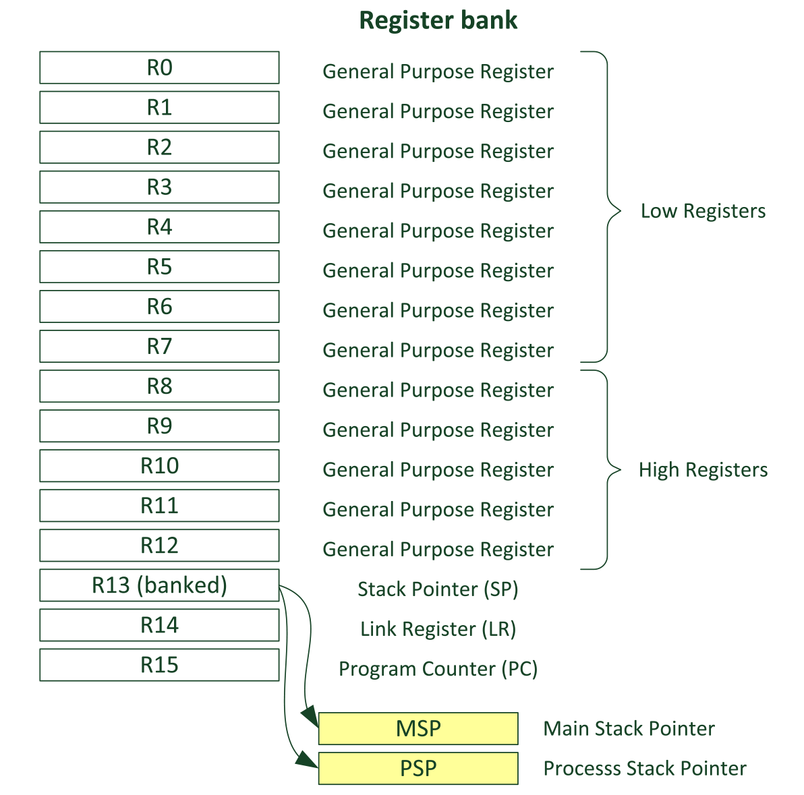
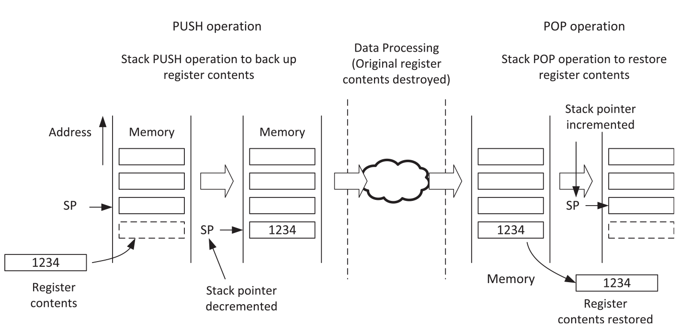
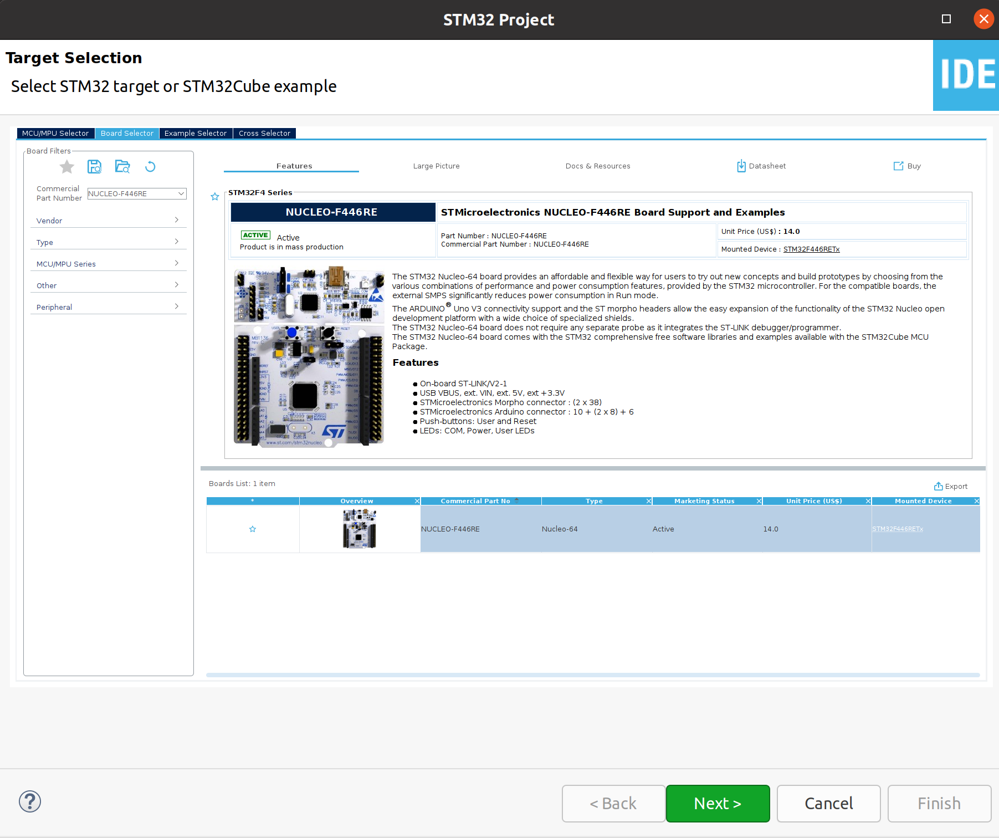
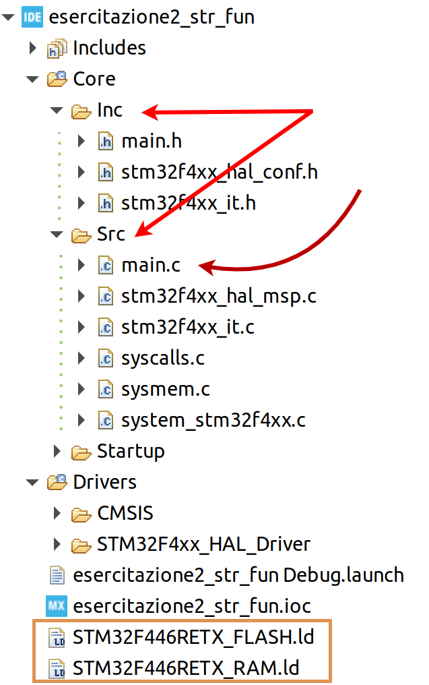
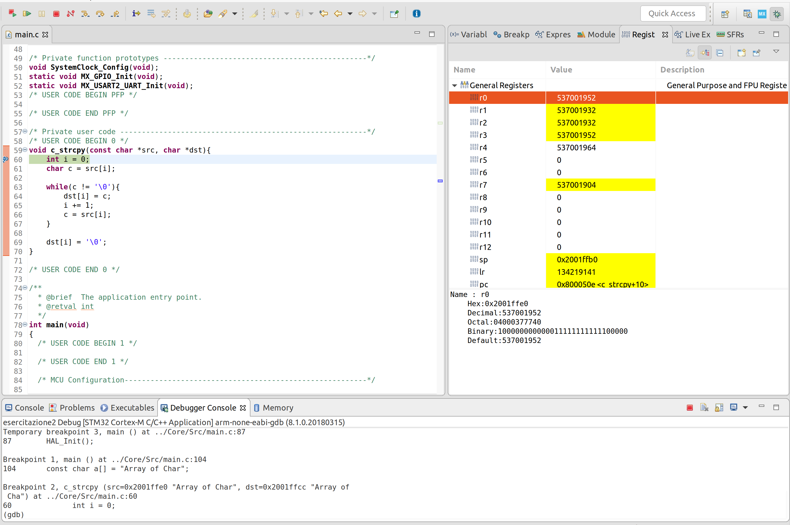
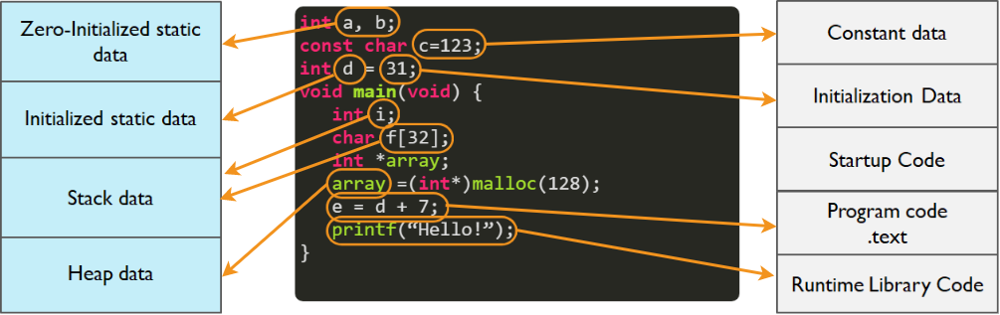

# Esercitazione 2
### Introduzione alla programmazione ed all'analisi dell'architettura hardware
***
</br>

## Overview 
Di seguito si introduce la programmazione per microcontrollori **STM32** della serie **F4**, partendo dalla scrittura di due semplici funzioni per il processamento di stringhe:
* `c_strcpy(const char *src, char *dst)`: copia una stringa (`src`) in un'altra (`dst`), entrambe passate per riferimento alla funzione;
* `c_strcapitalize(char *str)`: trasforma tutti in caratteri della stringa (`str`) in maiuscolo;

Sebbene le funzioni da scrivere siano molto semplici, lo scopo è quello di analizzare il funzionamento interno dell'architettura, visualizzando ciò che accade nei registri e nella memoria del microcontrollore eseguendo le funzioni sopra indicate. Si farà uso del ambiente di sviluppo [**STM32Cube**](https://www.st.com/en/development-tools/stm32cubeide.html) e della scheda di sviluppo **STM32F446RE** usata in *modalità debug* grazie al modulo **ST-Link** già presente sulla scheda.

## Architettura ARM: Registri
L'architettura **ARM** è di tipo *load-store*: se un dato che si trova in memoria deve essere processato è necessario spostarlo dalla memoria e caricarlo nei registri che si trovano nell'area indicata come *register bank*. Il dato viene dunque elaborato dal processore e successivamente ricaricato in memoria.

Grazie ad un sufficiente numero di registri, questo meccanismo, abbastanza semplice, permette di generare del software efficiente.

<p align="center">
  
</p>
  
### R0 - R12
  > Registers R0 to R12 are general purpose registers. The first eight (R0 e R7) are also called low registers. Due to the limited available space in the instruction set, many 16-bit instructions can only access the low registers. The high registers (R8 e R12) can be used with 32-bit instructions, and a few with 16-bit instructions. The initial values of R0 to R12 are undefined
  
### R13, stack pointer (SP)
  > R13 is the Stack Pointer. It is used for accessing the stack memory via PUSH and POP operations. Physically there are two different Stack Pointers: the Main Stack Pointer (MSP) is the default Stack Pointer. It is selected after reset, or when the processor is in Handler Mode. The other Stack Pointer is called the Process Stack Pointer (PSP) and can only be used in Thread Mode. The selection of Stack Pointer is determined by a special register called CONTROL. For most cases, it is not necessary to use the PSP if the application doesn't require an embedded OS.

Nella maggior parte delle applicazioni, solo uno **Stack Pointer** è visibile e le modalità operative di funzionamento sono limitate. 

:dart:
La gestione della memoria secondo la logica a **stack** consiste nel utilizzarla come un buffer *LIFO* (*L*ast-*I*n-*F*irst-*O*ut), buffer che prende proprio il nome di **stack**.
Le istruzioni utilizzate per gestire questa struttura sono *PUSH* e *POP*, la prima utilizzata per caricare un dato sullo **stack**, la seconda per rimuovere ciò che è presente "in cima" allo **stack**. 

Lo **stack pointer** è un puntatore che in ogni istante punta alla cima dello **stack** e si aggiorna automaticamente dopo ogni istruzione *PUSH* o *POP*, fornendo a queste istruzioni anche l'indirizzo di memoria sul quale devono operare.

Il contenuto dello **stack** può consistere di:

* Variabili locali che vengono conservate temporaneamente;
* Dati che devono essere passati da una funzione ad una sua sotto-funzione (*subroutine*);
* Valori relativi allo stato del processore e dei registri nel caso in cui si verifichi un eccezione.

Figurativamente, lo **stack** viene rappresentato come una memoria che "cresce verso il basso"; questa fantasiosa concezione deriva dal fatto che sullo **stack** il processore opera seconodo il modello chiamato "full-descending stack": quando il processore viene avviato, lo **SP** viene impostato con il valore dell'ultimo indirizzo di memoria riservato per lo **stack** e si muoverà verso indirizzi numericamente di valore più basso. Al seguito di un operazione di *PUSH* lo **SP** viene decrementato e successivamente inserito un valore alla locazione di memoria puntata dallo **SP**. Per un'operazione di *POP* invece, il valore che si trova nell'area di memoria puntata dallo **SP** viene prelevato e successivamente quest'ultimo incrementato.



Si noti che, per ogni operazione di *PUSH* deve esserci una corrispondente operazione di *POP* prima o poi, per poter utilizzare correttamente la memoria allocata per lo **stack**.


### R14, link register (LR) 
> R14 is also called the Link Register (LR). This is used for holding the return address when calling a function or subroutine. At the end of the function or subroutine, the program control can return to the calling program and resume by loading the value of LR into the Program Counter (PC). When a function or subroutine call is made, the value of LR is updated automatically. If a function needs to call another function or subroutine, it needs to save the value of LR in the stack first. Otherwise, the current value in LR will be lost when the function call is made. During exception handling, the LR is also updated automatically to a special EXC_RETURN (Exception Return) value, which is then used for triggering the exception return at the end of the exception handler.
  
### R15, program counter (PC)
> R15 is the Program Counter (PC). It is readable and writeable: a read returns the current instruction address plus 4 (this is due to the pipeline nature of the design, and compatibility requirement with the ARM7TDMI processor). Writing to PC (e.g., using data transfer/processing instructions) causes a branch operation.

## 

Quando una funzione ne chiama un'altra, l'indirizzo di ritorno viene messo nel *link register* (**LR**). I parametri della funzione, se ve ne sono, sono caricati nei primi 4 registri, da **R0** a **R3** e se vi sono più di quattro argomenti, o se questi sono dimensionalmente maggiori di 32 bit, questi vengono passati sullo stack.

Questi stessi registri possono essere utilizzati per uno storage temporaneo di dati se non sono già occupati per conservare argomenti per le funzioni o se gli argomenti presenti nei registri non sono più necessari. 

I registri da **R4** a **R11** sono invece, tendenzialmente, preservati per le *subroutine*; se vi è la necessità di usarne qualcuno, il valore contenuto viene messo temporanemente nello stack e poi ricaricato.

## 

Oltre a tutti i registri nel *register bank*, ci sono una serie di registri considerati *speciali* che contengono informazioni circa lo stato del processore e permettono di definire situazioni operative più elaborate di quelle che riguardano lo sviluppo di semplici applicazioni, ad esempio in C; spesso riguardano processi di sviluppo di sistemi operativi embedded.

## 

Per informazioni più dettagliate riguardo il funzionamento dei registri ed il loro utilizzo si può far riferimento al [Reference Manual](https://www.st.com/resource/en/reference_manual/dm00135183.pdf).


## Implementazione con STM32Cube
Per lo svolgimento dell'esercitazione si implementa una funzione principale (`int main()`) facendo inizialmente uso delle funzionalità di *generazione del codice* fornite dall'ambiente di sviluppo *STM32Cube*. Nel corpo dell'applicazione si invocano le due funzioni, implementate all'esterno del metodo principale, e si analizza ciò che accade nei registri del microcontrollore tramite l'interfaccia di debug.

<br>

:pencil: **`c_strcpy(const char *src, char *dst)`**

La funzione accetta due parametri in ingresso, ognuno di quali puntatore ad un array di char. In base quanto riportato prima, i due puntatori vengono passati come argomento utilizzando i registri tra **R0** e **R7**, a seconda della disponibilità attuale del microcontrollore.

Gli strumenti di compilazione per **ARM** sono in grado di compilare codice C, Assembly o un'opportuna combinazione di entrambi, producendo un unico eseguibile. Questo permetterebbe di scrivere la funzione desiderata anche in codice Assembly, integrandolo in dei file di codice C: 

```assembly
__asm void asm_strcpy(const char *src, char *dst){
loop
  LDRB  r2, [r0] ; Load byte into R2 from mem. pointed to by R0 ('src' pointer)
  ADDS	r0, #1	 ; Increment src pointer
  STRB  r2, [r1] ; Store byte in R2 into memory pointed to by ('dst' pointer)
  ADDS	r1, #1	 ; Increment dst pointer
  CMP   r2, #0	 ; Was the byte 0?
  BNE   loop     ; If not, repeat the loop
  BX    lr       ; Else return from subroutine
}
```

Quando si scrive codice Assembly per processori di questo tipo bisogna assicurarsi che si rispetti lo standard: 
*"Procedure Call Standard for the ARM Architecture (AAPCS)"*, che stabilisce un regolamento che la funzione chiamante e la funzione chiamata devono rispettare. Ad esempio, tra le specifiche, consultabili interamente sul [documento ufficiale](https://static.docs.arm.com/ihi0042/i/aapcs32.pdf), si hanno le seguenti: </br>
> Registers **R0-R3** pass argument values to the callee function, with subsequent arguments passed on the stack.
</br></br> Register **R0** passes the result value back to the caller function.
</br></br> Caller functions must preserve **R0-R3** and **R12**, because these registers are allowed to be corrupted by the callee function.
</br></br>Callee functions must preserve **R4-R11** and **LR**, because these registers are not allowed to be corrupted by the callee function.

<br>

L'implementazione della funzione **`c_strcpy(const char *src, char *dst)`** si realizza all'interno di un *STM32 Project*, creato usando l'ambiente di sviluppo **STM32Cube**; la creazione di un progetto di questo tipo passa per la selezione di un microcontrollore o una scheda di sviluppo *target*.
<p align="center">
  
</p>

Per questo primo esempio non è necessario gestire in alcun modo i *pin* del microcontrollore, che possono restare nella loro configurazione di default. Più importante è invece prendere familiarità con l'ambiente di sviluppo e le cartelle di progetto che vengono create automaticamente dall'IDE.

<p align="center">
    
</p>

La funzione in questione verrà implementata all'interno del file `main.c` e richiamata all'interno della funzione `int main(void)` che si trova, appunto, in questo file. Di seguito è mostrata una porzione dell'interfaccia di *debug* dell'ambiente di sviluppo; tramite tale interfaccia è possibile analizzare il contenuto di tutti i registri del *register bank* e visualizzare i valori assunti dalle variabili del programma.

<p align="center">
    
</p>

<br>

:pencil: **`c_strcapitalize(char *string)`**

La funzione che ha il compito di trasformare tutti in caratteri della stringa (`string`) in maiuscolo viene implementata tenendo in considerazione il fatto che ogni carattere della stringa è rappresentato tramite codice **ASCII** nel calcolatore. Ad esempio il carattere 'A' è rappresentata con il valore 65 decimale (0x41) e la 'Z' con 90 (0x5A); per quanto riguarda le lettere minuscole: la 'a' corrisponde a 97 (0x61) e la 'z' a 122 (0x7A). Si può far riferimento ad una [tabella **ASCII**](https://it.wikipedia.org/wiki/ASCII#Tabella_dei_caratteri) per informazioni più dettagliate a riguardo.

***
L'analisi del codice prodotto è importante per determinare, anche in termini di memorizzazione, dove il codice scritto verrà salvato. Ad esempio, mentre gli array costanti vengono salvati nello *stack*, quelli che sono inizializzati tramite funzioni tipo `malloc` risiedono nell'*heap*. Altre parti di codice invece, che viene compilato, resta salvato all'interno della memoria flash del microcontrollore.



Per un corretto sviluppo di un sistema embedded, può essere importante tener conto anche delle risorse (in termini di *Kbytes* di memoria flash o *Kbytes* di SRAM) a disposizione in modo da ottimizzare il codice sviluppato.

***

:bookmark: Per quanto riguarda  il modulo **ST-Link** per la programmazione ed il debugging del microcontrollore si deve far riferimento alla [pagina ufficiale](https://www.st.com/en/development-tools/st-link-v2.html), sulla quale si trovano anche i driver necessari per utilizzare il modulo su sistemi Windows 7/8/10.

***
</br></br>

## Esercizi
:pencil: Tradurre in codice Assembly la seguente funzione C:
```c
int c_strlen(char *s) { 
  int i = 0; 
  
  while ( s[i] != '\0' ) 
    i++; 
  
  return i; 
}
```

:pencil: Scrivere in codice Assembly una funzione `main` nella quale si esegue il calcolo della sommatoria indicata di seguito. 


Si utilizzi il registro **R0** per la variabile *n*, il registro **R1** per conservare il risultato (variabile *sum*) ed un altro registro a scelta per conservare la variabile *i* che deve aumentare fino al valore *n*.

Successivamente implementare la funzione in C e valutare, tramite modalità debug, quali registri vengono utilizzati ed in che modo. 

:interrobang: Illustrare brevemente funzionamento e differenze tra le funzioni **MOV**, **MVN** e **MOVT**.

:question: Di quanti registri vi è bisogno per conservare il risultato di un operazione come **UMLAL**?