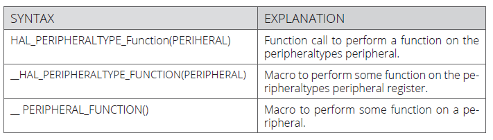
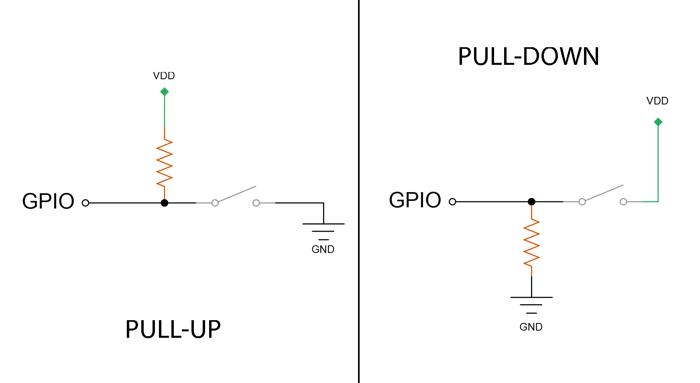

# Esercitazione 3
### Digital I/O e GPIO

***
</br>

## Overview
Scopo dell'esercitazione è di configurare ed utilizzare una periferica *General Purpose Input Output* (**GPIO**) con un approccio *low-level*, cioè configurando manualmente i registri che la gestiscono. Il risultato desiderato è quello di avere una semplice applicazione che usi dei pin, come **GPIO**, per leggere lo stato di diversi pulsanti e conseguentemente modifichi il livello logico in uscita su altri **GPIO**.

## Dettagli per lo sviluppo
Fare riferimento alla documentazione della [scheda di sviluppo](https://os.mbed.com/platforms/ST-Nucleo-F446RE) per individuare quali pin della scheda utilizzare per connettere i pulsanti, utilizzando in maniera opportuna breadboard, resistenze e connettori adeguati.

Tramite l'interfaccia di debug dell'ambiente di sviluppo *STM32Cube* si possono analizzare i registri che entrano in gioco per la configurazione dei **GPIO** e si farà uso delle seguenti operazioni *bitwise* per gestire il contenuto di questi registri:
```
REG = 0x04;     // Set bit[2] and clear other bits
REG |= 0x04;    // Set bit[2] and keep others unchanged
REG &= 0x04;    // Clear all bits except bit[2]
REG &= ~0x04;   // Clear bit[2] and keep others unchanged
```

:dart: Le operazioni sui bit, dette *bitwise*, permettono di agire direttamente sui bit di una variabile piuttosto che sui byte. Queste operazioni sono realizzate, in **C**, utilizzando degli speciali operatori:

`&` (Operatore di congiunzione logica: *and*)</br>
`|` (Operatore di disgiunzione logica: *or*)</br>
`^` (Operatore di disgiunzione esclusiva: *xor*)</br>
`~` (Complemento a 1)</br>
`<<` (Bit-Shift a sinistra)</br>
`>>` (Bit-Shift a destra)</br>

Per utilizzare correttamente questi operatori bisogna tenere in considerazione la rappresentazione binaria dei numeri all'interno del calcolatore. A volte torna utile anche l'utilizzo della rappresentazione esadecimale, per un assegnamento più immediato dei valori.
</br>

|Binary| Dec | HEX |
|:---: |:---:|:---:|
| 0000 0001 | 1   | 0x01|
| 0000 0010 | 2   | 0x02|
| 0000 0100 | 4   | 0x04|
| 0000 1000 | 8   | 0x08|
| 0001 0000 | 16  | 0x10|
| 0010 0000 | 32  | 0x20|
| 0100 0000 | 64  | 0x40|
| 1000 0000 | 128 | 0x80|


Di seguito un esempio di utilizzo di operazioni *bitwise* in **C** con variabili che in memoria sono conservate in 8 bit:
```c
unsigned char val1, val2, res;
val1 = 21;         // 0001 0101
val2 = 0x7;        // 0000 0111
// AND    
res = val1 & val2; // 0000 0101
// OR
res = val1 | val2; // 0001 0111 
// XOR
res = val1 ^ val2; // 0001 0010
// Ones' Complement
res = ~val1;       // 1110 1010
// Shift 
res = val1<<2      // 0101 0100	
res = val1>>3      // 0000 0010
```

## GPIO e registri per la loro gestione
Come molti altri dispositivi, anche i microcontrollori STM32 offrono dei circuiti dedicati che realizzano *Input/Output* di tipo *General Purpose* (**GPIO**) per l'interfacciamento con componenti esterne al microcontrollore. I segnali che, tramite pin esterni, si trovano su un **GPIO** vengono trattati come segnali digitali, dunque assumono uno tra due stati logici:
* **0 Logico** -- Livello Basso -- **0V**
* **1 Logico** -- Livello Alto -- **3.3V/5V**

<p align="center">
    
</p>

Ogni linea **GPIO** può essere configurata, via software, come *output* - per generare un segnale che può essere usato, ad esempio, per alimentare un LED - oppure come *input* - con la possibilità di ricevere un segnale, ad esempio, da un pulsante - in accordo a diverse modalità.

Le tre modalità con cui può essere gestito un *output* sono le seguenti:
* **open-drain** 
> There is a transistor (NMOS) connects to ground and nothing else
* **open-drain** con **pull-up**
> There is transistor (NMOS) connects to ground, and a resistor connects to VDD for solving *floating* problem
* **push-pull**
> There are a transistor (PMOS) connects to VDD, and a transistor (NMOS) connects to GND (only one is operated at a time).

Gli *input* possono, generalmente, essere invece configurati come:

* **pull-up** o **pull-down**
> There is only a resistor: connected to VDD in **pull-up**, connected to GND in **pull-down**

* **pull-up** e **pull-down**
> There are one resistor connected to VDD and a resistor connected to GND (only useful in rare cases).

Nel caso di pin connessi come **GPIO**, queste configurazioni si possono spesso miscelare, dando luogo a configurazioni miste. 

Inoltre, molti pin **GPIO** sono condivisi con altre funzionalità analogiche e/o digitali; anche per questo motivo sono tutti *high-current-capable* e forniscono la possibilità di essere configurati, tramite opportuni parametri, per gestire rumore ed emissione elettromagnetica.

La connessione **GPIO** avviene tramite i pin che la scheda offre all'esterno e sono organizzati in gruppi, che prendono il nome di *porte*. Si possono quindi identificare le diverse porte legate alle differenti periferiche **GPIO**, e si indicano con:

    GPIOx con x = A,B,C,D,E,F,G,H

con **A-H** identificativi delle diverse porte. I singoli pin si potranno identificare più specificatamente con

    GPIOxy con y = 0,1,...,15

oppure, in maniera generica

    Px_y con y = 0,1,...,15

specificando uno tra i 16 pin disponibili per ogni porta.

Per l'utilizzo corretto di ingressi o uscite come dei **GPIO** bisogna utilizzare i registri, legati alle diverse porte, come indicato nella documentazione ufficiale del microcontrollore:

*	**GPIO** port mode register **(GPIOx_MODER)**

    These bits are written by software to configure the I/O direction mode:

    * 00: Input (reset state)
    * 01: General purpose output mode
    * 10: Alternate function mode
    * 11: Analog mode
    
* **GPIO** port output type register **(GPIOx_TYPER)**

    These bits are written by software to configure the output type of the I/O port:
    * 0: Output push-pull (reset state)
    * 1: Output open-drain
    
* **GPIO** port output speed register  **(GPIOx_OSPEEDR)**

    These bits are written by software to configure the I/O output speed:

    * 00: 2 Mhz (low speed)
    * 01: 25 Mhz (medium speed)
    * 10: 50 Mhz (fast speed)
    * 11: 100 Mhz (high speed)

* **GPIO** port pull-up/pull-down register   **(GPIOx_PUPDR)**

   These bits are written by software to configure the I/O pull-up or pull-down:

    * 00: No pull-up, pull-down
    * 01: Pull-up
    * 10: Pull-down
    * 11: Reserved

* **GPIO** port input data register **(GPIOx_IDR)**

    These bits are read-only and can be accessed in word mode only. They contain the input value of the corresponding I/O port

* **GPIO** port output data register **(GPIOx_ODR)**
    
    These bits can be read and written by software

* **GPIO** port bit set/reset register **(GPIOx_BSRR)**
    
    These bits are write-only and can be accessed in word, half-word or byte mode. A read to these bits returns the value 0x0000

* **GPIO** port configuration lock register **(GPIOx_LCKR)**

    This register is used to lock the configuration of the port bits when a correct write sequence is applied to bit 16 (LCKK). The value of bits [15:0] is used to lock the configuration of the GPIO. During the write sequence, the value of LCKR[15:0] must not change. When the LOCK sequence has been applied on a port bit, the value of this port bit can no longer be modified until the next reset.

* **GPIO** alternate function low/high register **(GPIOx_AFRL)**/**(GPIOx_AFRH)**
    
    These bits are written by software to configure alternate function I/Os


Le strutture e le variabili necessarie all'utilizzo dei pin **GPIO**, che già tengono conto degli indirizzi di memoria cui si trovano i vari registri, sono implementate nelle librerie del driver **HAL** (**H**ardware **A**bstraction **L**ayer) già disponibile in *STM32Cube*.

```c
typedef struct {
  volatile uint32_t MODER;    // Mode register
  volatile uint32_t OTYPER;   // Output type register
  volatile uint32_t OSPEEDR;  // Output speed register
  volatile uint32_t PUPDR;    // Pull-up/pull-down register
  volatile uint32_t IDR;      // Input data register
  volatile uint32_t ODR;      // Output data register
  volatile uint32_t BSRR;     // Bit set/reset register
  volatile uint32_t LCKR;     // Configuration lock register
  volatile uint32_t AFR[2];   // Alternate function registers
  volatile uint32_t BRR;      // Bit Reset register
  volatile uint32_t ASCR;     // Analog switch control register
} GPIO_TypeDef;

#define GPIOA ((GPIO_TypeDef *)  0x40000000UL)
```

Dunque, per l'accesso ai registri delle periferiche **GPIO** si può scrivere qualcosa del tipo:
```c
GPIOA->MODER &= ~(0x01 << 4); // Clear bit 4 of the GPIOA MODER
```
Per informazioni più accurate si può far riferimento al [Reference Manual](https://www.st.com/resource/en/reference_manual/dm00135183.pdf) o alla [descrizione ufficiale delle librerie HAL](https://www.st.com/resource/en/user_manual/dm00105879-description-of-stm32f4-hal-and-ll-drivers-stmicroelectronics.pdf), incluse di default in progetti *STM32Cube*.

</br>

:dart:
> The STM32Cube **HAL** is an STM32 embedded software layer that ensures maximized portability across the STM32 portfolio, while the **LL** APIs (Application Programming Interfaces) make up a fast, light-weight, expert-oriented layer which is closer to the hardware than the **HAL**. **HAL** and **LL** APIs can be used simultaneously with a few restrictions.

Sfruttando i driver **HAL** è possibile utilizzare completamente un microcontrollore STM32 per lo sviluppo di qualsiasi applicazione. Sebbene la struttura possa sembrare un po' complessa inizialmente, sfruttando opportunamente la libreria è possibile apprezzarne la semplicità e l'importante capacità di astrazione dell'hardware. Inoltre, l'intera libreria è integrata nell'ambiente di sviluppo *STM32Cube* e del codice che la utilizza si può generare automaticamente grazie a *STM32CubeMX*.

La sintassi utilizzata nella libreria **HAL** è standardizzata, favorendo uno sviluppo rapido che permette di realizzare del software (parzialmente) indipendente dall'hardware utilizzato. 

<p align="center">
    
</p>

I driver **HAL** sono suddivisi in due categorie: una contenente delle API generiche per tutti i microcontrollori STM32, una che include le personalizzazioni specifiche di una data famiglia di microcontrollori.

<p align="center">
    


## Implementazione
Per l'implementazione dell'esercizio desiderato si farà uso di pulsanti e LED esterni alla scheda di sviluppo, connessi opportunamente su dei **GPIO** tramite una breadboard.
A tal proposito, si presti attenzione ad effettuare correttamente la connessione fisica tra il pulsante ed il **GPIO** sulla scheda facendo ricorso a basilari conoscenze di elettronica.

<p align="center">
    

I pulsanti connessi come *input* alla scheda devono essere usati per comandare dei *segnali di output logici* che gestiscono lo stato dei LED: si associa quindi, ad ogni pulsante - connesso ad un **GPIO** come *input* - un LED - connesso ad un **GPIO** come dispositivo di *output*.

Per la connessione fisica dei componenti sulla scheda fare riferimento al seguente schema, in cui si mostra come connettere un singolo pulsante e un LED.


Cliccando sul pulsante, connesso fisicamente al pin gestito dal **GPIOA10** (**PA10**), il valore logico presente sul **GPIOB10** (**PB10**) deve cambiare il suo stato. Il risultato si potrebbe visualizzare anche tramite oscilloscopio, prima di connettere il LED. 

L'implementazione del software si realizza in *STM32Cube* senza necessariamente sfruttare le funzioni di "generazione del codice"; nel codice della funzione principale bisogna, prima di tutto, abilitare il segnale di clock sulle porte **GPIOA** e **GPIOB** usando il registro **RCC_AHB1ENR**, per attivarle. 
```c
RCC->AHB1ENR |= 0x3;
```
A questo punto si può abilitare il **GPIOA10** come ingresso configurandolo in *pull-up-mode* e il **GPIOB10** come uscita, anch'esso in *pull-up-mode* e con tipo di output *push-pull*.
```c
GPIOA->MODER  &= ~(0x03 << 20); // Clear GPIOA10
GPIOA->MODER |= (0x00 << 20);   // Set Input
GPIOA->PUPDR |= (0x01 << 20);  // Pull-Up Mode su pin di input

GPIOB->MODER |= (0x01 << 20);  // Set Output
// Push-Pull output & Pull-Down
GPIOB->OTYPER &= ~(0x1 << 10);
GPIOB->PUPDR &= ~(0x03 << 20); // Clear GPIOB10
GPIOB->PUPDR |= (0x01 << 20);
```

Si noti che, per effettuare la pulizia (*clear* ) di due bit, ad esempio in posizioni 20 e 21 di un registro, si sfrutta la logica *bitwise* con la seguente operazione:
```c
REG &=  ~(0x3 << 20);
```

L'intero codice dell'applicazione si trova nella cartella **digital_io_stm32**, cartella contenente l'intero progetto per *STM32Cube*.

:warning: 
Lavorando con i pulsanti, si presti attenzione ai problemi fisici come il *bouncing*.
> "When the switch is closed, the two contacts actually separate and reconnect, typically 10 to 100 times over a periode of about 1ms." ("The Art of electronics", Horowitz & Hill, Second edition, pag 506.)
***
</br> </br>

## Esercizi

:pencil:
Con la stessa logica utilizzata nell'esempio precedente, abilitare altri due pin di ingresso su due **GPIO** della porta **B**, connettendoli ad altri due pulsanti, ed altri due pin di uscita su **GPIO** della porta **A**, connettendo altri due LED. Collegare logicamente ogni pulsante (ingresso) ad un LED (in uscita) e fare in modo che alla pressione di ogni pulsante si accenda un LED diverso. Testare il funzionamento dell'intero programma valutando anche le variazioni dei registri tramite interfaccia di debug. Si faccia attenzione ad utilizzare le opportune resistenze per la connessione di LED e pulsanti, come indicato.

:pencil:
Scrivere del codice **C** che, operando su un valore a 8 bit (`unsigned char`), configuri i bit 4, 5 e 6 rispettivamente ai valori 1, 0 e 1; lasciando tutti i restanti a 0.

:question:
Cosa rappresenta la *velocità* di un **GPIO** configurato come output? In quale registro viene conservata questa informazione e qual'è il valore di configurazione di default?

:question:
Cosa cambia, dal punto di vista pratico, nella configurazione di un **GPIO** di output come *push-pull* o *open-drain*? Con quali registri vengono configurate tali modalità?
