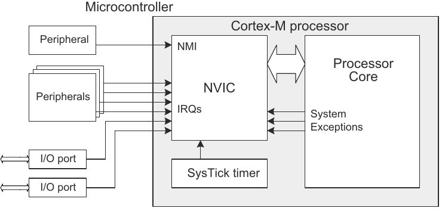

# Esercitazione 4
### GPIO ed Interrupt

***
</br>

## Overview
Finalità di questa esercitazione è configurare ed utilizzare l'interfaccia *General Purpose Input Output* (**GPIO**) con un approccio *low-level* utilizzando il meccanismo delle **interrupt** per gestire gli input esterni, associati a dei pin abilitati come input.

Il risultato desiderato è quello di avere un'applicazione che si accorga delle pressioni sui dei pulsanti, collegati ai pin di ingresso, grazie ad **interrupt** esterne, evitando operazioni di *polling*. Di conseguenza verrà modificato lo stato logico di alcuni **GPIO** di output.

## Requisiti Teorici
Quando si ha a che fare in maniera diretta con l'hardware, e non si lavora solo a livello software, è importante saper trattare eventi **asincroni**, in genere (ma non sempre) scaturiti da periferiche esterne all'unità di calcolo.
Per questo motivo, ogni microcontrollore fornisce un meccanismo di interruzioni (**interrupts**) per la gestione di eventi asincroni, che permette di gestire un'interruzione imprescindibile del codice in esecuzione, in favore di particolari funzioni che prendono il nome di **I**nterrupt **S**ervice **R**outine (**ISR**), basandosi su criteri di priorità.

Queste si possono programmare in modo da essere invocate in rispetto a particolari eventi temporali oppure al seguito dell'occorrenza di eventi fisici, dando luogo, in questo caso, ad applicazioni di tipo *event-driven*. 

All'interno di un software per un *sistema embedded* le **ISR** sono codificate come delle vere e proprie funzioni, che però non vengono invocate da nessuna parte, in maniera diretta, nel codice scritto dal programmatore. 

Dal punto di vista hardware, la gestione delle **interrupts** è mediata principalmente da due moduli:
* **N**ested **V**ectored **I**nterrupt **C**ontroller (**NVIC**)

  >The **NVIC** maintains knowledge of the stacked (nested) interrupts to enable tail-chaining of interrupts. The **NVIC** supports up to 240 dynamically reprioritizable interrupts each with up to 256 levels of priority. The **NVIC** and the processor core interface are closely coupled, which enables low latency interrupt processing and efficient processing of late arriving interrupts.</br></br>
  

* **EXT**ernal **I**nterrupt/event Controller (EXTI)

  >The external interrupt/event controller consists of up to 23 edge detectors for generating event/interrupt requests. Each input line can be independently configured to select the type of the interrupt and the corresponding trigger event (rising or falling or both). Each line can also masked independently. A pending register maintains the status line of the interrupt requests.

Queste entità (e di conseguenza il meccanismo delle **interrupts**) vengono gestite in base alla configurazione di opportuni registri che si trovano nel microcontrollore.

## Registri per la gestione delle Interrupt
*	SYSCFG external interrupt configuration register **(SYSCFG_EXTICRn)** n:[0-3]

    These bits are written by software to select the source input for the **EXTIx** external interrupt.

    * 0000: PAx pin
    * 0001: PBx pin
    * 0010: PCx pin
    * 0011: PDx pin
    * 0100: PEx pin
    * 0101: PFx pin
    * 0110: PGx pin
    * 0111: PHx pin
    
* Interrupt mask register **(EXTI_IMR)**
    
    Set the interrupt as maskable/non-maskable on line *x*
    
    * 0: Interrupt request from line *x* is masked
    * 1: Interrupt request from line *x* is not masked
    
* Rising trigger selection register **(EXTI_RTSR)**

    Rising trigger event configuration bit of line *x*
    
    * 0: Rising trigger disabled for input line *x*
    * 1: Rising trigger enabled for input line *x*

* Pending register **(EXTI_PR)**

    Pending bit on line *x*
    
    * 0: No trigger request occurred
    * 1: Selected trigger request occurred
    
    This bit is set when the selected edge event arrives on the external interrupt line. This bit is cleared by programming it to 1.
    
    
Per informazioni più accurate si può far riferimento al [Reference Manual](https://www.st.com/resource/en/reference_manual/dm00135183.pdf).

## Implementazione e altri dettagli
Fare riferimento alla documentazione della scheda [ST Nucleo F446RE](https://os.mbed.com/platforms/ST-Nucleo-F446RE) per individuarne il *pinout*, quindi i pin da utilizzare per connettere pulsanti e LED utilizzando opportunamente una breadboard, delle resistenze e dei connettori adeguati, come già fatto in precedenza.

### Funzioni per gestire interrupt, **NVIC** e **EXTI Controller**
```c
__enable_irq();                       \\ Abilitazione gestione richieste di interrupt
NVIC_SetPriority(EXTI3_IRQn, 0);      \\ Assegnamento priorità
NVIC_EnableIRQ(EXTI3_IRQn);           \\ Abilitare l'interrupt sulla linea indicata 
NVIC_DisableIRQ (EXTI3_IRQn);         \\ Disabilitare interrupt
NVIC_ClearPendingIRQ(EXTI3_IRQn);     \\ Eliminare richieste di interrupt pendenti
```
Le funzioni associate alle **interrupt** ( le **I**nterrupt **S**ervice **R**outine) devono avere nomi che rispettino la nomenclatura stabilita dal **CMSIS-Core**, dunque per un **interrupt** associata alla linea **EXTI3** si avrà la funzione
```c
void EXTI3_IRQHandler(void){
  NVIC_ClearPendingIRQ(EXTI3_IRQn);  \\ Pulizia del registro IRQ
  EXTI->PR |= 0x01 << 3;                
  ext_flag = 1;                      \\ Assegnazione valore a variabile esterna
}
```
Convenzionalmente si fa in modo che il processore passi il minor tempo possibile a processare una **ISR**, spesso si cambia solo il valore di una qualche variabile, o magari si configura un valore per qualche *flag*, controllata da qualche altra parte, fuori dalla **ISR**, per abilitare l'esecuzione di calcoli o operazioni.

:dart:
> The **C**ortex **M**icrocontroller **S**oftware **I**nterface **S**tandard (**CMSIS**) is a vendor-independent hardware abstraction layer for microcontrollers that are based on Arm® Cortex® processors. 

Il **CMSIS-Core** è una delle componenti, appunto centrale, di questa libreria (**CMSIS**) sviluppata da Arm, che permette di gestire in maniera molto semplificata una serie di periferiche interne al microcontrollore, come ad esempio **NVIC** o registri per **MPU**(**M**emory **P**rotection **U**nit) e **FPU**(**F**loating **P**oint **U**nit). 

Per un progetto in *STM32Cube*, l'utilizzo di questa libreria, insieme al driver **HAL**, fornisce una sovrastruttura che permette di trattare in maniera semplifica molte periferiche altrimenti complesse da gestire. 

<p align="center">
  
</p>

## 

Tramite gli ingressi **GPIO** vengono esportate 16 linee diverse sulle quali è possibile connettere delle **interrupts**; evidentemente, tutti i pin di tipo **Px_y** si troveranno sulla linea **y**; ad esempio per un pin come **PA_0** si troverà l'**interrupt** associata sulla linea **0** e un pin come **PA_13** sulla linea **13**. 

C'è da tenere in mente che i pin con uno stesso numero sono *multiplexati* su un'unica linea, dunque bisogna prestare attenzione ad utilizzi simultanei.

Un microcontrollore **STM32F4** ha 7 diversi *handlers* per le **interrupts** associate ai pin **GPIO**. Per ogni richiesta di interrupt (**IRQ**), la **ISR** associata deve avere uno specifico nome, come indicato nella seguente tabella.

|IRQ|Handler|	Descrizione|
|:---------:|:--------------:|:-:|
|EXTI0_IRQn	|`EXTI0_IRQHandler`|Handler per i pin connessi alla linea 0|
|EXTI1_IRQn	|`EXTI1_IRQHandler` |Handler per i pin connessi alla linea 1|
|EXTI2_IRQn	|`EXTI2_IRQHandler` |Handler per i pin connessi alla linea 2|
|EXTI3_IRQn	|`EXTI3_IRQHandler` |Handler per i pin connessi alla linea 3|
|EXTI4_IRQn	|`EXTI4_IRQHandler` |Handler per i pin connessi alla linea 4|
|EXTI9_5_IRQn	|`EXTI9_5_IRQHandler`	|Handler per i pin connessi alle linee da 5 a 9| 
|EXTI15_10_IRQn	|`EXTI15_10_IRQHandler`	|Handler per i pin connessi alle linee da 10 a 15|


## 

Per procedere allo sviluppo dell'applicazione desiderata bisogna, come fatto in precedenza, abilitare il segnale di clock sulle porte **GPIO** che si vogliono utilizzare (**GPIOC** e **GPIOA**) usando il registro **RCC_AHB1ENR**, poi abilitare **GPIOC2** e **GPIOC13** come ingressi configurandoli in *pull-up mode* e **GPIOA5** e **GPIOA10** come uscite, in *pull-up mode* e tipo di output in *push-pull*.


Si associa quindi una **interrupt** al pin **13** della porta **C** e si scrive la **ISR** ad esso associata, che viene invocata in base alla pressione del pulsante connesso sul **GPIOC13** e gestisce lo stato del LED su **PA_5**. Stesso procedimento si realizza per il pin **2** della porta **C**.

```c
// Abilitazione SYSCFG
RCC->APB2ENR |= RCC_APB2ENR_SYSCFGEN;

SYSCFG->EXTICR[0] |= SYSCFG_EXTICR1_EXTI2_PC;	// External interrupt on GPIOC2
SYSCFG->EXTICR[3] |= SYSCFG_EXTICR4_EXTI13_PC;  // External interrupt on GPIOC13
EXTI->IMR |= (0x01 << 13) | (0x01 << 2);     // Set not masked interrupt
EXTI->RTSR |= (0x01 << 13) | (0x01 << 2);    // Rising Edge

// Abilitazione Interrupt
__enable_irq();

// Gestione NVIC
NVIC_SetPriority(EXTI15_10_IRQn, 0);
NVIC_SetPriority(EXTI2_IRQn, 0);
NVIC_ClearPendingIRQ(EXTI15_10_IRQn);
NVIC_ClearPendingIRQ(EXTI2_IRQn);
NVIC_EnableIRQ(EXTI15_10_IRQn);
NVIC_EnableIRQ(EXTI2_IRQn);
```

Nel main, all'interno del ciclo di vita principale del programma, non è necessario effettuare nessuna operazione: la gestione dei LED si effettua nelle **ISR**, come:

```c
void EXTI2_IRQHandler(void){
  NVIC_ClearPendingIRQ(EXTI2_IRQn); // Clear pending IRQ
  EXTI->PR |= (0x01 << 2);  // Clear the EXTI pending register
  GPIOA->ODR ^= (0x1 << 10); // Set Output on PA_10
}
```

Alla pressione dei pulsanti, connessi fisicamente ai pin **PC_13** e **PC_2**, arrivano delle richiesta di interruzione al **NVIC**, che comunica con il processore ed invoca la **ISR** associata all'evento identificato.

:warning:
* Evitare codice *bloccante* all'interno di **ISR**: non invocare chiamate a funzioni tipo `wait()`, cicli potenzialmente infiniti o altri costrutti che potrebbero essere bloccanti.
* Evitare chiamate ad altre funzioni, sia quelle semplici come una `printf()`, sia quelle più elaborate come una `malloc()` o una diversa **ISR**. Queste funzioni potrebbero assumere un comportamento che risulta corrotto se invocate dall'interno d una **ISR**.
* Fare attenzione all'utilizzo di meccanismi di debbuging, che potrebbero non funzionare correttamente quando si lavora con le chiamate ad **ISR**.

## 
L'implementazione mostrata, utilizza completamente la logica delle **interrupt**, senza fare uso di *polling* (sebbene a volte potrebbe essere necessario). Uno schema più completo è quello mostrato di seguito, in cui si identifica anche il richiamo all'utilizzo di modalità di *sleep* del microcontrollore.

<p align="center">
  
</p>

In accordo a questa logica, si può utilizzare una *flag* nelle **ISR** ed il valore di tale variabile viene controllato all'interno del ciclo di vita principale del microcontrollore per eseguire alcune operazioni. In questo modo si possono associare ad ogni **interrupt** dei processi anche più elaborati di una semplice modifica di variabile.

Volendo sviluppare il software in accordo a questo meccanismo bisogna strutturare l'intero codice utilizzando le **interrupts**, altrimenti un comportamento misto (come di seguito) potrebbe generare alcuni problemi di funzionamento rispetto al comportamento desiderato. E soprattutto non si potrebbero utilizzare meccanismi di *sleep* per il microcontrollore.

```c
volatile int flag = 0;

...

while (1){
  if(!(GPIOC->IDR >> 14 & 0x01)){
    GPIOA->ODR ^= (0x1 << 10);
    HAL_Delay(400);
  }

  if(flag){
    GPIOA->ODR ^= (0x1 << 5); // Set Output on PA_5
    HAL_Delay(400);
    flag = 0;
  }
}
```

:rotating_light: </br>
La modalità di *sleep*, per ridurre i consumi del microcontrollore, mette "a dormire" il processore svegliandolo solo all'arrivo di richieste di **interrupts**, tale modalità viene identificata infatti con il nome di: *Wait For Interrupts*.

Se si vuole attivare questa particolare modalità, bisogna prima abilitare le funzionalità  di debug, che altrimenti si disabiliterebbero per default. Nel caso in cui ciò non venga fatto, la scheda concluderà ogni tipo di comunicazione tramite il modulo ST-Link e non sarà possibile comunicarvi neanche in modalità debug.
Se dovesse succedere, una possibile soluzione per riabilitare il normale funzionamento del microcontrollore sarebbe quella di compilare un semplice programma (che non utilizzi le **interrupts**) e copiare manualmente il file `.bin` nello spazio di memoria che la scheda fornisce quando collegata ad un PC. In questo modo, a seguito di un riavvio della scheda, si dovrebbe essere ripristinato il normale funzionamento con programmatore e debugger ripristinati.

Per mantenere attivo il programmatore, quindi il debug, anche in modalità *low-power* bisogna configurare il Debug MCU configuration register **(DBGMCU)**:
```c
DBGMCU->CR |= DBGMCU_CR_DBG_SLEEP | DBGMCU_CR_DBG_STOP | DBGMCU_CR_DBG_STANDBY;
```
Solo dopo aver configurato questi registri è possibile "mandare a dormire" la CPU utilizzando la funzione *wait-for-interrupt*:
```c
__WFI();  // Wait-For-Interrupt
```
Funzione che però deve essere usata opportunamente, per evitare comportamenti indesiderati e incontrollati del microcontrollore.
***


</br></br>
## Esercizi

:pencil:
Partendo dall'esempio presentato, inserire un terzo pulsante (con una terza **ISR**) ed un terzo LED. A questo  punto, con il meccanismo delle *flag*, realizzare per ogni pulsante premuto una diversa funzione per i LED: 
1. Cambio stato (*toggle*) di tutti e tre i LED;
2. Lampeggiamento intermittente dei tre LED, per almeno un secondo;
3. Accensione e successivo spegnimento in sequenza dei tre LED;

Possibilmente, realizzare queste due funzionalità in due metodi separati, sviluppati all'esterno del `main()`.

:question: Quale registro viene utilizzato per la gestione delle priorità per le **interrupts**? In quanti (e quali) campi viene suddiviso tale registro per la configurazione delle priorità?

:question: Quali registri entrano in giorno nella configurazione del *System Timer* (**SysTick**)?

:question: È possibile, usando il clock **HSI** con **PLL**, generare un **SYSCLK** a 100.5 Mhz? Motivare la risposta esplicitando la soluzione, eventualmente mostrare anche uno screen della schermata di *Clock Configuration* di STM32Cube MX.