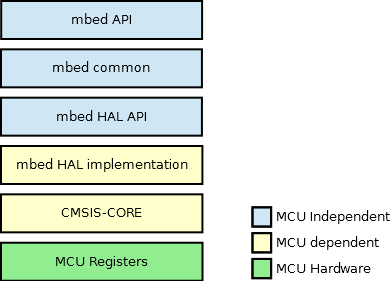

# Esercitazione 5
### I/O Digitale e Interrupt :zap: ARM Mbed

***
</br>


## Overview
In questa esercitazione viene introdotta ed utilizzata la piattaforma software [**mbed**](https://www.mbed.com/en/) sviluppata da ARM. Questa fornisce la possibilità di programmazione con un approccio ad *alto livello*, ed in questa esercitazione sarà utilizzato per configurare ed utilizzare i **GPIO** sfruttando il meccanismo delle *interrupt*.

## CMSIS e Mbed SDK

Sebbene la programmazione ad un livello *più basso* (ad esempio programmando tramite la configurazione manuale dei registri o addirittura in Assembly) presenti dei vantaggi dal punto di vista dell'ottimizzazione del codice e più possibilità nello strutturare operazioni molto specifiche, come approccio riduce drasticamente la produttività complessiva e rende il codice più difficile da leggere, modificare e mantenere nel corso del tempo.

Per far fronte a queste problematiche, ed aumentare di molto l'usabilità e l'evolvibilità del software, anche la programmazione su microcontrollori per sistemi embedded ha fatto dei passi avanti verso un tipo di programmazione ad *alto livello*; che permette una prototipazione molto più rapida. Visto anche il crescente interesse ad adattare i microcontrollori all'interno di sistemi *IoT*.

Come già mostrato, la stessa ARM ha sviluppato una serie di driver e librerie (o **A**pplication **P**rogramming **I**nterfaces (**APIs**)) che permettono lo sviluppo di applicazioni in tempi più rapidi e con codice più facilmente manutenibile, permettendo inoltre la portabilità tra diversi dispositivi di una stessa famiglia di processori. Queste librerie sono esportate tramite interfacce standard per tutti i microcontrollori della famiglia *Cortex*.

### CMSIS –  Cortex Microcontroller Software Interface Standard
> **CMSIS** is a vendor-independent hardware abstraction layer for the Cortex-M processor series. 

Fornisce una interfaccia software standardizzata comprendente funzioni di utilità per il controllo del flusso di lavoro a carico della MCU, gestendo anche l'interconnessione tra l'unità centrale e le moltissime periferiche interne ed esterne.

Inoltre, la sua componente centrale (**CMSIS-Core**) è decisamente moderata dal punto di vista delle risorse richieste al microcontrollore: circa 1Kb di codice ed appena 4 byte di RAM.

<p align="center">
    
</p>

### MBED SDK
> The **mbed** **S**oftware **D**evelopment **K**it (**SDK**) is a C/C++ microcontroller software platform relied upon by tens of thousands of developers to build projects fast. We've worried about creating and testing startup code, C runtime, libraries and peripheral APIs, so you can worry about coding the smarts of your next product. 

Come kit di sviluppo software, è stato progettato basandosi su **CMSIS** e permette un livello di astrazione hardware molto avanzato, sebbene sia sempre possibile (a volte necessario) programmare in una logica di più basso livello. Inoltre esporta, ad esempio, librerie per la gestione di periferiche USB, periferiche di rete, RTOS e molti altri moduli esterni. Il tutto è incapsulato in **APIs** semplificate ed *user friendly*, che sono da utilizzare in una logica *object oriented* programmando in **C++**.

Per informazioni più dettagliate riguardo l'implementazione di software utilizzando **mbed** fare riferimento alla sua [documentazione ufficiale](https://os.mbed.com/docs/mbed-os/v5.15/apis/index.html).


</br> :dart: **C++ : Classi e Oggetti** </br></br>
**C++** è un linguaggio di programmazione *orientato agli oggetti*. 

Un *oggetto* è una realizzazione (un'istanza) di una specifica *classe*: un costrutto grazie al quale è possibile implementare dei particolari *tipi di dato astratti*, che possono rappresentare qualcosa di più complesso rispetto ai tipi considerati di base (`int`, `char`, `int[]`, etc).


Una *classe* può avere cittadinanza, ad esempio, per la rappresentazione di uno dei **GPIO** che si trova sulla scheda di sviluppo: questo infatti può essere usato e configurato in diversi modi, può intercettare diversi valori come ingresso e fornire in uscita quantità variabili. Tutto ciò viene gestito tramite *attributi* interni alla classe e *metodi* esportati all'esterno. In genere, una classe viene implementata dichiarandone attributi e metodi in un *file header* e definendoli in un file di codice sorgente **C++** (file con estensione `.cpp`). Di seguito un esempio, con semplice scopo illustrativo, di creazione ed utilizzo della classe discussa, `GPIO_PIN`.

<p style="margin-bottom:33px"></p>


```c++
class GPIO_PIN {         // Dichiarazione Classe
    private:             // Attributi
        int pin_number;        
        int pin_mode;
        float input_value;
        float output_value;

    public:             // Metodi
        void set_number(int x){
            pin_number = x;
        }
        ...
};

int main() {
    // Creazione di un oggetto GPIO_PIN
    GPIO_PIN GPIOA7;  

    // Utilizzo dei metodi
    GPIOA7.set_number(7);
    ...
    float in = GPIOA7.get_input();
    ...

    return 0;
}
```

## Implementazione ed altri dettagli

Per l'implementazione utilizzando **mbed** è necessario fare riferimento alla documentazione della libreria, individuando le funzioni e gli oggetti utili per sviluppare l'applicazione desiderata.

### DigitalIn/DigitalOut
> Use the **DigitalIn** interface to read the value of a digital input pin. The logic level is either 1 or 0.<br/><br/>Use the **DigitalOut** interface to configure and control a digital output pin by setting the pin to logic level 0 or 1.

Un primo semplicissimo programma che utilizza **mbed** si può sviluppare tramite il [compilatore online](https://ide.mbed.com/compiler/) che si trova sul sito ufficiale di [**ARM mbed**](https://www.mbed.com/en/). 

La piattaforma software fornisce le funzioni per gestire l'accesso ai pin digitali come input o output in maniera molto semplificata. Se si vuole far lampeggiare il led che si trova sulla scheda il programma principale è il seguente:
```cpp
#include "mbed.h"            

DigitalOut internal_led(LED1); // Creazione oggetto DigitalOut

int main() {
    while(1) {
        internal_led = 1; // LED ON
        wait(0.5); // 500 ms
        internal_led = 0; // LED OFF
        wait(1.0); // 1 sec
    }
}
```
Il LED sulla scheda di sviluppo è individuato dalla keyword `LED1` e per gestirlo come periferica digitale in uscita si inizializza un oggetto di tipo [`DigitalOut`](https://os.mbed.com/docs/mbed-os/v5.15/apis/digitalout.html). Si può anche valutare, tramite oscilloscopio, la variazione del valore logico sul pin **PA_5**, oppure connettere un LED esterno alla scheda di sviluppo.

Come successiva modifica, si effettua il controllo del LED tramite il pulsante presente sulla scheda. Per fare ciò si utilizzerà un oggetto di tipo [`DigitalIn`](https://os.mbed.com/docs/mbed-os/v5.15/apis/digitalin.html), inizializzandolo usando la keyword `USER_BUTTON` per identificare il pulsante che si trova sulla scheda.
```cpp
#include "mbed.h"            

DigitalOut internal_led(LED1);  
DigitalIn internal_btn(USER_BUTTON);

int main() {
    while(1) {
        if(internal_btn == 0){
            internal_led = 1; // LED ON
        }else{
            internal_led = 0; // LED OFF
        }
    }
}
```

:pencil: A questo punto è anche possibile connettere un pulsante esterno alla scheda e comandare un secondo led. Si usano in questo caso i pin: **PA_10** come input (`DigitalIn`) per il pulsante, e **PB_10** come output (`DigitalOut`). Per utilizzare questi pin è sufficiente dichiarare gli oggetti `DigitalIn` e `DigitalOut` passandogli come argomento l'identificativo dei pin, ad esempio 
```c++ 
DigitalIn nome_oggetto(PA_10);
```

Implementazione nel file: [mbed_btn_led](mbed_btn_led.cpp)

### BusIn/BusOut
> With the **BusIn** API, you can combine number of DigitalIn pins to read them at once. This abstraction is useful for checking multiple inputs together as single interface instead of individual pins.<br/><br/>Use the **BusOut** interface to combine a number of DigitalOut pins to write them at once. This API is useful for writing to multiple pins together as single interface instead of individual pins.

Questi oggetti, con le relative funzioni, forniscono propriamente l'astrazione di un *bus* sul quale si trovano tutti i pin classificati come ingresso o come uscita. Su uno stesso *bus* si definiscono dunque tutti gli ingressi usando un oggetto [`BusIn`](https://os.mbed.com/docs/mbed-os/v5.15/apis/busin.html) e tutte le uscite con un oggetto [`BusOut`](https://os.mbed.com/docs/mbed-os/v5.15/apis/busout.html). 

Si faccia attenzione all'ordine con cui vengono specificati i pin al costruttore dell'oggetto, poiché vengono usati successivamente in ordine inverso rispetto a tale scrittura; ciò è da tenere in considerazione nelle fasi di lettura e scrittura sui bus, di ingresso o di uscita.

Per mostrare un esempio di funzionamento di questi oggetti, si crea un bus di ingresso con il pin **PA_10** e il pulsante **USER_BUTTON**, un bus di uscita con il pin **PB_10** e il **LED1**. Quindi si fa in modo che: la pressione del tasto esterno (su **PA_10**) porti allo stato logico alto tutte le uscite, la pressione del pulsante-utente porti allo stato logico basso tutte le uscite. 
```cpp
#include "mbed.h"            

//Define input bus
BusIn buttons(USER_BUTTON, PA_10);

//Define output bus
BusOut leds(PB_10, LED1);

int main() {
    while(1) {
        if(buttons == 0x01){         // PA_10 Pressed
            leds = 0x03;             // All Led ON
        }else if(buttons == 0x02){   // USER_BUTTON Pressed
            leds = 0x00;             // All Led OFF
        }
    }
}
```

Come già fatto su *STM32Cube*, è possibile utilizzare un solo pulsante per gestire direttamente tutti i led che si trovano sul bus, per fare ciò si realizza un'operazione di *toggle* che utilizza l'operatore di complemento a uno.

```cpp
#include "mbed.h"            

//Define input bus
BusIn buttons(USER_BUTTON, PA_10);

//Define output bus
BusOut leds(PB_10, LED1);


int main(){
    leds.write(0x03); // LEDS ON

    while(1) {
        if(buttons == 0x01){ // PA_10 Pressed
            leds = ~leds.read(); // Toggle Leds
        }
    }
}
```

In questo caso, come già presentato in altri contesti, si presenta un problema: il ciclo finisce e ricomincia prima che si riesca a staccare il dito dal pulsante, ciò significa che durante la pressione fisica del pulsante il controllo del valore logico assunto dal bottone viene effettuato più volte, facendo variare in continuazione lo stato logico sui pin di uscita. Una prima soluzione *naive* si può ottenere come mostrato nel file [mbed_btn_led_bounce](mbed_btn_led_bounce.cpp), in cui si introduce semplicemente un attesa utilizzando la funzione `wait()`. Volendo ottenere risultati migliori, non è sufficiente tener conto solo del livello logico assunto dal pulsante ma c'è bisogno di analizzarne la variazione, dunque variare lo stato dei LED solo rispetto a fronti di *salita* o *discesa* del segnale scaturito dalla pressione del pulsante.

### InterruptIn
> Use the **InterruptIn** interface to trigger an event when a digital input pin changes. You can trigger interrupts on the *rising edge* (change from 0 to 1) or *falling edge* (change from 1 to 0) of signals.

Un oggetto di tipo [`InterruptIn`](https://os.mbed.com/docs/mbed-os/v5.15/apis/interruptin.html) viene creato specificando il nome del pin sul quale collegare l'input cui si vuole associare la *interrupt*. L'evento di *trigger* si specifica tramite appositi metodi ai quali deve essere passato come argomento l'indirizzo di memoria cui si trova la **ISR** associata (in `C` e `C++` si utilizza l'operatore unario di referenziazione `&` ).

Utilizzando due led (connessi a **PB_10** e **PA_5**) si costruiscono le **ISR** che variano lo stato dei led alla pressione di un pulsante, più nel dettaglio, quando viene rilevato un *fronte di salita*. Oltre a dover scrivere un `main` e le due **ISR**, tra i metodi da utilizzare ci sono i seguenti:
```
__enable_irq();  // Abilitazione interrupt-request
__disable_irq(); // Disabilitazione interrupt-request
__WFI();         // Wait-For-Interrupt
```
il cui funzionamento è già stato discusso. Si noti che in questo contesto, non c'è bisogno di operare direttamente con il **NVIC** per abilitare le interrupt, ma comunque, per funzionalità leggermente più avanzate (come anche gestire le priorità) si può fare ricorso alle funzioni di **CMSIS** già illustrate. 
```cpp
#include "mbed.h"            

// Define Interrupt Inputs
InterruptIn btn_1(PA_10);
InterruptIn btn_2(PC_2);

// Define output 
DigitalOut led_1(LED1);
DigitalOut led_2(PB_10);

// Define ISR - btn_1
void btn_1_callback(){
    led_1 = !led_1;    
}

// Define ISR - btn_2
void btn_2_callback(){
    led_2 = !led_2;    
}

int main(){
    __enable_irq();
    
    // Callback on Rising Edge
    btn_1.rise(&btn_1_callback);
    btn_2.rise(&btn_2_callback);
    
    // Change Priority
    NVIC_SetPriority(EXTI15_10_IRQn, 1);

    while(1){
        __WFI(); // Wait-For-Interrupt            
    }
}
```



Come mostrato nell'ultimo esempio, la piattaforma di sviluppo di **mbed** offre la possibilità di utilizzare anche direttamente tutte le funzionalità del driver **HAL** e dalla libreria **CMSIS**, lasciando al programmatore l'accortezza di utilizzarle in maniera opportuna. Come si può dedurre dallo schema mostrato, ogni nuovo livello aggiunge un grado di astrazione maggiore per l'hardware del microcontrollore, lasciando comunque disponibile tutto ciò che si trova nei livelli più in basso; ciò fornisce un potente strumento per la programmazione di microcontrollori ARM. Si noti che alcune di queste librerie (quelle più a basso livello) sono dipendenti dal tipo di MCU utilizzato, mentre tutto il software scritto utilizzando unicamente le librerie **mbed** è *MCU independent*.

<p style="margin-bottom:30px"></p>

##
:space_invader:
Un sensore digitale che può essere utilizzato è il sensore passivo piroelettrico (*PIR*) **HC-SR501**. Questo sensore permette, tramite infrarossi, di rilevare il movimento di un "corpo caldo" entro 7 metri. L'uscita fornita è un segnale digitale che assume il valore alto (3V) quando viene rilevato un movimento.

Si realizza un'applicazione che segnala, tramite lampeggiamento di un LED, il movimento rilevato dal sensore. Questo deve essere prima opportunamente regolato, in base a quanto riportato nella [documentazione](docs/HC-SR501.pdf) rilasciata dal produttore. Si noti che si tratta di un modulo già pronto che ha al suo interno diverse componenti, si può fare riferimento alle singole componenti per avere informazioni più dettagliate.


L'applicazione fa uso di una **interrupt** per identificare un fronte di salita sul segnale proveniente dal sensore di movimento, quindi fa lampeggiare per un po' il LED rosso. Il LED verde dovrebbe invece segnalare il fatto che il sensore di movimento è pronto per una nuova misurazione.

Si utilizzano i pin sul connettori-arduino **D2** e **D3** per connettere i due LED ed il pin **PC_2** per il sensore di movimento, come riportato nello schema.

***
</br> </br>

## Esercizi

:pencil: Realizzare, utilizzando la piattaforma **mbed**, lo stesso esercizio realizzato in precedenti esercitazioni: connettere alla scheda 3 pulsanti e 3 LED ed utilizzare il meccanismo delle **interrupt** per realizzare, alla pressione di ogni pulsante, una funzione differente con i LED. 

Preferibilmente, implementare le tre funzioni in un altro file `.cpp` e non nel `main.cpp`, prevedendo anche un file header (`.h`) per le definizioni delle stesse. Invocare quindi le funzioni passando il riferimento dei diversi oggetti `DigitalOut` su cui la funzione deve intervenire.