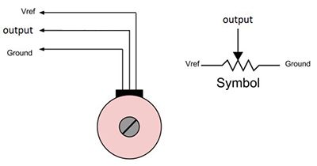
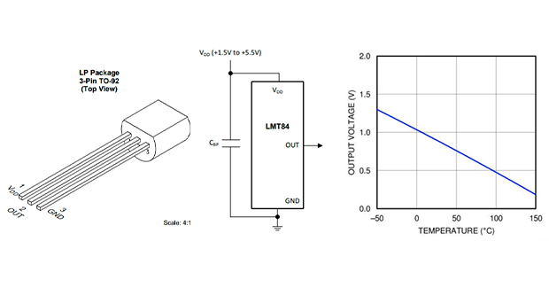
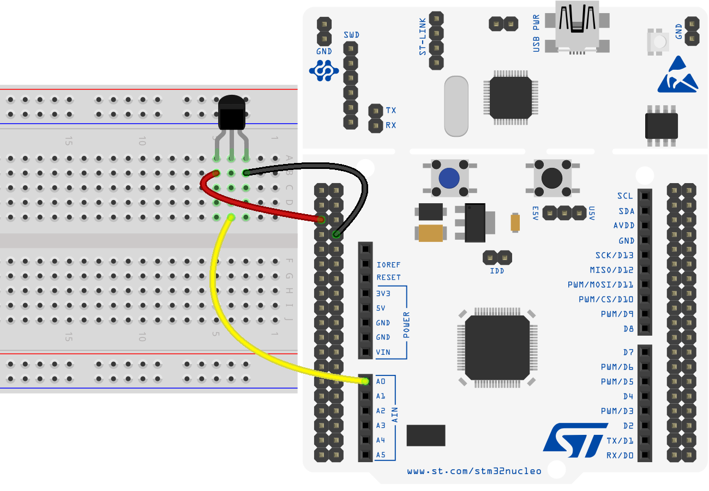

# Esercitazione 6
### I/O Analogico

***
</br>


## Overview
In questa esercitazione, utilizzando la piattaforma **mbed** e l'ambiente di sviluppo **mbed Studio**, si realizzeranno delle applicazioni che mostrano il funzionamento delle periferiche per l'interfacciamento con segnali analogici, che necessariamente devono essere intesi come valori digitali all'interno di un microcontrollore, se si vogliono eseguire delle operazioni algoritmiche con essi.

Con un approccio *top-down*, si utilizzerà infine *STM32Cube* ed il driver **HAL** per realizzare delle operazioni di conversione Analogico-Digitale leggermente più articolate dal punto di vista implementativo.

## Requisiti Teorici

### Analog-to-Digital-Converter (ADC)
È un dispositivo in grado di convertire un segnale analogico, continuo nel tempo, in una serie di valori discreti. Il valore in uscita è determinato a partire dal valore della tensione in ingresso, fissato un valore di tensione di riferimento, secondo la formula

<p align="center">
    
</p>

La *risoluzione* in termini di tensione è determinata a partire dalla risoluzione in bit dell'**ADC**, che definisce i _livelli di quantizzazione_ a disposizione. Sulla MCU della Nucleo-F446RE si ha a disposizione un **ADC** con _risoluzione a 12 bit_, quindi 4096 (= 2¹²) livelli di quantizzazione, che corrispondono a 4096 distinguibili uscite possibili. La tensione di riferimento è pari a 3.3V, conseguentemente la risoluzione in termini di voltaggio è di 0.81mV (= 3.3V/4096).

Dunque, ad esempio, se la tensione in ingresso è pari ad 1V, l'**ADC** genererà un valore digitale in uscita pari a 1250 (1/0.00080) che equivale al numero binario **010011100010** (a 12 bit); mentre per una tensione di ingresso pari a 3V, la conversione in digitale produrrà il valore 3750 (3/0.00080) che equivale al valore binario **111010100110**.

Si noti che, più alta è la risoluzione e minore sarà il numero di conversioni possibili nello stesso arco temporale; in applicazioni in cui non è cruciale la "velocità di risposta", è bene utilizzare la più alta risoluzione possibile.

### **D**igital-to-**A**nalog-**C**onverter (**DAC**)
È un dispositivo che converte un segnale digitale in uno analogico: accetta come un ingresso un valore (generalmente espresso come numero binario) a precisione finita e fornisce in uscita un segnale analogico di tensione determinato come di seguito in base ad un tensione di riferimento:

<p align="center">

</p>

Anche per questo dispositivo è possibile determinare una _risoluzione_ (in bit o in termini di tensione) come per un **ADC** e valgono ragionamenti del tutto equivalenti.

 ### ADC/DAC nei microcontrollori STM32
 
Nei dispositivi *STM32*, la conversione offerta dall **ADC** è fornita da una struttura **SAR** (**S**uccessive **A**pproximation **R**egister) e può operare in diverse modalità: *single mode*, *continuous mode*, *scan mode*. 

Queste modalità, e l'intera struttura, si possono utilizzare in accordo a tre principali logiche, identificate come:
- *polling mode*
- *interrupt mode*
- *DMA mode*

I risultati ottenuti vengono comunque sempre conservati in un registro a 16 bit i cui bit all'interno vengono allineati a sinistra (*left-aligned*) o a destra (*right-aligned*).

È da annoverare inoltre che, generalmente, l'**ADC** implementa delle particolari funzionalità per iniziare la conversione di valori analogici in base al riconoscimento di particolari valori di tensione usati come soglie, definite dal programmatore. 

Il microcontrollore utilizzato in questa esercitazione, fornisce tre **ADC** a 12 bit, che comunicano con l'esterno tramite 16 diversi canali.


Per quanto riguarda il **DAC**, il microcontrollore ne possiede due a 12 bit, utilizzabili anche contemporaneamente. Oltre a questa, altre caratteristiche principali sono: la possibilità di utilizzo a 8, 10 o 12 bit; la possibilità di utilizzare dei *triggers* esterni e la possibilità di gestione tramite **DMA**.

## I/O Analogico con Mbed 

Come per le altre periferiche, anche **ADC** e **DAC** si gestiscono configurando opportunamente dei registri, utilizzando strutture e funzioni esportate dal driver **HAL** o, in maniera più immediata, sfruttando **mbed**: la gestione completa tramite quest'ultima, nasconde al programmatore tutta una serie di configurazioni che sono in genere necessarie per l'utilizzo di un **ADC** o un **DAC**, a partire dalla scelta del clock del sistema per poi proseguire con:
* Abilitazione del clock sulla periferica (**ADC/DAC**)
* Abilitazione del clock e attivazione del **GPIO** che si vuole utilizzare esternare la periferica 
* Configurazione della velocità di acquisizione/generazione tramite settaggio di opportuni prescalari del clock del sistema
* Configurazione di risoluzione, eventuale trigger esterno, utilizzo di *DMA*, etc;

tutto ciò viene interamente gestito dalla stessa libreria **mbed** in maniera decisamente semplificata, in questo contesto la conoscenza delle strutture e funzioni fornite dal driver **HAL** è dunque importante per lo sviluppo di applicazioni che utilizzano le periferiche in maniera più efficace. 

### AnalogIn/AnalogOut
> Use the **AnalogIn** API to read an external voltage applied to an analog input pin. <br/> <br/> Use the **AnalogOut** interface to set the output voltage of an analog output pin specified as a percentage or as an unsigned short.

Probabilmente, la più semplice applicazione per testare il funzionamento di un **DAC** consiste nella generazione di segnali analogici a voltaggio fissato. Per realizzare questa applicazione si utilizza un oggetto di tipo [AnalogOut](https://os.mbed.com/docs/mbed-os/v5.15/apis/analogout.html), inizializzato specificando il pin da utilizzare per l'uscita analogica: sulla scheda utilizzata, uno dei due pin in grado di assolvere a tale scopo è il pin 4 della porta A (**PA_4**).

Il programma principale esegue, nel suo ciclo di vita infinito, i comandi per portare sull'uscita un valore di tensione che varia da 0V a 3V, con 100ms di delay tra valori differenti. Ovviamente, per valutare il corretto funzionamento del **DAC** è necessario connettere il pin **PA_4** ad un oscilloscopio. 
```cpp
#include "mbed.h"

// Define Analog Output
AnalogOut out(PA_4);

int main(){
    float out_val;
    while(1) {
        out = 0.0 / 3.3f; // Generate 0V
        wait(0.1);        // Wait 100ms
        out = 1.0 / 3.3f; // Generate 1V
        wait(0.1);        // Wait 1000ms
        out = 2.0 / 3.3f;  // Generate 2V
        wait(0.1);        // Wait 100ms
        out = 3.0 / 3.3f; // Generate 3V
        wait(0.1);        // Wait 100ms
    }
}
```
Si noti che, dare un valore in questo modo diretto alla variabile `out`, corrisponde ad usare il metodo `write()` illustrato nelle [API di riferimento](https://os.mbed.com/docs/mbed-os/v5.15/mbed-os-api-doxy/classmbed_1_1_analog_out.html#a04593bbcefdddb53406c0943a711f293): il valore in uscita è un valore in percentuale tra 0.0 e 1.0, che corrispondono rispettivamente a 0V e 3.3V.

Una seconda interessante applicazione consiste nella generazione di un'onda a *dente di sega*, con un periodo di 50ms dunque con un delay di 5ms tra ogni step. Anche in questo caso si può fare uso dell'oscilloscopio per valutare l'uscita del **DAC**.
```cpp
#include "mbed.h"

// Define Analog Output
AnalogOut out(PA_4);

int main(){
    float out_val;
    while(1) {
        for(out_val = 0.0f; out_val < 1.0f; out_val += 0.1f) {
            out.write(out_val);   // Set the output voltage, specified as a percentage
            HAL_Delay(5);          // Wait 5ms
        }
    }
}
```
<p align="center">

</p>

Per cominciare ad utilizzare invece  un **ADC** e misurarne la bontà di conversione, si può sfruttare l'esempio precedente di generazione del segnale ma questa volta, invece di un oscilloscopio, si può usare direttamente l'**ADC** presente sulla scheda per acquisire il segnale.
```cpp
#include "mbed.h"

// Define Analog Output
AnalogOut out(PA_4);

// Define Analog Input
AnalogIn in(A0);

int main(){
    float out_val, in_val;
    while(1) {
        for(out_val = 0.0f; out_val < 1.1f; out_val += 0.1f) {
            // Set the output voltage, specified as a percentage
            out.write(out_val);
            // Read the input voltage, represented as a float in the range [0.0, 1.0]
            in_val = in.read();
            // Debug Print
            printf("(out:%.4f) || (in:%.4f) \n", out_val, in_val);
            wait(0.5);          // Wait 500ms
            printf("\033[1A");  // Clear Line
        }
    }
}
```
In questo caso, è possibile valutare i valori che il **DAC** genera in uscita e che l'**ADC** acquisisce in ingresso stampandoli a video sfruttando il modulo ST-Link, che permette l'interfacciamento del PC con la scheda; questo infatti fornisce un'interfaccia di *comunicazione seriale* **UART** che effettua automaticamente il ridirezionamento del canale di output **(stdout)** su una *porta seriale*. Questo flusso di dati è visualizzabile direttamente nell'ambiente di sviluppo di **mbed Studio**. Una spiegazione più dettagliata di tale procedimento comunicativo, tra microcontrollore e PC, sarà fornita nelle successive esercitazioni. 

##

Una volta testato il funzionamento base dell'**ADC**, con questa modalità *loopback*, è possibile connettervi, tramite gli ingressi analogici forniti dalla scheda di sviluppo, periferiche analogiche esterne, come potenziometri o sensori analogici. 


Di seguito un esempio di acquisizione di un potenziometro rotativo, connesso alla scheda come illustrato nell'immagine seguente; l'uscita del potenziometro viene connessa all'ingresso analogico sul pin 0 della porta A (**PA_0**). 

<p align="center">
    
</p>

La connessione si rispetta la logica di base in accordo alla quale funzionano tutti i potenziometri rotativi.

<p align="center">
    
</p>

Anche in questo caso i valori letti vengono mostrati tramite la comunicazione seriale implicita, usando la funzione `printf()`, per effettuare un debug molto più diretto; in questo modo si possono confrontare i due metodi di lettura presenti per gli oggetti di tipo `AnalogIn`.
```cpp
#include "mbed.h"

// Define Analog Input
AnalogIn pot_in(A0);

int main(){
    float pot_val_f;
    uint16_t pot_val;
    while(1) {
        // Read the input voltage, represented as a float in the range [0.0, 1.0]
        pot_val_f = pot_in.read();
        // Read the input voltage, represented as an unsigned short in the range [0x0, 0xFFFF]
        pot_val = pot_in.read_u16();
        // Debug Print
        printf("(Float value: %.4f) || (Unsigned int value: %d)    \n", pot_val_f, pot_val);
        wait(0.5);          // Wait 500ms
        printf("\033[1A");  // Clear Line        
    }
}
```
##

:traffic_light: Un ingresso analogico può essere utilizzato per la lettura dei valori forniti da un sensore, appunto, analogico. Si sceglie come riferimento, per mostrare un primo esempio, un sensore di temperatura della *Texas Instrument*: [LMT84](docs/lmt84.pdf). Tutte le informazioni riguardo il collegamento con la scheda e la trasformazione del segnale di tensione letto in un valore di temperatura, si possono individuare consultando il datasheet del sensore. 

<p align="center">
    
</p>

Il programma esegue un ciclo infinito all'interno del quale legge il valore fornito dall'**ADC** tramite la funzione `read()`, il valore restituito (di tipo *floating-point* e che spazia tra 0.0 e 1.0) viene trasformato in un valore di tensione in *mV* moltiplicandolo per 3300 (che corrisponde alla tensione di riferimento dell'**ADC**: 3.3V = 3300mV). Per effettuare la conversione tra segnale in *mV* valore di temperatura si ricava una formula di trasformazione a partire da quella riportata sul datasheet:

<p align="center">
    
</p>

<p align="center">
    
</p>

Ancora una volta si utilizza la comunicazione seriale implicita fornita dal modulo ST-link per visualizzare i dati acquisiti dal sensore.

```cpp
#include "mbed.h"

AnalogIn analog_in(A1);

int main(){
    
    float meas_in;
    float meas_mv;
    float temp;

    while(1) {
        // Read the analog input value (value from 0.0 to 1.0 = full ADC conversion range)
        meas_in = analog_in.read(); 
        // Converts value in the 0V-3.3V range
        meas_mv = meas_in * 3300; 
        // Convert mV to temperature
        temp = (1035 - meas_mv)/5.50f;
        // Display values
        printf("measure : %f -> %.0f mV \n", meas_in, meas_mv);
        printf("temperature : %f °C\n", temp);

        HAL_Delay(1000); 
        
        // Clear Lines
        printf("\033[1A");
        printf("\033[1A");
    }
}
```

## I/O Analogico con STM32Cube 
Per gestire la periferica dell'**ADC**, in *STM32Cube*, si fa uso del driver **HAL**, che comprende una serie di funzioni e strutture dati molto specifiche, tra cui la seguente:

```c
typedef struct {
ADC_TypeDef         *Instance; // Pointer to ADC descriptor
ADC_InitTypeDef     Init;      // ADC initialization parameters
__IO uint32_t       NbrOfCurrentConversionRank; // ADC number of current conversion rank
DMA_HandleTypeDef   *DMA_Handle;  // Pointer to the DMA Handler
HAL_LockTypeDef     Lock;         // ADC locking object
__IO uint32_t       State;        // ADC communication state
__IO uint32_t       ErrorCode;    // Error code
} ADC_HandleTypeDef;
```

in cui:
- `Instance`: è il puntatore all'istanza di **ADC** da utilizzare, ad esempio `ADC1`:
- `Init`: è una struttura usata per la configurazione dell'**ADC**;
- `NbrOfCurrentConversionRank`: indica il numero del canale correntemente in uso;
- `DMA_Handle`: è un puntatore utilizzato per la gestione dell'**ADC** in *DMA mode*.

Per la configurazione dell'**ADC** si utilizza un'altra struttura, più complessa per numero di campi e loro configurazione, che è la seguente:

```c
typedef struct {
uint32_t ClockPrescaler; // Selects the ADC clock frequency
uint32_t Resolution; // Configures the ADC resolution mode
uint32_t ScanConvMode; // The scan sequence direction.
uint32_t ContinuousConvMode; // Specifies whether the conversion is performed in
Continuous or Single mode
uint32_t DataAlign; // Specifies whether the ADC data alignment
is left or right
uint32_t NbrOfConversion; // Specifies the number of input that will be converted
within the regular group sequencer
uint32_t NbrOfDiscConversion; // Specifies the number of discontinuous conversions in
which the main sequence of regular group
uint32_t DiscontinuousConvMode; // Specifies whether the conversion sequence of regular
group is performed in Complete-sequence/Discontinuous
sequence
uint32_t ExternalTrigConv; // Select the external event used to trigger the start
of conversion
uint32_t ExternalTrigConvEdge; // Select the external trigger edge and enable it
uint32_t DMAContinuousRequests; // Specifies whether the DMA requests are performed in
one shot or in continuous mode
uint32_t EOCSelection; // Specifies what EOC (End Of Conversion) flag is used
for conversion polling and interruption
} ADC_InitTypeDef;
```
in cui i campi fondamentali sono:
- `ClockPrescaler`: definisce la velocità di clock per il circuito analogico che fa parte dell'**ADC** (**ADCCLK**). Il clock si genera facendo uso anche di un *prescalar*, che permette all'**ADC** di lavorare a **fPLCK/2, /4, /6, /8**.
- `Resolution`: permette la scelta della risoluzione dell'**ADC**, il valori possibili sono generalmente: `ADC_RESOLUTION_12B`, `ADC_RESOLUTION_10B`, `ADC_RESOLUTION_8B` e `ADC_RESOLUTION_6B`; che rappresentano ovviamente le risoluzioni possibili in termini di bit, da 12 a 6. 
- `ScanConvMode` e `ContinuousConvMode`: permetteono di gestire le diverse modalità di conversione come *scan mode*, *single mode* e *continuous mode*.
- `NbrOfConversion`: specifica il numero di canali da utilizzare in *scan mode*.
- `DataAlign`: viene utilizzato per effettuare un allineamento dei bit memorizzati a seguito della conversione; può assumere valori `ADC_DATAALIGN_LEFT` o `ADC_DATAALIGN_RIGHT`.
- `ExternalTrigConvEdge`: si usa per selezionare la sorgente esterna in base alla quale far partire una conversione.

Noti i diversi metodi di conversione possibili ed il loro funzionamento, è possibile analizzare la struttura che gestisce la configurazione dei canali e successivamente implementare dei metodi per utilizzo dell'**ADC**, sia in *polling* sia in *interrupt mode*.
```c
typedef struct {
uint32_t Channel; // Specifies the channel to configure into ADC rank
uint32_t Rank;    // Specifies the rank ID
uint32_t SamplingTime; // Sampling time value for the selected channel
uint32_t Offset; // Reserved for future use, can be set to 0
} ADC_ChannelConfTypeDef;
```
in questa struttura:
- `Channel`: può assumere valori da `ADC_CHANNEL_0` a `ADC_CHANNEL_N`, con *N* che indica il numero di canali disponibili.
- `Rank`: può assumere valori da 0 a 16 e corrisponde ai *rank* associati al canale.
- `SamplingTime`: il valore da inserire in questo campo viene spesso scelto tra un set di valori possibili che lo stesso ambiente di sviluppo propone, in quanto valori specifici della *MCU* utilizzata.

Per informazioni più approfondite su strutture dati e metodi esportati dal driver **HAL** per la gestione dell'**ADC** fare riferimento alla [documentazione ufficiale](https://www.st.com/resource/en/user_manual/dm00105879-description-of-stm32f4-hal-and-ll-drivers-stmicroelectronics.pdf).

Di seguito si farà uso di due diverse logiche di implementazione per leggere la temperatura fornita da un sensore di temperatura analogico, come già fatto utilizzando esclusivamente utilizzando piattaforma **mbed**.

### Polling Mode
Per utilizzare l'**ADC** in modalità *polling*, oltre che delle strutture presentate e delle funzioni principali come `HAL_ADC_Start()` e `HAL_ADC_Stop()`, si fa uso della funzione
```c
HAL_StatusTypeDef HAL_ADC_PollForConversion(ADC_HandleTypeDef* hadc, uint32_t Timeout);
```
per determinare quando una conversione è completa ed il risultato disponibile. Per utilizzare questa funzione si usa un puntatore ad una struttura `ADC_Handle` e un valore numerico che rappresenta il massimo tempo (in millisecondi) da attendere.

Una volta terminata la conversione si può prelevare il valore convertito utilizzando il metodo:
```c
uint32_t HAL_ADC_GetValue(ADC_HandleTypeDef* hadc);
```

Per la configurazione dell'**ADC** si farà uso degli strumenti forniti da *STM32CubeMX*, configurando il canale 0 dell'**ADC** come mostrato in figura:


Con l'ausilio di questo ambiente di sviluppo, viene generato in maniera automatica il codice necessario alla configurazione della struttura `ADC_HandleTypeDef`. È importante però comprendere sia la configurazione impostata sia il relativo codice generato.

Oltre al prescalare del clock e la risoluzione impostata al massimo, viene disabilitata la *scan mode* e abilitata la modalità di conversione continua -*continuos mode*- in modo che la conversione avvenga di continuo, senza interruzioni e si possa mettere in pratica il meccanismo del *polling*. Anche per questo motivo è importante configurare la flag *EOC* su `ADC_EOC_SEQ_CONV`.

Queste configurazioni si ritroveranno nel metodo `void MX_ADC1_Init(void)`, realizzate come di seguito:
```c
hadc1.Instance = ADC1;
hadc1.Init.ClockPrescaler = ADC_CLOCK_SYNC_PCLK_DIV4;
hadc1.Init.Resolution = ADC_RESOLUTION_12B;
hadc1.Init.ScanConvMode = DISABLE;
hadc1.Init.ContinuousConvMode = ENABLE;
hadc1.Init.DiscontinuousConvMode = DISABLE;
hadc1.Init.ExternalTrigConvEdge = ADC_EXTERNALTRIGCONVEDGE_NONE;
hadc1.Init.ExternalTrigConv = ADC_SOFTWARE_START;
hadc1.Init.DataAlign = ADC_DATAALIGN_RIGHT;
hadc1.Init.NbrOfConversion = 1;
hadc1.Init.DMAContinuousRequests = DISABLE;
hadc1.Init.EOCSelection = ADC_EOC_SEQ_CONV;
```

Finita questa prima configurazione è possibile connettere il sensore di temperatura (come già illustrato) ed implementare il codice nel ciclo di vita principale del programma, che si occupa di invocare le funzioni necessaria a comandare una conversione all'**ADC** e prelevare i valori digitali convertiti. Questi possono essere valutati, per il momento, grazie all'interfaccia di *debug*. 

La logica con cui si implementa il ciclo di vita principale sarà la stessa di quella mostrata nell'esempio svolto utilizzando la piattaforma **mbed**.


### Interrupt Mode
Dal punto di vista logico, la conversione in *interrupt mode* non è molto differente da quella appena mostrata. Cambia però l'intera logica con cui si progetta il software, infatti in questo caso si fa uso di specifiche **ISR** per comandare la conversione dell'**ADC** e si eviteranno processi di *polling*.

Come anche per altre periferiche gestite dal driver **HAL**, si farà uso delle funzioni che gestiscono le richieste di **interrupt**, in questo caso facendo attenzione a non cambiare il nome della **ISR** associata all'**ADC**, come riportato nelle librerie **HAL**: `ADC_IRQHandler`.

Tra le funzioni principali per gestire le **ISR** vi sono:
```c
HAL_ADC_IRQHandler();
...
HAL_ADC_ConvCpltCallback();
```
la prima gestisce le richieste di **interrupt**, la seconda è automaticamente invocata quando la conversione finisce.

Oltre a queste, si fa uso di 
```c
HAL_ADC_Start_IT()
```
che abilita l'**ADC** a funzionare in *interrupt mode*, facendo partire il processo di conversione.

Con questa logica, il `main()` potrebbe semplificarsi di molto e diventare, ad esempio, simile a quanto riportato di seguito:
```c
int main(void) {
    HAL_Init();

    MX_ADC1_Init(); // ADC Initialization

    /* ADC Interrupt Configuration */
    NVIC_SetPriority(ADC_IRQn, 0);
    NVIC_EnableIRQ(ADC_IRQn);
    HAL_ADC_Start_IT(&hadc1);
    
    while (1){
        ;
    }
}
```

La gestione dei valori convertiti dall'**ADC** viene effettuata all'interno del metodo `HAL_ADC_ConvCpltCallback()`, che è invocato automaticamente e deve essere implementato prendendo come argomento il puntatore ad una struttura `ADC_HandleTypeDef` che contiene le informazioni di configurazione dello specifico **ADC** che si sta utilizzando.

Per quanto riguarda le configurazioni delle principali strutture, si fa uso, come fatto in precedenza, di *STM32CubeMX*, che genererà automaticamente il codice a seguito di una fase di configurazione grafica.


</br> </br>

## Esercizi

:pencil: Utilizzare un potenziometro per gestire il lampeggiamento di un LED.

Utilizzando i valori letti dal potenziometro, il *flashing rate* del LED deve variare tra 0 secondi e un 1 secondo, nel caso di valore pari a 0.0 il LED deve spegnersi. Il sistema viene gestito dalla pressione di un pulsante (**USER_BUTTON** o pulsante esterno) che abilita/disabilita l'utilizzo del valore letto dal potenziometro per gestire il lampeggiare del LED: dopo l'avvio del programma, premendo il pulsante si disabilita la lettura dal potenziometro ed il LED continua a lampeggiare con un *rate* pari all'ultimo valore letto in ingresso; ri-premendo il pulsante si ripristina il funzionamento iniziale, con il potenziometro si può nuovamente gestire il lampeggiare del LED. 

L'applicazione si può implementare anche in *STM32Cube*, facendo uno del driver **HAL** per la gestione dell'**ADC** che legge dal potenziometro.


:pencil: Sfruttare **ADC** e **DAC** per simulare la gestione di un sistema di monitoraggio di temperatura, molto semplificato, implementando il tutto con la piattaforma **Mbed**.

Il programma legge, anche in *polling*, il valore di temperatura fornito da un sensore analogico e controlla ciclicamente se il valore letto supera una determinata soglia (scelta in maniera adeguata vista l'applicazione); se la soglia viene superata si interrompe la fase di lettura per passare ad una fase di generazione di un segnale analogico costante (pari a 1.5V) per 10 secondi, durante la quale si può accendere un LED rosso di segnalazione.

Per controllare la corretta generazione del segnale è possibile utilizzare un altro ingresso analogico, sul quale viene collegata l'uscita del **DAC** ed il valore letto viene stampato sullo schermo. Passati i 10 secondi, il programma ricomincia a leggere e controllare il valore di temperatura come fatto inizialmente. Si suppone che nell'arco di 10 secondi la temperatura non sia più superiore alla soglia: si lascia alla fantasia l'immaginare un qualche stratagemma che, nell'arco di quei 10 secondi, raffreddi il sensore. Per rendere l'esercizio più completo si potrebbe infine aggiungere una modulazione del segnale analogico generato tramite un potenziometro. 

Si noti che, ovviamente, questo ha solo lo scopo di essere un esercizio per prendere familiarità con i sensori analogici e le uscite del **DAC**, non ha la pretesa di essere un vero sistema di monitoraggio e gestione della temperatura.

</br>

:question: Quale valore avrà l'intero `x` per un valore di ingresso tra 1.5V e 2.5V campionato usando un oggetto `AnalogIn` della libreria mbed?
```c
#include "mbed.h"
AnalogIn A_in(p20);

int main(){
    int x = A_in.read_u16();
}
```

:question: Se per un **DAC** a 7 bit la tensione di riferimento è 2.56V, qual è la sua risoluzione in termini di voltaggio?

:interrobang: Descrivere brevemente il funzionamento di un **ADC** ad approssimazioni successive (*SAR*).

:question: Come funziona l'*Analog Watchdog* e in quale registro si trovano i campi di configurazione? Come ad esempio il campo *analog watchdog channel selection*.
##
</br></br></br>
:round_pushpin:Per chi non disponesse di un sensore di temperature come LMT84, LM35 o simili, può fare uso di un *termistore* NTC (ad esempio è quello incluso nel kit di componenti consigliato per l'esercitazione).

I *termistori* sono dei resistori particolari che variano la propria resistenza in base alla temperatura a cui sono sottoposti. Quelli di tipo NTC abbassano la propria resistenza all’aumentare della temperatura, mentre quelli PTC la aumentano. 

Purtroppo questi componenti non hanno una caratteristica totalmente lineare, quindi non basta una semplice proporzione per conoscere la loro temperatura (a partire dalla resistenza), ma si deve disporre di alcuni parametri ed utilizzare alcune specifiche equazioni.

Per un *termistore* NTC classico di tipo MF52 (generalmente usato nei semplici esempi per Arduino) il [datasheet](docs/mf52.pdf) è riportato nella sottocartella docs; in questo documento si ritrovano i valori principali da utilizzare nella formula seguente (derivata da riformulazioni e adattamenti della formula di *Steinhart-Hart*):

<p align="center">

</p>

In questa formula, oltre a parametri specifici del *termistore*, riportati anche di seguito, bisogna utilizzare il valore della resistenza messa in serie al *termistore*, preferibilmente si sceglie da 10KΩ; questa è infatti utilizzata insieme nella formula del partitore di tensione per calcolare il valore della resistenza del termistore, a partire della misure dell'**ADC**. In questo infatti caso non c'è un legame tra temperatura e voltaggio, ma tra temperatura e resistenza.

Le variabili da utilizzare sono:
```c
#define R_S 10000    // Resistenza in Serie al termistore
#define R25 10000    // Resistenza di riferimento
#define T0 25+273.15 // Temperatura di riferimento
#define B 3950       // Parametro B del termistore
```
e per estrarre la temperatura si può utilizzare quindi questo codice (usando la piattaforma **mbed**):
```c
int main(){
    
    float meas_in;
    double v_in;
    float temp;
    float R_thermistor;
    float S_H;

    while(1) {
        // Read the analog input value (value from 0.0 to 1.0 = full ADC conversion range)
        meas_in = analog_in.read(); 
        // Converts value in the 0V-3.3V range (3.3V = 3300mV)
        v_in = (meas_in*3300);
        // Calculate Thermistor Resistance (using Voltage divider formula)
        R_thermistor = (R_S)/((3300/v_in)-1);
        // Steinhart-Hart
        S_H = 1.0/(T0) + (1.0/B)*log(R_thermistor/R25);
        S_H = 1/S_H;
        // Kelvin -> Celsius
        temp = S_H-273.15;
        // Pause
        HAL_Delay(1000);
    }
}
```
Il circuito da utilizzare per integrare un *termistore* NTC è quello mostrato di seguito; si noti che la resistenza da 10KΩ ed il termistore sono connessi in *serie*.

<p align="center">
 
</p>