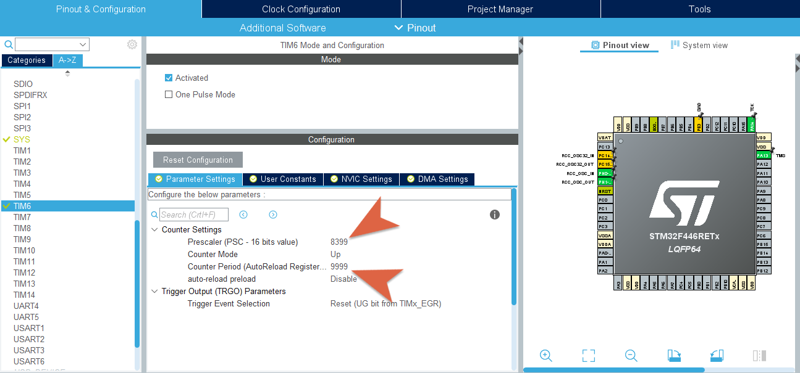
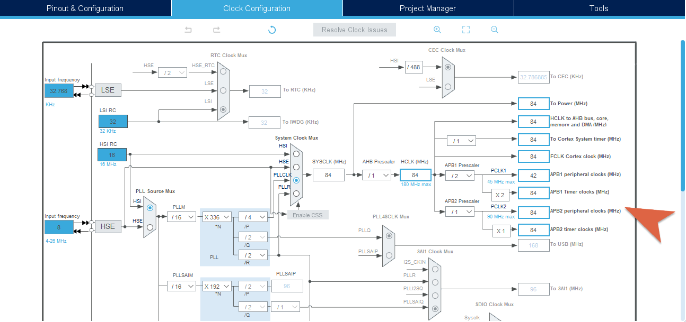
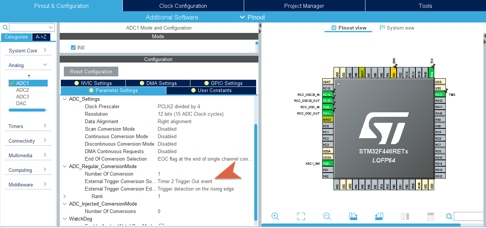
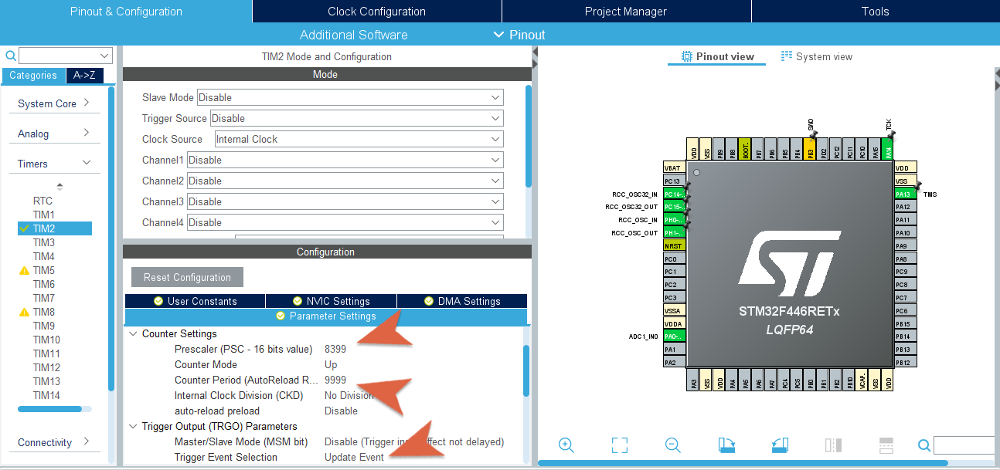
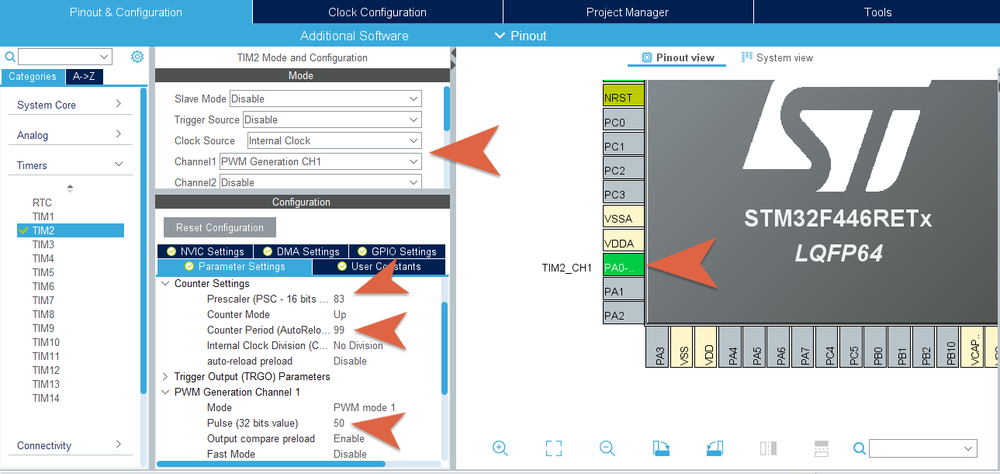

# Esercitazione 7
### Timers e PWM

***
</br>


## Overview
In questa esercitazione, una successione di esempi ed esercizi faranno da compendio per l'utilizzo di **timers** e segnali **PWM**. Si comincerà con l'illustrare il funzionamento in *STM32Cube*, per poi arrivare infine ad applicazioni realizzate con la piattaforma **mbed**.

## Timers

### Requisiti Teorici
Molte volte nello sviluppo di un programma è necessario, per svariati motivi, introdurre delle *attese*. Farlo con le funzioni come `HAL_Delay()` è molto semplice ed immediato ma una funzione di questo tipo è *bloccante* per il microcontrollore.

Nella maggior parte del sistemi embedded è richiesta molta precisione per la gestione del tempo e spesso fornire una risposta immediata rispetto ad un determinato evento è cruciale. Un'attesa che faccia "perdere tempo" alla CPU non è opportuna ed ecco perché tutti i microcontrollori forniscono delle *periferiche hardware dedicate* per la gestione del tempo: i **Timers**.

Un **timer**, come periferica hardware, è un contatore che effettua le sue operazioni di *conteggio* con una frequenza che è in qualche modo legata a quella fornita da un *clock* sorgente, interno o esterno al microcontrollore. Questo conteggio viene effettuato incrementando (o decrementando) il valore contenuto in opportuni registri fino al determinarsi di una situazione di *overflow*, che provoca una **interrupt**. Il valore massimo oltre il quale si verifica l'*overflow* dipende dalla risoluzione del **timer** (ad esempio, per un **timer** con risoluzione 16 bit il valore massimo è 65535). 

Le componenti principali che permettono il funzionamento di un **timer** sono:
- Un *prescalar*;
- Un registro all'interno del quale conservare il valore attuale del **timer**: *timer register*;
- Un registro che prende in carico il valore del *timer register* all'occorrenza di particolari eventi: *capture register*;
- Un registro che contiene un valore che viene periodicamente comparato con il valore del *timer register*: il *compare register*.

Grazie a questi è possibile gestire, anche con meccanismo di **interrupts**, i **timers**, utilizzandoli in diverse modalità.

### Timers nei microcontrollori STM32

Nel microcontrollore STM32F466RE si possono utilizzare fino a 17 **timers**, come riportato nel datasheet:
> 2x watchdog, 1x SysTick timer and up to twelve 16-bit and two 32-bit timers up to 180 MHz.
<p>


Come per gli altri microcontrollori della famiglia STM32, questi sono suddivisi logicamente come riportato di seguito
* *Advanced-Control Timers* : TIM1, TIM8 (16 bit)
* *General-Purpose Timers* : TIM2, TIM5 (32 bit) | TIM3, TIM4, TIM9-TIM14 (16 bit)
* *Basic-Configuration Timers* : TIM6, TIM7 (16 bit)

In base alla sua tipologia, un **timer** può essere utilizzato in diverse *modalità*, le principali sono: *compare mode*, *capture mode*, e *PWM mode*. Queste permettono di utilizzare un **timer** non solo per svolgere funzioni da contatore ma per realizzare funzionalità più complesse e, come già specificato, per realizzare queste modalità si farà uso delle componenti interne e dei registri principali che compongono un **timer**. È da tenere in considerazione che si può utilizzare un *general purpose timer* per assolvere agli stessi scopi di un *basic timer*, ma non vale il contrario.
</p>

Una descrizione accurata delle caratteristiche dei **timers** presenti nel microcontrollore da utilizzare, si ritrova su [datasheet](https://www.st.com/resource/en/datasheet/stm32f446mc.pdf) e [reference manual](https://www.st.com/resource/en/reference_manual/dm00135183-stm32f446xx-advanced-arm-based-32-bit-mcus-stmicroelectronics.pdf); di seguito è riportata una tabella che schematizza le principali caratteristiche.

<p align="center">
    
</p>

Ogni tipo di **timers** deve essere utilizzato opportunamente tenendo conto delle sue capacità e delle sue caratteristiche; anche in un ambiente di sviluppo come *STM32Cube*, utilizzando i costrutti forniti dal driver **HAL**, ci sarà bisogno di fare riferimento a funzioni e strutture diverse per utilizzare i diversi tipi di **timers**.

## Utilizzo dei Timers in STM32Cube

### :alarm_clock: Basic Timers
> The basic timers **TIM6** and **TIM7** consist of a 16-bit auto-reload counter driven by a programmable prescaler.</br>
They may be used as generic timers for time-base generation but they are also specifically used to drive the digital-to-analog converter (DAC).

Nota la teoria di funzionamento di un **timer** di questo tipo, è possibile metterlo in funzione in maniera adeguata utilizzando la libreria **HAL**, facendo riferimento alle funzioni del tipo `HAL_TIM_Base_xxx` e ad una serie di strutture, come le seguenti:
```c
typedef struct {
TIM_TypeDef                 *Instance; // Pointer to timer descriptor 
TIM_Base_InitTypeDef        Init;      // TIM Time Base required parameters
HAL_TIM_ActiveChannel       Channel;   // Active channel 
DMA_*HandleTypeDef           *hdma[7];  // DMA Handlers array 
HAL_LockTypeDef             Lock;      // Locking object 
__IO HAL_TIM_StateTypeDef   State;     // TIM operation state 
} TIM_HandleTypeDef;
```
```c
typedef struct {
uint32_t Prescaler;      //Specifies the prescaler value used to divide the TIM clock.
uint32_t CounterMode;    //Specifies the counter mode.
uint32_t Period;         //Specifies the period value to be loaded into the active Auto-Reload Register at the next update event.
uint32_t ClockDivision;  //Specifies the clock division.
uint32_t RepetitionCounter;  //Specifies the repetition counter value.
} TIM_Base_InitTypeDef;
```
per le quali è possibile reperire una descrizione accurata nel [manuale descrittivo del driver **HAL**](https://www.st.com/resource/en/user_manual/dm00105879-description-of-stm32f4-hal-and-ll-drivers-stmicroelectronics.pdf). Queste sono le strutture fondamentali usate per tutti i tipi di **timers**, da quelli *base* a quelli *avanzati*, per realizzare le basilari funzionalità di conteggio.

Tra i campi più rilevanti della struttura `TIM_Base_InitTypeDef` vi sono il campo `CounterMode` (che specifica la modalità ed il "verso" con cui si esegue il conteggio) ed i campi `Prescalar` e `Period` (cruciali per definire un **timer** che funzioni come desiderato); questi ultimi devono essere configurati in accordo alla seguente formula, per poter gestire gli *overflow* del timer, quindi l'occorrenza di quelli che sono in genere chiamati *update event*:

<p align="center">
    
</p>

Partendo dal valore noto della frequenza di clock del sistema, è possibile fissare gli altri due valori per ottenere un *update event* pari al valore di frequenza desiderata per l'evento legato al **timer**.

Un primo semplice esempio si può realizzare in *STM32Cube* facendo lampeggiare un LED utilizzando il **timer** TIM6: si fa uso di *STM32CubeMX* per configurare il **timer** e successivamente si utilizzano delle funzioni esportate dalla libreria **HAL** per gestire il **timer** con un meccanismo ad *interrupt*.

TIM6 è un **timer** base e non si esterna su alcun pin; la sua configurazione passa solo per l'impostazione dei campi che definiranno le strutture indicate sopra; i campi principali sono *prescalar* e *period*. Per configurarli opportunamente, ricordandosi della formula scritta in alto, si può dividere la frequenza di clock per un valore tale da ottenere un prescalare minore di 65535 e poi gestire il valore del periodo per ottenere l'*update event* desiderato.

Per un clock a 84Mhz, è possibile individuare come valore di *prescalar* 8399 (= 84000000/10000) e come *period* 9999, quest'ultimo è selezionato in modo da ottenere 1Hz come *update event*.

<p align="center">
    
</p>

Dopo aver imposto questi parametri in *STM32CubeMX* ed aver generato il codice, si fa uso delle funzioni: 
```c
HAL_TIM_Base_Init(&htim6);     // Configure the TIMER
HAL_TIM_Base_Start_IT(&htim6); // Start the TIMER
```
per far partire il **timer** in modalità *interrupt*. 

A questo punto la sua gestione si effettua tramite la **ISR** che deve avere il nome `TIM6_IRQHandler()`. Allo scattare di questa **ISR** (quando il **timer** va in *overflow*) si invoca la funzione `HAL_TIM_IRQHandler()`, che automaticamente gestisce l'evento e invoca `HAL_TIM_PeriodElapsedCallback()`. All'interno di quest'ultima verrà propriamente gestito l'evento e, per lo scopo di questo esempio, cambiato lo stato del LED (connesso per comodità su PA_5).

```c
void TIM6_IRQHandler(void) {
	HAL_TIM_IRQHandler(&htim6);
}

void HAL_TIM_PeriodElapsedCallback(TIM_HandleTypeDef *htim) {
	if(htim->Instance == TIM6){
		GPIOA->ODR ^= (0x1 << 5);
	}
}
```

Si può analizzare il codice auto generato per valutare come viene gestita la struttura principale `TIM_HandleTypeDef`, per attuare delle modifiche si può mettere mano al codice che si trova nella funzione `MX_TIM6_Init()`.

</br>

Si riporta, come ulteriore esempio, il calcolo per determinare un *update event* di 2Hz. Fissando il valore del clock a 84Mhz ed il *prescalar* (come in precedenza) a 8399, si utilizza questa formula inversa:
<p align="center">

</p>

ottenendo un valore di *period* pari a 4999 ed in definitiva l'*update event* di 2Hz (500ms) desiderato. Ovviamente si deve prestare attenzione al fatto che il clock deve essere configurato a 84MHz, affinché i calcoli effettuati siano sensati; si può quindi analizzare la finestra di *Clock Configuration* per ricavare tale informazione.

<p align="center">
    
</p>

### :watch: General Timers
> The general-purpose timers consist of a 16-bit or 32-bit auto-reload counter driven by a programmable prescaler.</br>
They may be used for a variety of purposes, including measuring the pulse lengths of input signals (input capture) or generating output waveforms (output compare and **PWM**).

La maggior parte dei **timers** sono di tipo *geneal purpose*; rispetto a quelli "di base", offrono molte più funzionalità e capacità di interazione. Sono infatti usati, ad esempio, per la generazione di particolari segnali (**PWM**) ed il microcontrollore offre 4 canali indipendenti dedicati a l'interfacciamento di questi **timers** con periferiche esterne.

<p align="center">
    
</p>

Valutando questo schema, riportato nella documentazione del microcontrollore, è possibile valutare come intervengano, per l'utilizzo di questa tipologia di **timers**, una serie di segnali legati al clock oppure a segnali di *trigger* (interni o esterni).

È importante anche notare che questi **timers** possono essere gestiti con dei segnali di clock esterni al microcontrollore; nel driver **HAL** è presente infatti una struttura che serve proprio a comandare tale specifica.

```c
typedef struct {
uint32_t ClockSource;       // TIM clock sources
uint32_t ClockPolarity;     // TIM clock polarity
uint32_t ClockPrescaler;    // TIM clock prescaler
uint32_t ClockFilter;       // TIM clock filter
} TIM_ClockConfigTypeDef;
```
e vi sono anche una serie di costanti, già definite, che permettono di configurare ognuno di questi campi.

Queste funzionalità permettono un avanzato utilizzo dei **timers** in accordo a meccanismi di tipo *master/slave*.

Inoltre, questi **timers** possono essere anche utilizzati come *trigger* per la periferica **ADC**; di seguito viene mostrato infatti l'utilizzo del **TIM2** per gestire le conversioni dell'**ADC**; per farlo si utilizzano, in maniera equivalente a quanto riportato per i *basic timers*, alcune strutture e funzioni definite nella libreria **HAL** (come `TIM_HandleTypeDef`, descritta in precedenza).

Anche in questo caso si sfrutta la funzionalità di generazione del codice di *STM32CubeMX* configurando separatamente il **timer** 2 (`TIM2`) e la periferica **ADC** (`ADC1`).

<p align="center">
    
</p>

<p align="center">
    
</p>

Nelle immagini sono riportati i campi principali che vengono modificati per implementare il seguente esempio: si utilizzerà l'**ADC** per acquisire valori da un sensore di temperatura e la conversione sarà comandata da un *trigger* esterno, cioè lo "scattare" del **timer due**.

Il sensore di temperatura viene connesso al canale 0 dell'**ADC**, come già mostrato nell'esercitazione precedente, e la conversione dei valori di tensione acquisiti in valori di temperatura viene effettuata con la formula ricavata dalle informazioni presenti sul datasheet del sensore utilizzato (*Texas Instrument* LMT84).

La logica di funzionamento dell'**ADC** farà uso del meccanismo delle *interrupts* come già mostrato, in questo però caso la **ISR** scatterà all'occorrenza del *update event* del **timer due** con una frequenza di 1Hz.

## Utilizzo dei Timers in mbed
Nella sua essenza logica, il criterio con cui si utilizzano i **timers** con la piattaforma **mbed** è diverso rispetto a quanto mostrato finora. 

Questa piattaforma mette a disposizione infatti 3 diversi oggetti che, come mostrato di seguito, si possono utilizzare per realizzare le principali modalità di funzionamento di un **timer**; che sono sufficienti per applicazioni non troppo specifiche.

### Timer
> Use the **Timer** interface to create, start, stop and read a timer for measuring precise times (better than millisecond precision). You can independently create, start and stop any number of **Timer** objects.

Utilizzare un oggetto [Timer](https://os.mbed.com/docs/mbed-os/v5.15/apis/timer.html) è molto semplice; nell'esempio seguente si sfrutta questo oggetto per realizzare il lampeggiamento di un LED con una frequenza di 5Hz. Da un'altro punto di vista, si sta generando un'onda quadra di periodo 400ms.

```cpp
#include "mbed.h"

// Define Output
DigitalOut output(PA_5); 
// Define Timers
Timer timer; 

void task(void){
    // Toggle output
    output = !output;
}

int main() {
    timer.start(); // Start timer counting
    while(1) {
        if (timer.read_ms() >= 200){
            task();
            timer.reset(); // Reset timer
        }
    }
}
```
In questo modo è possibile utilizzare un **timer** per tener traccia del "passare del tempo" in maniera molto precisa, grazie ad alcune funzioni come `start()`, `stop()`, `read()` o `read_ms`, `reset()`. 

Evidentemente, in questo contesto probabilmente si fa uso di un *basic timer*, anche se non viene scelto in maniera esplicita in fase di programmazione.

Di seguito è mostrato l'utilizzo congiunto di **timer** e **interrupt**, realizzando meccanismo di *software-debouncing* che gestisce la pressione del pulsante che comanda il cambio di stato di un LED. 

In questo caso, il **timer** si sostituisce in qualche modo a quella che sarebbe stata una funzione di attesa, ad esempio `HAL_Delay(200)`.
```cpp
#include "mbed.h"

// Define Interrupt Inputs
InterruptIn button(USER_BUTTON); 
// Define Led Output
DigitalOut led(LED1); 
// Define Timer for debouncing
Timer debounce; 

void toggle_ISR() {
    if (debounce.read_ms()>200)
        led=!led; 
    debounce.reset(); // Reset Timer
}

int main() {
    __enable_irq();
    
    debounce.start(); // Start Timer
    button.fall(&toggle_ISR); // Callback on Falling Edge 
    
    while(1){
        __WFI(); // Wait-For-Interrupt
    }
}
```
### Timeout

> Use the **Timeout** interface to set up an interrupt to call a function after a specified delay.

Un uso più avanzato del meccanismo delle *interrupts* con i **timers** si ottiene con l'ultilizzo di oggetti [Timeout](https://os.mbed.com/docs/mbed-os/v5.15/apis/timeout.html); questi permettono di invocare una **ISR** dopo uno specificato delay, evitando meccanismi di polling. Si utilizza quindi il **timer** in *interrupt mode*, come mostrato negli esempi in STM32Cube.

```cpp
#include "mbed.h"

// Define Timout Object
Timeout response; 
// Define Button
DigitalIn button(USER_BUTTON);
// Define Leds
DigitalOut led1(LED1); // Internal

void blink_ISR(){ 
    led1 = 1;
    HAL_Delay(500);
    led1=0;
}

int main() {
    
    while(1) {
        if(button.read() == 0){        
            /* Attach blink_ISR function to response Timeout, to occur after 2 seconds*/
            response.attach(&blink_ISR, 2.0); 
        }
    }
}
```
In questo esempio, dopo due secondi dalla pressione del pulsante, il LED lampeggia una volta. È un esempio che ha il solo scopo di illustrare l'utilizzo di un oggetto **Timeout**.

### Ticker

> Use the **Ticker** interface to set up a recurring interrupt; it calls a function repeatedly and at a specified rate.

Secondo metodo per utilizzare in una modalità *interrupt* i **timers** è utilizzare un oggetto [Ticker](https://os.mbed.com/docs/mbed-os/v5.15/apis/ticker.html):
```cpp
#include"mbed.h"

// Define Ticker
Ticker time_up; 
// Define Led
DigitalOut led(LED1);

void led_switch_ISR(){
    led = !led;
}

int main(){
    time_up.attach(&led_switch_ISR, 0.2);
    
    while(1){ 
        ; // Keep Alive
    }
}
```
Nell'esempio mostrato, è possibile far scattare una *interrupt* in maniera ricorrente, ogni 200 ms. L'esempio mostrato realizza il lampeggiamento del LED che si trova sulla scheda, ma si intuisce che, un oggetto di questo tipo potrebbe essere usato per comandare anche le conversioni di un **ADC** con la frequenza desiderata. 

Questo oggetto **Ticker** può viene utilizzato per effettuare la lettura da un sensore analogico, con una frequenza fissata, ad esempio ogni 500ms. Utilizzando il solito sensore di temperatura, si implementa un funzionamento equivalente a quello mostrato in *STM32Cube* precedentemente.

Con l'utilizzo dell'oggetto **Ticker** si crea una **ISR** ricorrente, che viene invocata automaticamente ogni 500ms; in questa funzione si cambia solo il valore di una variabile booleana usata come flag nel codice principale del programma.

```c
int main(){
    __enable_irq();
    
    // ADC/Timer Interrupt - 500 ms
    adc_timer.attach(&lmt84_read, 0.5);

    debounce.start(); // Start Debouncing-Timer
    button.fall(&button_pressed_callback); // Button rising-edge interrupt

    while(1) {
        if(adc_read_flag){
            // Read the analog input value (value from 0.0 to 1.0 = full ADC conversion range)
            raw_in = lmt84.read(); 
            // Converts value in the 0V-3.3V range
            lmt84_mv = raw_in * 3300; 
            // Convert mV to temperature
            temp = (1035 - lmt84_mv)/5.50f;
            // Reset Flag
            adc_read_flag = false;
        }else{
            __WFI(); // Wait-For-Interrupt 
        }
    }   
```

Ovviamente è possibile, mentre il microcontrollore esegue queste operazioni, intercettare **interrupts** provenienti da altri componenti. Come esempio, si abilita un pulsante con **interrupt** e si fa in modo che, alla pressione del pulsante, l'acquisizione dell'**ADC** venga sospesa per qualche secondo.

:warning: Nelle ultime versioni della piattaforma **mbed** non è possibile invocare la lettura da **ADC** all'interno di una **ISR**. Questa operazione viene impedita in quanto una funzione di `read()` potrebbe essere bloccante se vi sono problemi di tipo hardware.
</br></br>

## **P**ulse **W**idth **M**odulation (**PWM**)
Tramite un **DAC** è ovviamente possibile generare in uscita qualsiasi tipo di segnale analogico ma, ad oggi, il modo più efficace per la generazione di una forma d'onda rettangolare è sicuramente la **modulazione di larghezza di impulso** (**PWM**). Il controllo, in termini di tensione o corrente, con questo tipo di modulazione si usa in moltissime applicazioni, dalle telecomunicazioni al controllo automatico.

Fondamentalmente, una modulazione di larghezza di impulso, opera sulla variazione, entro il periodo dell'onda, della durata dell'impulso alto (o tempo di *on*) e conseguentemente sulla durata dell'impulso basso (o tempo di *off*).

La proporzione tra il tempo di *on* e l'intero periodo **T** è detto **duty cycle**, ed è un concetto fondamentale per lavorare con il **PWM**: **duty cycle** del 100% significa che il segnale è continuo (sempre alto), mentre 0% significa che il segnale è basso in ogni periodo.

<p align="center">
    
</p>
<p align="center">
    
</p>

Legato al **duty cycle** è il **valore medio** del segnale che viene generato, che ovviamente è proporzionale alla durate del segnale *alto*, al tempo di *on*; scegliendo il valore del **duty cycle** si gestisce il **valor medio**, valore cui spesso si è interessati quando si lavora con **PWM**.

Per la generazione di un segnale di questo tipo in un microcontrollore si fa uso di un **timer** in *modalità PWM*: in base alla relazione tra il valore corrente del contatore ed i valori nei registri *compare register* e *capture register* si stabilisce se il valore di un segnale di uscita deve essere alto o basso. 

## Generazione PWM in STM32Cube
Un segnale **PWM** si può generare utilizzando un *general purpose timers* in *modalità PWM*, che è una modalità molto simile a quella *output compare*. 

Si può fare uso di *STM32CubeMX* per configurare manualmente un **timer**, con sorgente di clock interno; l'ambiente di sviluppo offre la possibilità di configurare uno dei canali del **timer** come *PWM Generation* e questo abilita automaticamente uno dei pin della scheda a generare, in output, il segnale desiderato.

Sicuramente, l'aspetto più delicato della configurazione riguarda la scelta dei parametri di *prescalar*, *period* e *pulse* (valore relativo al *period*), con i quali si regola effettivamente il **duty cycle** del segnale.

Per un primo esempio si vuole realizzare un **PWM** con **duty cycle** del 50% e, individuato il clock di sistema a 84MHz, si sceglie un valore di *prescalare* pari a 84, in modo da ridurre il clock a 1MHz, a questo punto si sceglie il valore di *periodo* pari a 100 in modo da scalare ulteriormente il segnale a 10KHz. Queste considerazioni si fanno sempre in base alla principale formula per la regolazione del valore di *update event* dei **timers**.

<p align="center">
    
</p>

Con questo valore impostato, si ragiona sul parametro *pulse*, per determinare il **duty cycle**: con questa impostazione diventa triviale fissare questo parametro a 50 per ottenere un **duty cycle** del 50%. 

Se invece, abbassando sempre il clock ad 1MHz inizialmente, si fissa il *period* ad esempio a 300, per avere un **duty cycle** del 50% bisogna impostare *pulse* ad un valore 150.

<p align="center">
    
</p>

Si noti che, in automatico, dopo aver abilitato il canale 0 del **timer** 2, viene attivato il pin PA_0 del microcontrollore.

Invocando la generazione automatica del codice, *STM32CubeMX* si occuperà di generare il codice necessario a configurare le strutture relative al **timer due** ed ai suoi parametri. Tutto ciò si ritrova nella funzione `MX_TIM2_Init()`, cui bisognerà mettere mano qualora si volessero variare i parametri di generazione del segnale **PWM**.

Per far partire la generazione del segnale **PWM**, il metodo da invocare è:
```c
HAL_TIM_PWM_Start(&htim2, TIM_CHANNEL_1);
```
alla quale si passano come parametri l'istanza del **timer** in uso ed il riferimento al canale da utilizzare (individuato dalla *keyword* `TIM_CHANNEL_1`, che identifica il canale configurato precedentemente). 

Per un'analisi adeguata del segnale generato e per apprezzare le variazioni del **duty cycle** al variare dei parametri del **timer**, il modo migliore è quello di utilizzare un oscilloscopio.

Altro modo per valutare gli effetti di un segnale **PWM** consiste nell'utilizzarne il valor medio per gestire l'intensità luminosa di un LED. La variazione di questo valor medio passa ovviamente per una variazione del **duty cycle**. 

All'aumentare del **duty cycle** il valore medio aumenta, variando, inteso come segnale di tensione, da 0V a 3.3V.

Si scelgono dunque i valori:
```c
htim2.Init.Prescaler = 839;
htim2.Init.Period = 999;
```
per visualizzare un cambio di intensità del LED più "lento" e si inserisce, nel ciclo di vita principale, il codice che implementa una variazione del **duty cycle**.
```c
uint16_t dutyCycle = HAL_TIM_ReadCapturedValue(&htim2, TIM_CHANNEL_1);

while(1) {
    // Increase duty cycle
    while(dutyCycle < __HAL_TIM_GET_AUTORELOAD(&htim2)) {
        __HAL_TIM_SET_COMPARE(&htim2, TIM_CHANNEL_1, ++dutyCycle);
        HAL_Delay(1);
    }

    HAL_Delay(1000); // Wait

    // Decrease duty cycle
    while(dutyCycle > 0) {
        __HAL_TIM_SET_COMPARE(&htim2, TIM_CHANNEL_1, --dutyCycle);
        HAL_Delay(1);
    }

    HAL_Delay(500); // Wait;
    }
}
```

## Generazione PWM con MBED 

### PwmOut
> Use the **PwmOut** interface to control the frequency and duty cycle of a PWM signal.

Dopo avere creato un oggetto di tipo [PwmOut](hhttps://os.mbed.com/docs/mbed-os/v5.15/apis/pwmout.html), si possono usare le seguenti funzioni per la gestione del **duty cycle**:
* `write`: fissa il **duty cycle** specificato in percentuale;
* `pulsewdith()`: fissa la larghezza dell'impulso alto, dunque il **duty cycle**, specificandone la durata in secondi;

(maggiori dettagli si ritrovano sulla documentazione della piattaforma).

Evidentemente, l'oggetto che fornisce la libreria utilizza internamente i **timer** per la generazione di un segnale **PWM**, ma questo viene totalmente nascosto al programmatore, che può semplicemente usare un oggetto **PwmOut** inizializzandolo specificando un pin di uscita sul quale si vuole il segnale ottenere il segnale modulato. 

Per la prima e più semplice applicazione con la quale si può testare il **PWM** si crea un'onda quadra a 400Hz con **duty cycle** del 50%:
```cpp
#include "mbed.h"

PwmOut PWM(PA_8);

int main() {
    PWM.period(0.0022); // set PWM period to 1/400Hz (~2.2ms)
    PWM.write(0.5);    // set duty cycle to 50%
    while(1){
        ;
    }
}
```
Per valutare l'output che troveremo sul pin 8 della porta A, il modo migliore è quello di utilizzare un oscilloscopio.

Prima di impostare il **duty cycle** è necessario fissare il **periodo**, in questo caso fissato a 10ms; volendo fissare il **duty cycle** con un tempo assoluto si sarebbe potuto utilizzare:

```cpp
PWM.pulsewidth_ms(5)
```

Per valutare il **PWM** in maniera più empirica è possibile utilizzare un *buzzer*: classico dispositivo di segnalazione audio, che è in grado di riprodurre il segnale che gli viene fornito in ingresso sotto forma di suono con la stessa frequenza del segnale ad esso in input. Fissando un **duty cycle** del 50% è possibile generare dei suoni riproducibili con un buzzer, la cui frequenza dipende dal valore di periodo fissato.

Si mostra, come esempio la generazione di una successione di *note* individuando le [frequenze](https://pages.mtu.edu/~suits/notefreqs.html) che le definiscono e ricavando quindi il periodo cui configurare il segnale **PWM**.

```cpp
# define DO     0.0038221 // 1 / 261.63Hz
# define MI     0.0030337 // 1 / 329.63Hz
# define SOL    0.0025510 // 1 / 392Hz
# define SI     0.0020247 // 1 / 493.88Hz
```

Questi valori si usano come periodo del segnale **PWM**, impostando il **duty cycle** al 50%; nel ciclo di vita principale si avrà quindi:
```cpp
while(1){
    Speaker.period(DO);
    Speaker.write(0.5);
    HAL_Delay(pause);

    Speaker.period(MI);
    Speaker.write(0.5);
    HAL_Delay(pause);

    Speaker.period(SOL);
    Speaker.write(0.5);
    HAL_Delay(pause);

    Speaker.period(SI);
    Speaker.write(0.5);
    HAL_Delay(pause);

    Speaker.write(0); // Duty-Cycle 0 For Silence
    HAL_Delay(pause);
}
```

##

Altro modo di utilizzare un **PWM** è quello di sfruttare il valore medio che si genera al variare del **duty cycle**.

Come fatto in *STM32Cube*, nell'esempio seguente si fa variare la luminosità di un LED sfruttando il valore medio di un segnale **PWM**:
```cpp
#include "mbed.h"

// PWM Output on PA_5
PwmOut led(PA_5);

float brightness = 0.0;

int main() {
    while(1) {
        while(brightness <= 1.0){
            HAL_Delay(1);
            brightness += 0.001;
            led.write(brightness);
        }

        HAL_Delay(1000);
        
        while(brightness >= 0.0){
            HAL_Delay(1);
            brightness -= 0.001;
            led.write(brightness);
        }

        HAL_Delay(500);
    }    
}
```
Si noti che in questo caso il periodo del **PWM** è rimasto al suo valore di default: 0.020 secondi.


## 


***

</br> </br>

## Esercizi

:pencil: Implementare, in *STM32Cube*, un programma che fa uso dell'**ADC** per leggere i valori di un potenziometro. Acquisire questi valori con una risoluzione a 8 bit (ottenendo valori tra 0 e 255) e usare questi valori per gestire la luminosità di un LED, con un segnale **PWM**.

Fare in modo che il **duty cycle** vari in maniera proporzionale al valore letto dal potenziometro. Si presti attenzione al fatto che, evidentemente, il **duty cycle** varia tra 0 e 100 e non tra 0 e 255, come invece succede per i valori letti da potenziometro.

:interrobang: Spiegare in maniera sintetica il funzionamento della *capture mode* con cui possono operare i **timers**.

:question: Per un *basic timer* in un sistema con clock a 42Mhz, come possono essere scelti i di *prescalar* e *period* per ottenere un *update event* di 300ms?

:question: Quali registri entrano in gioco per la generazione di un segnale **PWM** con un *general purpose timer*? Ed in particolare, a quale registro è direttamente associato il valore del **duty cycle**?

:question: Qual'è la differenza tra le modalità *up-counting* e *center-aligned* per la generazione di un segnale **PWM**? Pensa ci possa essere un vantaggio ad usare una delle due o l'utilizzo dipende esclusivamente dal tipo di segnale che si vuole realizzare?

***

</br> </br>

:musical_note:
Ogni suono percepito dall'orecchio dell'uomo consiste di una vibrazione ad una o più frequenze. La caratteristica che permette di distinguere i suoni viene detta *altezza* (in inglese *pitch*) che può essere intesa come la "frequenza fondamentale" di un suono o come il risultato di una serie di ulteriori frequenze (dette armoniche) multiple di quella chiamata "fondamentale". 

Per poter riprodurre suoni a diverse *altezze*, un segnale deve essere in grado di rappresentare la frequenza del suono che vogliamo riprodurre; il modo più semplice per ottenere tale risultato è di generare un segnale con un **duty cycle** del 50% e fare in modo che la frequenza di tale segnale sia proprio quella del suono che si vuole riprodurre, facendo ricorso alla relazione per cui *Periodo = 1/Frequenza*.

Nella notazione musicale, vengono usati diversi segni grafici per rappresentare i suoni: le *note*. Ad ogni nota è associata dunque una frequenza fondamentale e, individuata questa frequenza, è possibile determinare il periodo da associare al segnale digitale. Ovviamente, al variare dell'*altezza* dei suoni cambieranno le note, anche se generalmente identificate con lo stesso simbolo grafico. 

Si può fare un esempio prendendo in analisi la nota **LA**, quella ad una *altezza* tale da essere identificata dalla frequenza di 440Hz; il periodo per questa nota è quindi di 1/440 = 2.2727 ms. Un segnale che si mantiene alto per 1.13636 ms e basso per altrettanto tempo, può rappresentare in maniera digitale questa nota. Se questo segnale viene utilizzato per mandare in vibrazione un oggetto, come un buzzer, l'onda sonora derivata da questa vibrazione si propagherà con una frequenza che è quella della nota **LA** desiderata.

Per produrre un segnale di questo tipo si può quindi utilizzare un segnale **PWM** con un **duty cycle** del 50%, che è di fatto un'onda quadra. In realtà, anche facendo variare il **duty cycle** si ottiene la stessa *altezza*, visto che il periodo non varia, ma dall'orecchio viene percepito in altro modo il suono, e non esattamente come desiderato. Questo succede perché, in realtà, un'onda quadra è il risultato di una somma (infinita, o quasi) di onde sinusoidali a diverse frequenze, che comunque sono tutte "armoniche" della frequenza fondamentale scelta in base al periodo dell'onda quadra; variando il **duty cycle** variano le armoniche presenti in termini della loro intensità.

Per valutare queste frequenze e individuare la frequenza fondamentale presente nei segnali generati si può fare uso di uno strumento matematico che è la **FFT** (**F**ast **F**ourier **T**ransform), che come operazione si ritrova implementata in molti oscilloscopi ma anche apparecchiature di uso più comune.

Nel file `pwm_play_music.cpp` si trova un esempio in cui, utilizzando un buzzer, si fa in modo di riprodurre della "musica". Noti i concetti di base della produzione di un suono con segnale **PWM**, si definiscono una lista di *note* ed una serie di possibili durate di queste. Ogni nota viene definita in base alla [frequenza](https://pages.mtu.edu/~suits/notefreqs.html) dell'onda sonora ad essa associata e ognuna di esse viene riprodotta con una specifica durata, specificando dunque il tempo per il quale la nota deve essere riprodotta. 