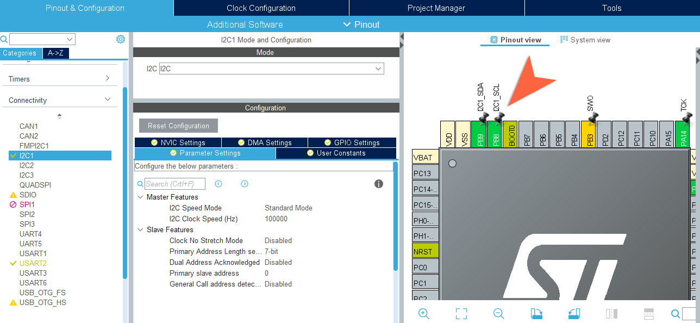

# Esercitazione 8
### Comunicazione Seriale

***
</br>

## Overview
In questa esercitazione si utilizzeranno le principali interfacce di comunicazione seriale - **UART**, **I²C** e **SPI**  - per la comunicazione con diversi dispositivi e sensori.

* [UART/USART](#uart-e-usart)
    * [Comunicazione UART/USART in STM32Cube](#Comunicazione-usart-in-stm32cube)
    * [Comunicazione UART con mbed](#Comunicazione-uart-con-mbed)
* [I<sup>2</sup>C](#I<sup>2</sup>C)
    * [Comunicazione I<sup>2</sup>C in STM32Cube](#Comunicazione-I<sup>2</sup>C-in-stm32cube)
    * [Comunicazione I<sup>2</sup>C con mbed](#Comunicazione-I<sup>2</sup>C-con-mbed)


## Requisiti Teorici
Una comunicazione di tipo seriale utilizza in maniera efficiente un singolo filo per il trasferimento di dati, sotto forma di bit, in maniera sequenziale.

I diversi protocolli di comunicazione seriale risolvono i principali problemi che riguardano la comunicazione tra due dispositivi; ad esempio stabilire, da parte del ricevitore, quando comincia e finisce un singolo bit o un'intera sequenza.

Un approccio utilizzato da diversi protocolli consiste nell'utilizzare un *segnale di clock* "accoppiato" ai dati, in questo modo si riesce a stabilire dunque una sincronizzazione tra dati e clock ed il tipo di comunicazione si dice **sincrona**: ad ogni impulso del *segnale di clock* il trasmettitore invia un bit e il ricevitore si sincronizza su uno dei fronti del *segnale di clock* per effettuare la lettura.


Il *segnale di clock* stabilisce quanto veloce vengono trasferiti i dati, con la sua frequenza, e quanto dura l'intera trasmissione. 

Nel caso in cui entrambi i dispositivi, che vogliono comunicare, siano già d'accordo sulla velocità e sul tempo di trasmissione di un singolo bit si può evitare di utilizzare un *segnale di clock* e concordare tra i due una comunicazione **asincrona**.


Diversi dispositivi possono essere interconnessi in diversi modi per realizzare delle comunicazioni di tipo seriale; si possono realizzare, ad esempio, anche delle "reti" con la classica architettura *master-slave*, in cui assume il ruolo di master il dispositivo che gestisce il clock. Secondo questa logica funzionano sistemi di comunicazione quali **SPI** e **I2C**.

<p align="center">
     
</p>

## UART e USART
Sebbene la comunicazione seriale **sincrona** sia utilizzata con moltissimi dispositivi, la gestione di un segnale (*il clock*) che ha bisogno sia di una linea dedicata che di una certa banda a disposizione risulta essere un peso, che ha indotto quindi allo sviluppo di criteri di comunicazione **asincroni**. Questi offrono anche il vantaggio di essere affidabili su lunghe distanze, rispetto alle quali un *segnale di clock* potrebbe degradarsi e far perdere la sincronizzazione. 

La logica di funzionamento si basa sullo stabilire la durata di trasmissione di un singolo bit ed evitare l'utilizzo di un clock di sincronizzazione. Questo meccanismo viene realizzato tramite un dispositivo hardware dedicato chiamato **UART** (**U**niversal **A**synchronous **R**eceiver-**T**ransmitter), che è presente in ogni microcontrollore e permette la comunicazione con una miriade di dispositivi.

Nella forma più semplice, una comunicazione **UART** utilizza una sola connessione per la trasmissione (indicata con **TX**) ed una sola per la ricezione (indicata con **RX**). È importante stabilire il *data rate* con cui operano il trasmettitore ed il ricevitore, e questo valore prende il nome di *baud rate*.

Oltre a questo valore ci sono una serie di altri parametri che entrano in gioco quando si vuole inviare un flusso di dati con comunicazione **UART**, i principali sono i seguenti:
- **Data bits**: Numero di bits per singolo valore trasmesso (default: 8);
- **Stop bits**: Numero di bits usati per identificare la fine, lo stop, del flusso dati (default: 1);
- **Parity bit**: Presenza ed eventuale tipologia del bit di parità.

Per la gestione della **UART** in un microcontrollore entrano in gioco altri parametri di configurazione importanti, che permettono di mettere in pratica anche diverse modalità di funzionamento.

Spesso, questo metodo di comunicazione viene accompagnato anche da un segnale di clock, dando luogo ad una comunicazione chiamata **USART** (**U**niversal **S**ynchronous/**A**synchronous **R**eceiver-**T**ransmitter).
<p align="center">
     
</p>

Mentre per la comunicazione **UART** un segnale di clock viene generato internamente nel microcontrollore -a partire dalla conoscenza del *baud rate* ed appena si identifica il primo bit del flusso dati- per la **USART** non vi è bisogno di specificare alcun *baud rate*: il segnale di clock viaggia su un canale dedicato e ciò permette di ottenere anche risultati migliori, arrivando in alcuni casi a trasferimenti con *rate* di 4 Mbps. Questa però porta con sé gli svantaggi legati alla presenza di un segnale di clock.

### UART/USART nei microcontrollori STM32
Ogni microcontrollore della famiglia STM32 esporta almeno una porta di comunicazione **UART**, nel caso del microcontrollore utilizzato per queste esercitazioni si hanno a disposizione due **UART** (UART4 e UART5) e quattro **USART** (USART1, USART2, USART3 e USART6). 

La gestione di questo tipo di comunicazione passa, ovviamente, per l'utilizzo di opportuni registri che permettono di configurare sia una comunicazione **USART** che una comunicazione **UART**, a seconda dei campi utilizzati. Di seguito, ed anche in fase di implementazione, si utilizzeranno spesso in maniera equivalente le due parole, specificando la distinzione tra le due solo se necessario.

Per quanto riguarda la configurazione del *baud rate*, si ricorre ovviamente al clock del sistema, che deve essere opportunamente scalato per essere adeguato, sulla periferica **UART**, e permettere di ottenere il *rate* desiderato.

<p align="center">
    
</p>

I valori che permettono di definire il *baud rate* e tutti gli altri parametri di configurazione si ritrovano all'interno di un set di registri, che si ritrovano completamente descritti nel [reference manual](https://www.st.com/resource/en/reference_manual/dm00135183-stm32f446xx-advanced-arm-based-32-bit-mcus-stmicroelectronics.pdf) del microcontrollore, insieme alla descrizione delle modalità di utilizzo e dei meccanismi di configurazione.

:information_source: Per il microcontrollore STM32F446RE, la comunicazione **USART2** passa attraverso i pin PA_2 e PA_3, questi mettono in comunicazione internamente il microcontrollore ed il modulo ST-Link. Sono utilizzati quindi per instaurare una comunicazione tra i due elementi e dunque per mettere in comunicazione il microcontrollore con il PC, tramite porta USB. Questa comunicazione è utilizzata implicitamente in tutte le fasi di programmazione e debugging del microcontrollore.  Dunque, finché si farà uso del modulo ST-Link sarà impossibile utilizzare questi pin per altri scopi.

La comunicazione mediante **UART** si può mettere in pratica in tre modalità: *polling*, *interrupt* o *DMA mode*.

- *Polling Mode*
> The main application, or one of its threads, synchronously waits for the data transmission and reception. This is the most simple form of data communication using this peripheral, and it can be used when the transmit rate is not too much low and when the UART is not used as critical peripheral in our application 
- *Interrupt Mode*
> The main application is freed from waiting for the completion of data transmission and reception. The data transfer routines terminate as soon as they complete to configure the peripheral. When the data transmission ends, a subsequent interrupt will signal the main code about this.

## I<sup>2</sup>C
L'acronimo **I²C** sta per "**I**nter **I**ntegrated **C**ircuit" ed è anch'esso un protocollo di comunicazione seriale che opera in accordo a relazioni di tipo *master-slave*. 

Per funzionare utilizza fisicamente due fili, ciò significa che i dati viaggiano esclusivamente in una direzione alla volta.

Come suggerito dal suo nome, viene utilizzato per interconnessioni su distanze abbastanza ravvicinate, possibilmente con tutti i dispositivi sullo stesso integrato, e permette di connettere, contemporaneamente, ad un solo *master* diversi dispositivi *slaves*, utilizzando un unico bus.

Il meccanismo per l'individuazione dei diversi dispositivi *slaves*, si basa su un sistema di indirizzamento in accordo al quale ogni dispositivo possiede un indirizzo univoco per il bus **I²C**.

La comunicazione, che è *half-duplex*, avviene su due linee, ed avviene con una logica sincrona utilizzando due diversi segnali:
* **SCL** (**S**erial **CL**ock)
* **SDA** (**S**erial **DA**ta)

<p align="center">
     
</p>

Oltre ai valori in bit propri del dato da trasferire, sul bus **I²C** si trovano una serie di segnali che operano come delimitatori speciali per identificare uno *start* ed uno *stop* del trasferimento di un flusso dati: il protocollo, in base al quale si mettono in comunicazione un dispositivo principale (*master*) e gli altri (*slaves*) connessi tramite bus **I²C**, prevede l'invio di un segnale di *start* seguito dall'indirizzo (in genere a 7 bit) della periferica con cui comunicare; inoltre si specifica tramite un singolo bit se si vuole effettuare una lettura (con un bit ad 1) o una scrittura (con un bit a 0).

Se la periferica *slave* con l'indirizzo indicato esiste sul bus **I²C**, questa risponderà con un ACK ed il *master* potrà avviare la trasmissione o mettersi in ricezione.

### I<sup>2</sup>C nei microcontrollori STM32
Nel microcontrollore utilizzato vi sono quattro bus per interfacciamento **I²C**, che possono operare sia in modalità *master* che *slave*; tre di questi bus possono lavorare, oltre che nella modalità standard (fino a 100KHz) in una particolare modalità veloce (fino a 400KHz).

Tra le caratteristiche principali vi sono la possibilità di indirizzare con valori a 7 bit o 10 bit ed un circuito hardware integrato per il controllo d'errore.

Per avere una indicazione precisa sul funzionamento delle diverse modalità, è bene studiare il [manuale di riferimento](https://www.st.com/resource/en/reference_manual/dm00135183-stm32f446xx-advanced-arm-based-32-bit-mcus-stmicroelectronics.pdf) del microcontrollore su cui vi è una descrizione delle due modalità di utilizzo principali:
- *Master mode*: 
> The **I²C** interface initiates a data transfer and generates the clock signal. A serial data transfer always begins with a start condition and ends with a stop condition. Both start and stop conditions are generated in master mode by software.
- *Slave mode*:
> In Slave mode, the interface is capable of recognizing its own addresses (7 or 10-bit), and the General Call address. The General Call address detection may be enabled or disabled
by software. 

Sia i dati che gli indirizzi sono trasferiti come singoli bytes, specificando come primo valore il MSB (Most Significant Bit).

<p align="center">
    
</p>
</br>

## Comunicazione USART in STM32Cube

Nell'ambiente di sviluppo di *STM32Cube* è possibile realizzare comunicazione di tipo **UART** a diversi livelli di astrazione, come sarà mostrato di seguito. Si partirà con un esempio mostrato utilizzando direttamente i registri (per comprenderne il funzionamento) e successivamente utilizzando il driver **HAL**.

Nell'esempio si farà uso delle porte **USART** che si trovano su PA_2 e PA_3 per comunicare con il pc, tramite porta USB; se non si dispone di un convertitore UART/USB esterno si farà quindi uso della comunicazione implicita fornita dal modulo ST-Link.

<p align="center" width="30%">
    
</p>
</br>

Lo scopo di un primo semplice esercizio è quello di mandare dei caratteri al PC; le fasi indispensabili per procedere a tale scopo sono le seguenti:
1. Attivazione del segnale di clock su periferica **USART** e **GPIO**
```c
RCC->APB1ENR |= (0x01 << 17); // Abilitazione USART2 clock
RCC->AHB1ENR |= (0x01 << 0);  // Abilitazione GPIOA clock
```
2. Configurazione dei pin PA_2 e PA_3 in modalità veloce e *alternate function mode*
```c
GPIOA->MODER &= ~(0x0F << 6);  // Clear MODER GPIOA2/3
GPIOA->MODER |= (0x0A << 6);   // Set Alternate function mode
GPIOA->OSPEEDR |= (0x0A << 6); // Set Fast Speed

GPIOA->AFR[0] |= (0b111 << 8);
GPIOA->AFR[0] |= (0b111 << 12);
```
 &nbsp; si noti che i registri **AFRL** e **AFRH** sono implementati utilizzando un array di due elementi `AFR[0]` e `AFR[1]`. </br> &nbsp; Per la loro configurazione fare riferimento al datasheet ed alle tabelle, come [quella estratta](docs/AlternateFunctionTab.pdf) e messa nella sottocartella *docs*.

3. Configurazione della lunghezza di trasmissione, dei valori di parità e di altri eventuali parametri
```c
USART2->CR1 |= (0b0 << 12); // 1 Start bit, 8 Data bits, n Stop bit (DEFAULT)
USART2->CR1 |= (0b0 << 9); // Even parity
```
4. Abilitazione di trasmissione/ricezione sulla porta **USART** desiderata
```c
USART2->CR1 |= (0b1 << 3); // Transmitter enable
USART2->CR1 |= (0b1 << 2); // Receiver enable
```
5. Calcolo dei valori per determinare il *baud rate* desiderato e configurazione con i registri
```c
USART2->BRR |= (22 << 4); // Mantissa - Configurato come valore decimale
USART2->BRR |= (13 << 0); // Fraction - Configurato come valore decimale
```
6. Avvio della comunicazione tramite abilitazione della **USART**
```c
USART2->CR1 |= (0b1 << 13);
```

A questo punto è possibile procedere all'invio dei dati facendo uso dei registri:
- **USART_DR** (**D**ata **R**egister)
> Che contiene il valore che si vuole trasmettere (oppure il valore appena ricevuto); 
- **USART_SR** (**S**tatus **R**egister)
> Usato in lettura per individuare diversi stati come, ad esempio, la fine della trasmissione.

Il programma implementato si trova nella cartella di progetto `uart_simpleTX`.

##

Ovviamente, è possibile fare uso delle funzioni e strutture del driver **HAL** per instaurare una comunicazione **UART**, in questa ottica implementativa si passa per una prima configurazione con *STM32CubeMX*.

<p align="center">
    
</p>

Come applicazione d'esempio si realizza la comunicazione tra MCU e PC scambiandosi, come valori, le successive letture di una valore analogico tramite **ADC** (usando un **timer** per dare una precisa frequenza alla lettura).

La generazione del codice agirà configurando una particolare struttura, come per tutte le periferiche gestite con la libreria **HAL**. La struttura in questione è 
```c
typedef struct {
uint32_t BaudRate;      // The connection Speed
uint32_t WordLength;    // The number of data bits transmitted or received in a frame
uint32_t StopBits;      // The number of stop bits transmitte
uint32_t Parity;        // Indicates the parity mode
uint32_t Mode;          // Specifies RX o TX mode
uint32_t HwFlowCtl;     // it specifies whether the RS232 Hardware Flow Control mode is enabled or disabled.
uint32_t OverSampling;  // Specification about oversampling method
} UART_InitTypeDef;
```
e la sua configurazione è la seguente:
```c
huart2.Instance = USART2;
huart2.Init.BaudRate = 115200;
huart2.Init.WordLength = UART_WORDLENGTH_8B;
huart2.Init.StopBits = UART_STOPBITS_1;
huart2.Init.Parity = UART_PARITY_NONE;
huart2.Init.Mode = UART_MODE_TX_RX;
huart2.Init.HwFlowCtl = UART_HWCONTROL_NONE;
huart2.Init.OverSampling = UART_OVERSAMPLING_16;
```

Per mettere in pratica una comunicazione seriale di questo tipo, la libreria **HAL** offre diverse funzioni, a seconda che si voglia usare una modalità *polling* o *interrupt*. Per la prima, si fa utilizzo della funzione:
```c
HAL_StatusTypeDef HAL_UART_Transmit(UART_HandleTypeDef *huart, uint8_t *pData, uint16_t Size, uint32_t Timeout);
```
in cui `huart` è il puntatore ad una istanza della struttura mostrata precedentemente; `pData` è il puntatore ad un array che contiene la sequenza di bytes da inviare; `Size` è la dimensione di quest'array ed infine `Timeout` è il massimo tempo di attesa per il completamento della comunicazione (per aspettare in maniera indefinita si può usare la costante `HAL_MAX_DELAY`).

Questa funzione permette di inviare i dati contenuti nell'array specificato, in maniera equivalente esisterà una funzione per mettersi in ricezione in *polling*:
```c
HAL_StatusTypeDef HAL_UART_Receive(UART_HandleTypeDef *huart, uint8_t *pData, uint16_t Size, uint32_t Timeout);
```

Per inviare i dati con una frequenza di 1Hz, si dovrà fare, in questo caso, una cosa del genere nel ciclo di vita principale del programma:
```c
while (1){
    // Temperature value "printed" on uart_data for serial output
    sprintf(uart_data_buff, "\r%.3f°C\n", temp);
    // Polling TX - a transmission every second
    HAL_UART_Transmit(&huart2, (uint8_t *)uart_data_buff, sizeof(uart_data_buff), HAL_MAX_DELAY);
    HAL_Delay(1000);
}
```
utilizzando un particolare accorgimento per inviare l'intero numero `float` sotto forma di bytes (come una stringa di caratteri che rappresentano il numero). L'alternativa sarebbe stata trasformare in maniera più "manuale" il valore decimale in una valore ad 8 bit, mettendo magari nell'array, in maniera separata, parte intera e parte decimale. In entrambi i casi si lascia al ricevitore l'onere di ricostruire il valore ricevuto.

Si faccia attenzione al fatto che, per utilizzare la funzione `sprintf()` è necessario attivare un campo di configurazione della sezione *Tool Setting* del progetto; come illustrato nello screenshot seguente.

<p align="center">
    
</p>

##

Per usare invece la periferica **UART** in *modalità interrupt* è necessario utilizzare la interrupt associata a tale periferica ed intercettata dalla funzione `USARTx_IRQHandler()`. All'interno di questa funzione deve essere invocata `HAL_UART_IRQHandler()`, che si occuperà di invocare tutte le funzioni relative alle attività della periferica **UART**, gestendola in questa modalità *interrupt*.

Oltre a queste si farà uso delle funzioni per abilitare la periferica in questa modalità:
```c
HAL_StatusTypeDef HAL_UART_Transmit_IT(UART_HandleTypeDef *huart, uint8_t *pData, uint16_t Size);
```
o
```c
HAL_StatusTypeDef HAL_UART_Receive_IT (UART_HandleTypeDef * huart, uint8_t * pData, uint16_t Size)
```
a seconda che si voglia effettuare la trasmissione o la ricezione. 

L'utilizzo di questa periferica con il meccanismo delle *interrupt* non è immediato, in quanto sono diversi i segnali che farebbero scattare un *interrupt* per una comunicazione **UART**, tra cui anche le segnalazioni di stato e di errore:
- *IRQs generate in trasmissione*: Transmission Complete, Clear to Send or Transmit Data Register empty interrupt;
- *IRQs generate in ricezione*: Idle Line detection, Overrun error, Receive Data register not empty, Parity error, LIN break detection, Noise Flag (only in multi buffer communication) and
Framing Error (only in multi buffer communication).

Ovviamente la gestione di tutti questi eventi d'errore è mediata dalla configurazione di alcuni bit di controllo che devono essere controllati nel programma per gestire opportunamente sia la trasmissione che la ricezione con le *interrupts*. 

Tendenzialmente, la fase di ricezione è quella che più si presta ad essere utilizzata con il meccanismo delle *interrutps* e ne viene mostrato un esempio: si mostra un'applicazione che riceve un singolo carattere, interpretato come un numero, tramite comunicazione **UART**.

Si implementa la funzione:
```c
void read_UART_input() {
	if(UartReady == SET) {
		UartReady = RESET;
		HAL_UART_Receive_IT(&huart2, (uint8_t*)readBuf, 1);
		read_value = atoi(readBuf);
	}
}
```
che viene invocata nel ciclo di vita principale del programma, ma non è bloccante per il sistema, infatti il microcontrollore può continuare ad eseguire altre operazioni mentre attende di ricevere un carattere. 

Si noti che, la non ripetuta invocazione della funzione 
`HAL_UART_Receive_IT` è garantita dall'utilizzo adeguato della flag `UartReady`, definita come tipo `ITStatus`, si tratta di una `enum` definita per essere usata in queste situazioni con i valori **SET** (=1) e **RESET** (=0).


### Comunicazione UART con mbed
La piattaforma *mbed* esporta le funzionalità necessarie per instaurare comunicazioni seriali con periferiche **UART**, per uno scambio di dati tra microcontrollore ed altri dispositivi. Come si può immaginare, il procedimento per una comunicazione seriale di questo tipo è abbastanza semplificato e si basa sull'uso di un particolare oggetto.

### Serial

> The Serial interface provides **UART** functionality. The serial link has two unidirectional channels, one for sending and one for receiving. 

Sebbene internamente sia un oggetto molto complesso, il suo utilizzo è abbastanza semplificato, permettendo comunque la configurazione delle principali caratteristiche necessarie ad una comunicazione **UART**; in questo caso si tratta propriamente di comunicazione *asincrona*.

Per utilizzare questo oggetto, [`Serial`](https://os.mbed.com/docs/mbed-os/v5.15/apis/serial.html), i metodi principali di configurazione sono `baud()` e `format()`, usati come mostrato:
```cpp
Serial uart_com(PA_2, PA_3);  // PA_2: TX pin | PA_: RX_pin

#define BAUDRATE    115200
#define BITS        8
#define PARITY      SerialBase::None
#define STOP_BITS   1

void UART_Init(){
    uart_com.baud(BAUDRATE);
    uart_com.format(BITS, PARITY, STOP_BITS);
}
```

Si può quindi realizzare un'applicazione che legga il valore di un sensore analogico tramite **ADC** e invi tale valore al PC tramite comunicazione **UART**. Per l'invio si farà uso della funzione `printf()` invocata come metodo dell'oggetto `uart_com` definito. In questo modo sarà possibile mandare in maniera molto immediata una stringa di testo, che contiene ad esempio il valore che vogliamo inviare. 
```cpp
while(1) {
    if(adc_read_flag){
        // Read the analog input value (value from 0.0 to 1.0 = full ADC conversion range)
        raw_in = lmt84.read(); 
        // Converts value in the 0V-3.3V range
        lmt84_mv = raw_in * 3300; 
        // Convert mV to temperature
        temp = (1035 - lmt84_mv)/5.50f;
        // UART Send values
        uart_com.printf("\r%.3f°C\n",temp);
        // Reset flag
        adc_read_flag = false;
    }
}
```

:information_source: Grazie all'ausilio del modulo ST-Link integrato nella scheda di sviluppo Nucleo-F446RE, è possibile utilizzare la comunicazione seriale implicita fornita da questo modulo. Questo infatti è sempre in comunicazione con il microcontrollore tramite la periferica **USART2** ed è per questo che è possibile invocare la funzione `printf()` anche senza inizializzare alcun oggetto **Serial**. La piattaforma di sviluppo riconosce che una stringa si vorrebbe esportare sullo *Standard output stream* e viene effettuata una redirezione dell'output sulla periferica **USART** inizializzata per default.

Questa comunicazione seriale, che arriva al PC tramite la porta USB, è indispensabile per programmare il microcontrollore ed operare con il debugger, ecco perché, di default, viene sempre attivata su una scheda di sviluppo del genere (con un *baud rate* di 9600).

Comunque, per un utilizzo appropriato della funzione `printf()` è bene passare per l'inizializzazione di un oggetto **Serial**, anche per semplici scopi di debugging; si può far riferimento a quanto riportato dalla [documentazione](https://os.mbed.com/docs/mbed-os/v5.15/tutorials/debugging-using-printf-statements.html) di *mbed* per chiarire questo funzionamento.


***

## Comunicazione I²C in STM32Cube
Di seguito si mostra un esempio di comunicazione **I²C** tra il microcontrollore ed un modulo esterno che è il sensore [MPU-6050](https://invensense.tdk.com/products/motion-tracking/6-axis/mpu-6050/) della InvenSense. 

Per poter utilizzare questo sensore (come si farebbe per qualsiasi altro modulo **I²C**) è necessario approfondire la documentazione rilasciata dalla casa produttrice, nella quale si trovano tutte le informazioni fisiche/elettriche e quelle relative all'utilizzo del sensore con un protocollo **I²C**.

Prima di passare allo studio di questo modulo si identificano le principali strutture e funzioni necessarie a utilizzare una comunicazione **I²C** facendo uso della libreria **HAL**. Struttura principale è:
```c
typedef struct {
I2C_TypeDef         *Instance;  // I²C registers base address
I2C_InitTypeDef     Init;       // I²C communication parameters
uint8_t             *pBuffPtr;  // Pointer to I²C transfer buffer
uint16_t            XferSize;   // I²C transfer size
__IO uint16_t       XferCount;  // I²C transfer counter
DMA_HandleTypeDef   *hdmatx;    // I²C Tx DMA handle parameters
DMA_HandleTypeDef   *hdmarx;    // I²C Rx DMA handle parameters
HAL_LockTypeDef     Lock;       // I²C locking object
__IO HAL_I2C_StateTypeDef   State;      // I²C communication state
__IO HAL_I2C_ModeTypeDef    Mode;       // I²C communication mode
__IO uint32_t               ErrorCode;  // I²C Error code
} I2C_HandleTypeDef;
```
in cui, tra i vari campi, si ha: il puntatore all'istanza della periferica **I²C** da utilizzare (`*Instance`), l'istanza delle struttura utilizzata per la specifica della configurazione della periferica (`Init`), il puntatore al buffer interno usato per lo store temporaneo dei dati da trasferire (`pBuffPtr`) ed altri campi utili a gestire gli errori ed eventualmente comunicare con il modulo DMA.

La struttura per la configurazione è invece la seguente:
```c
typedef struct {
uint32_t ClockSpeed;        // Specifies the clock frequency
uint32_t DutyCycle;         // Specifies the I²C fast mode duty cycle.
uint32_t OwnAddress1;       // Specifies the first device own address.
uint32_t OwnAddress2;       // Specifies the second device own address if dual addressing mode is selected
uint32_t AddressingMode;    // Specifies if 7-bit or 10-bit addressing mode is selected.
uint32_t DualAddressMode;   // Specifies if dual addressing mode is selected.
uint32_t GeneralCallMode;   // Specifies if general call mode is selected.
uint32_t NoStretchMode;     // Specifies if nostretch mode is selected.
} I2C_InitTypeDef;
```
in cui si trovano tutti i parametri per la configurazione delle caratteristiche che dovrà avere la comunicazione **I²C** che si vuole instaurare.

Il set di funzioni per operare con il bus **I²C** è molto vasto, vi sono infatti tutta una serie di funzioni necessarie per gestire le possibili **ISR** generate (in trasmissione e ricezione) sia in modalità *master* che in modalità *slave*. Si riportano di seguito solo le funzioni principali per utilizzare in modalità master il microcontrollore e si rimanda alla [descrizione completa del driver **HAL**](https://www.st.com/resource/en/user_manual/dm00105879-description-of-stm32f4-hal-and-ll-drivers-stmicroelectronics.pdf) per approfondire le altre.

Funzione base è sicuramente
```c
HAL_StatusTypeDef HAL_I2C_Init(I2C_HandleTypeDef *hi2c);
```
usata evidentemente per inizializzare il bus **I²C**. Si hanno inoltre una serie di funzioni per gestire invio e ricezione da parte del master:
```c
HAL_StatusTypeDef HAL_I2C_Master_Transmit(I2C_HandleTypeDef *hi2c, uint16_t DevAddress, uint8_t *pData, uint16_t Size, uint32_t Timeout);
```
```c
HAL_StatusTypeDef HAL_I2C_Master_Receive(I2C_HandleTypeDef *hi2c, uint16_t DevAddress, uint8_t *pData, uint16_t Size, uint32_t Timeout);
```
che possono essere usate anche in modalità interrupt:
```c
HAL_StatusTypeDef HAL_I2C_Master_Transmit_IT(I2C_HandleTypeDef *hi2c, uint16_t DevAddress, uint8_t *pData, uint16_t Size);
```
```c
HAL_StatusTypeDef HAL_I2C_Master_Receive_IT(I2C_HandleTypeDef *hi2c, uint16_t DevAddress, uint8_t *pData, uint16_t Size);
```

Ovviamente, le funzioni operano concettualmente come quelle già mostrate per altre periferiche (ad esempio per le periferiche **UART**); in questo caso si ha un campo particolare che è l'indirizzo del dispositivo cui si vuole con comunicare `DevAddress`, oltre che il puntatore ad un array che conterrà il dato che si desidera inviare o ricevere.

:rocket: Noti gli strumenti software per gestire il funzionamento del bus e del protocollo **I²C**, è possibile studiare i dettagli relativi al sensore che si desidera utilizzare, per poi procedere alla scrittura del programma che leggerà i valori da esso fornito. Il sensore in questione, MPU-6050, è una *IMU* a *6 DOF*, che si trova incapsulata su un modulo pronto per la connessione **I²C**; questo viene connesso alla scheda di sviluppo come indicato.

<p align="center">
    
</p>

Tutte le informazioni necessarie all'implementazione di un programma che realizzi una corretta comunicazione con il sensore si ricavano a seguito dello studio del [datasheet](docs/MPU-60x0-Datasheet.pdf) e della [documentazione relativa ai registri contenuti nel modulo MPU-6050](docs/MPU-60x0-Register-Map.pdf). 

In un contesto del genere è sensato implementare una *libreria* che si occupi di gestire il sensore e mediare la comunicazione **I²C**, come infatti specificato nel file [MPU-6050.md](MPU-6050.md). Grazie alla libreria illustrata è possibile strutturare il `main.c` in modo che vengano invocate le funzioni esportate dalla libreria stessa per la configurazione e la lettura dei dati dal sensore. Prima però è indispensabile configurare la periferica **I²C**, sfruttando l'interfaccia di configurazione di *CubeMX*.

<p align="center">
    
</p>

Con la configurazione illustrata si genera il codice che si può individuare nel metodo `MX_I2C1_Init()`:
```c
hi2c1.Instance = I2C1;
hi2c1.Init.ClockSpeed = 100000;
hi2c1.Init.DutyCycle = I2C_DUTYCYCLE_2;
hi2c1.Init.OwnAddress1 = 0;
hi2c1.Init.AddressingMode = I2C_ADDRESSINGMODE_7BIT;
hi2c1.Init.DualAddressMode = I2C_DUALADDRESS_DISABLE;
hi2c1.Init.OwnAddress2 = 0;
hi2c1.Init.GeneralCallMode = I2C_GENERALCALL_DISABLE;
hi2c1.Init.NoStretchMode = I2C_NOSTRETCH_DISABLE;
```

A questo punto, nel main è possibile leggere i dati proveniente dal sensore connesso tramite bus **I²C**, ovviamente a seguito di un adeguata configurazione:
```c
/* Configure Accel and Gyro parameters */
Mpu_Config.Accel_Full_Scale = AFS_SEL_4g;
Mpu_Config.Clock_Source = INTERNAL_8MHz;
Mpu_Config.Config_Dlpf = DLPF_184A_188G_Hz;
Mpu_Config.Gyro_Full_Scale = FS_SEL_500;
Mpu_Config.Sleep_Mode_Bit = 0;  //1: sleep mode, 0: normal mode
MPU6050_Init(&hi2c1, &Mpu_Config); // Initialization - Configuration

/* Infinite loop */
while (1){
    MPU6050_Read_RawData(&Accel_Raw, &Gyro_Raw);
    MPU6050_Read_ScaledData(&Accel_Scaled, &Gyro_Scaled);

    HAL_GPIO_TogglePin(GPIOA, GPIO_PIN_5);
    HAL_Delay(1000);
}
```

## Comunicazione I<sup>2</sup>C con mbed
Per gestire periferiche **I²C** utilizzando la piattaforma *mbed* si fa utilizzo dell'oggetto [`I2C`](https://os.mbed.com/docs/mbed-os/v5.15/apis/i2c.html), descritto ed utilizzato di seguito.
### I2C
> The I2C interface provides I2C Master functionality. I2C is a two wire serial protocol that allows an I2C Master to exchange data with an I2C Slave.

Esporta evidentemente le funzioni base di lettura 
```cpp
read(int address, char *data, int length, bool repeated=false)
```
e scrittura sul bus
```cpp
write(int address, const char *data, int length, bool repeated=false)
```
e la possibilità di configurare la frequenza, di default a 100KHz.

Per sfruttare il microcontrollore come *master*, e volendo utilizzare la configurazione di default, si riesce a comunicare in maniera basilare con qualsiasi periferica. Per un utilizzo più avanzato è possibile invocare le funzioni della libreria **HAL**, proprio come si è fatto in *STM32Cube*.

Gli esempi seguenti faranno sempre uso della piattaforma interziale MPU6050, in un primo semplice esempio si effettua una lettura dal registro *WHO_AM_I*, in cui si trova l'indirizzo con cui il modulo si esterna sul bus **I²C** (ovviamente già noto).

```cpp
I2C i2c_open(PB_9, PB_8);

...

const int MPU_ADDR8b = MPU_ADDR << 1;

...

while (1) {
    char I2C_cmd[2];
    I2C_cmd[0] = 0x75; // WHO_AM_I Register Address
    i2c_open.write(MPU_ADDR8b, I2C_cmd, 1);

    char I2C_response[2];
    I2C_response[0] = 0x00;
    I2C_response[1] = 0x00;
    i2c_open.read(MPU_ADDR8b, I2C_response, 1);
   
    printf("Who Am I: %x\n", I2C_response[0]);
}
```
Il codice seguente produce, come output della funzione di stampa, la stringa: `Who Am I: 68`

## 

Un esempio più interessante mostra l'utilizzo della libreria `MPU6050_lib` (scritta in **C**), integrata opportunamente in un'applicazione realizata con la piattaforma *mbed*.

Per l'inclusione del file header nel `main.cpp` si utilizza il costrutto:
```cpp
extern "C"{
#include "MPU6050_lib.h"
}
```
e per utilizzarla si sfrutta del codice equivalente a quello usato in *STM32Cube*, definendo le funzioni:
```cpp
void I2C_config(){
    i2c1.Instance = I2C1;
    i2c1.Init.ClockSpeed = 100000;
    i2c1.Init.DutyCycle = I2C_DUTYCYCLE_2;
    i2c1.Init.OwnAddress1 = 0;
    i2c1.Init.AddressingMode = I2C_ADDRESSINGMODE_7BIT;
    i2c1.Init.DualAddressMode = I2C_DUALADDRESS_DISABLE;
    i2c1.Init.OwnAddress2 = 0;
    i2c1.Init.GeneralCallMode = I2C_GENERALCALL_DISABLE;
    i2c1.Init.NoStretchMode = I2C_NOSTRETCH_DISABLE;
    HAL_I2C_Init(&i2c1);
}
```
e
```cpp
void MPU6050_config(){
    Mpu_Config.Clock_Source = INTERNAL_8MHz;
    Mpu_Config.Accel_Full_Scale = AFS_SEL_4g;
    Mpu_Config.Config_Dlpf = DLPF_184A_188G_Hz;
    Mpu_Config.Gyro_Full_Scale = FS_SEL_500;
    Mpu_Config.Sleep_Mode_Bit = 0;
    MPU6050_Init(&i2c1, &Mpu_Config); // Initialization - Configuration
}
```

Oltre a dover inizializzare strutture come `I2C_HandleTypeDef i2c1` e `MPU_ConfigTypeDef Mpu_Config` si utilizza anche l'oggetto definito nella piattaforma mbed `I2C`
```cpp
I2C i2c_open(PB_9, PB_8);
```
in modo da inizializzare correttamente i pin di **SDA** e **SCL** da utilizzare. L'implementazione completa si trova nel file [i2c_mpu6050.cpp](mbed/i2c_mpu6050.cpp).
***
</br> </br>

:computer:
Per interagire (in trasmissione o ricezione) con le periferiche **UART** del microcontrollore è possibile utilizzare uno dei diversi software che si trovano facilmente in rete. Uno di questi è [*Real Term*](https://realterm.sourceforge.io), che offre la possibilità di aprire la comunicazione **UART** con diversi *baud rate* e possibili configurazioni. Inoltre può essere usato anche come trasmettitore per inviare dati ad una periferica **UART** connessa al PC. Di seguito sono illustrate le due interfacce principali, evidenziando le sezioni di interazione.

<p align="center">
    
</p>

<p align="center">
    
</p>


Delle alternative potrebbero essere [Putty](https://www.putty.org) o [TeraTerm](https://ttssh2.osdn.jp/index.html.en).

***
