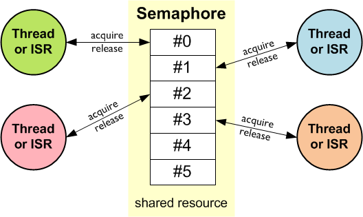

# Esercitazione 9
### RTOS

***
</br>


## Overview
In questa esercitazione, a seguito di una breve descrizione dei *sistemi operativi Real-Time* (**RTOS**) e della libreria **CMSIS-RTOS**, ci saranno una serie di esempi che mostreranno il funzionamento delle basilari componenti di un **RTOS**. 


## Sistemi Embedded e RTOS
In contesti in cui un'applicazione embedded diventa molto complessa, soprattutto dal punto di vista di gestione temporale degli eventi, le modalità di programmazione in *polling* ed il meccanismo delle *interrupts* potrebbero non bastare per la gestione di un corretto flusso di lavoro del programma.

Spesso, dei processi più lunghi, che occupano quindi per molto tempo l'unità di calcolo, è necessario che vengano eseguiti in maniera *concorrente* ad altri, per non rallentare il flusso di esecuzione che si desidera. Generalmente, questa *concorrenza* si gestisce suddividendo il tempo di elaborazione del processore in precisi *slots* temporali, affidando diversi *slots* ad ogni processo. La suddivisione e l'affidamento dei processi a diversi *time slots* è l'operazione che esegue un modulo chiamato **scheduler**, che, ovviamente, può essere implementato manualmente dal programmatore, ma si ritrova pronto ed incluso in ogni sistema operativo. 

Anche su un microcontrollore è possibile utilizzare un sistema operativo: si parla, in genere, di *embedded OS*, riferendosi a quei sistemi operativi che, pur essendo molto diversi dai consueti sistemi operativi che si utilizzano su un calcolatore, offrono delle funzionalità importanti come, appunto, lo **scheduler**. In realtà, la necessità di un sistema operativo nel contesto di un sistema embedded, non nasce solo dalla semplice esigenza di schedulare i processi, ma anche dalla necessità che questi forniscano all'utilizzatore delle risposte temporalmente "puntuali". Per questo motivo, si ha a che fare quindi con dei sistemi operativi che sono detti *Real-Time* (**RTOS** | **R**eal-**T**ime **O**perating **S**ystem).

Un **RTOS** è un sistema operativo capace di offrire le potenzialità del *multi-threading*, assicurando comunque il rispetto di specifici vincoli temporali, a cui ci si riferisce con il nome di *deadlines*; è questa la principale caratteristica che distingue un sistema operativo *Real-Time* da un qualsiasi normale sistema operativo. 

Scrivere un'applicazione che funzioni in un sistema operativo *Real-Time* consiste nell'utilizzo di un set di *threads* indipendenti, che comunicano tra loro scambiandosi "messaggi", entrando in "code" di attesa o aspettandosi a vicenda in base allo scattare di alcuni "semafori". Tutti questi *threads* vengono inoltre eseguiti in maniera *concorrente*, grazie all'applicazione di un accurato processo di *scheduling* ed un velocissimo processo di *context switching*. Questo processo viene eseguito dal sistema operativo che, grazie ad una serie di funzioni che lavorano a stretto contatto con l'hardware, è in grado di individuare lo stato di tutti i registri interni al microcontrollore (LR, PC, MSP, R0,...R15, etc.) e memorizzarlo prima di effettuare lo "switch" su un altro processo, che avrà a sua disposizione il MCU per uno *slot* di tempo.

<p align="center">
    
</p>

Fondamentale, per il corretto funzionamento di un **RTOS** è l'utilizzo di un *Timer* che permetta di realizzare effettivamente la caratteristica *Real-Time* tramite una precisa scansione dei diversi *time slots*: allo scadere di ogni *slot*, il timer deve generare una *interrupt* che attivi lo *scheduler*, il quale deciderà se è il caso di praticare una operazione di *context switching* ed in che modo.

Nei microcontrollori *Cortex-M* è possibile utilizzare un **RTOS**; oltre ai costrutti software (che saranno illustrati), a permetterlo è la particolare struttura hardware interna che, per sua natura, si presta a processamento *Real-Time*. Una periferica indispensabile, come già accennato, è il *Timer* e nei processori *Cortex-M* vi è un *Timer* speciale dedicato ad un utilizzo con **RTOS**: **SysTick**.
Si tratta di un *Timer* a 24 bit che, di default, fa scattare una interrupt una volta ogni millisecondo. Grazie a questa caratteristica viene utilizzato per la gestione dei *time slots* di una schedulazione di processi per un **RTOS**.

Una volta ogni millisecondo lo *scheduler* viene attivato dalla interrupt scattata grazie a **SysTick** e, in un contesto in cui la priorità dei diversi processi è fissa e si fa uso di *preemption*, i processi a più alta priorità saranno schedulati per primi ed i processi con la stessa priorità schedulati con una logica *Round-Robin*.

<p align="center">
    
</p>

In sintesi, un **RTOS** esporta tre principali funzionalità:
* Stabilisce quale *thread* deve essere eseguito e per quanto tempo;
* Fornisce la comunicazione e la sincronizzazione tra i *threads*;
* Controlla l'utilizzo di risorse condivise tra i *threads*.

## CMSIS-RTOS
**CMSIS-RTOS** è una parte del framework **CMSIS** che fornisce una interfaccia di programmazione standardizzata per implementare codice compatibile con diversi sistemi operativi *Real-Time*. 

> The CMSIS-RTOS2 manages the resources of the microcontroller system and implements the concept of parallel threads that run concurrently.

È pensato come una sorta di *wrapper* delle funzioni e strutture esportate da un **RTOS** e garantisce quindi l'implementazione semplificata di un *middleware* che mette in comunicazione l'applicazione con il kernel del sistema operativo *Real-Time*.

<p align="center">
    
</p>

> The CMSIS-RTOS2 offers services needed in many real-time applications, for example, periodical activation of timer functions, memory management, and message exchange between threads with time limits.

I moduli principali di cui è composto, trattati in maniera approfondita sulla [documentazione](https://arm-software.github.io/CMSIS_5/RTOS2/html/index.html) rilasciata da **ARM**, sono i seguenti:

* **Kernel Information and Control**
> Provide version/system information and start the RTOS Kernel.

* **Thread Management**
> Define, create, and control thread functions.

* **Generic Wait Functions**
> Wait for a time period or unspecified events.

* **Timer Management**
> Create and control timer and timer callback functions.

* **Inter-Thread Communication and Resource Sharing**
> Functions for inter-thread communication.

* **Generic Data Types and Definitions**
> Data Type Definitions used by the CMSIS-RTOS API functions.

* **Status and Error Codes**
> Status and Error Codes returned by CMSIS-RTOS API functions.

</br>

I principali sistemi operativi *Real-Time* che si possono utilizzare con l'interfaccia di **CMSIS-RTOS** sono [**FreeRTOS**](https://www.freertos.org) e [**RTX**](https://www2.keil.com/mdk5/cmsis/rtx).

<p align="center">
    
</p>

La strutturazione di un programma, utilizzando la libreria **CMSIS-RTOS** è decisamente semplificata rispetto all'uso delle API specifiche di un sistema operativo *Real-Time*.
```c
#include "cmsis_os2.h"
 
/* Application main thread */
void app_main_thread (void *argument) {
  // ...
  for (;;) {}
}
 
int main (void) {

    // MCU Initialization
    SystemClock_Config();
    // ...

    osKernelInitialize(); // Initialize CMSIS-RTOS
    osThreadNew(app_main_thread, NULL, &thread_attributes); // Create application main thread
    osKernelStart();  // Start thread execution

    while(1){
        ;
    }
}
```
Si fa uso di un set di funzioni e strutture che in maniera efficiente gestiscono il *Kernel* del sistema operativo ed i vari **Threads** con annessi metodi di inter-comunicazione.

### Thread
Il termine **Thread** viene utilizzato per individuare uno dei diversi processi che operano in *concorrenza*. Per ognuno di essi si possono identificare quattro principali stati, in cui un **Thread** può trovarsi.

<p align="center">
    
</p>

* **Running**: stato in cui il *thread* è attivo e sta eseguendo le operazioni per esso definite;
* **Ready**: stato in cui il *thread* è attivo e si trova nella coda contenente i *thread* che possono passare nello stato di **running**, è in attesa che lo scheduler gli assegni un *time slot*;
* **Waiting**: stato in cui il *thread* è attivo ma attende un segnale esterno, magari da parte di un altro *thread*, per completare la sua esecuzione;
* **Inactive/Terminated**: unico stato in cui il *thread* risulta inattivo, si può trovare in questo stato dopo essere passato da uno dei tre precedenti.

Un **Thread** può cambiare il suo stato, tra **Waiting**, **Ready** e **Running**, dipendentemente dalla sua priorità e dall'applicazione degli algoritmi di *scheduling*. All'interno della libreria, queste informazioni sono conservate in una `enum`:
```c
enum osThreadState_t {
    osThreadInactive = 0,
    osThreadReady = 1,
    osThreadRunning = 2,
    osThreadBlocked = 3,
    osThreadTerminated = 4,
    osThreadError = -1,
    osThreadReserved = 0x7FFFFFFF
}
```
Mentre è utilizzata una struttura per conservare tutti gli attributi principali di un **Thread**:
```c
typedef struct {
    const char  *name;      ///< name of the thread
    uint32_t    attr_bits;  ///< attribute bits
    void        *cb_mem;    ///< memory for control block
    uint32_t    cb_size;    ///< size of provided memory for control block
    void        *stack_mem; ///< memory for stack
    uint32_t    stack_size; ///< size of stack
    osPriority_t    priority;   ///< initial thread priority (default: osPriorityNormal)
    TZ_ModuleId_t   tz_module;  ///< TrustZone module identifier
    uint32_t        reserved;   ///< reserved (must be 0)
} osThreadAttr_t;
```
Tra i vari parametri da attribuire ad un **Thread**, uno importante è sicuramente la priorità: ogni **Thread** ha un livello di priorità programmabile, che viene definito in termini di valori numerici, mappati su una serie di costanti che si trovano all'interno di una `enum` con molti campi, di cui ne sono riportati alcuni di seguito:
```c
enum osPriority_t {
    osPriorityNone = 0,
    osPriorityIdle = 1,
    osPriorityLow = 8,
    ...
    osPriorityNormal = 24,
    ...
    osPriorityHigh = 40,
    ...
    osPriorityRealtime = 48,
    ...
    osPriorityISR = 56,
    osPriorityError = -1,
    osPriorityReserved = 0x7FFFFFFF
}
```
#### Comunicazione Inter-Thread
In una buona applicazione che utilizza **RTOS**, vi sono moltissime interazioni tra i diversi **Threads**. Queste si possono realizzare in diversi metodi, in base ad una serie di costrutti logici tipici della programmazione concorrente e di un sistema operativo *Real-Time*. Usare l'implementazione di questi costrutti fornisce sicuramente il modo più efficiente per realizzare la comunicazione tra diversi **Threads**.

I metodi principali esportati dai principali **RTOS**, e supportati da **CMSIS-RTOS**, per la comunicazione tra i **Threads** sono i seguenti:
* **Event Flags**
> The **event flags** management functions in CMSIS-RTOS allow you to control or wait for event flags and synchronize threads with them.
* **Mutex**
> **Mutual exclusion** (widely known as **Mutex**) is used in various operating systems for resource management. Many resources in a microcontroller device can be used repeatedly, but only by one thread at a time (for example communication channels, memory, and files). Mutexes are used to protect access to a shared resource. A mutex is created and then passed between the threads (they can acquire and release the mutex).
* **Semaphores**
> **Semaphores** are used to manage and protect access to shared resources. Semaphores are very similar to Mutexes. Whereas a Mutex permits just one thread to access a shared resource at a time, a semaphore can be used to permit a fixed number of threads/ISRs to access a pool of shared resources. Using semaphores, access to a group of identical peripherals can be managed.
<p align="center">
    
</p>

* **Message Queue**
> Message passing is another basic communication model between threads. In the message passing model, one thread sends data explicitly, while another thread receives it. The operation is more like some kind of I/O rather than a direct access to information to be shared. In CMSIS-RTOS, this mechanism is called s message queue. The data is passed from one thread to another in a FIFO-like operation. Using message queue functions, you can control, send, receive, or wait for messages.
<p align="center">
    
</p>

## FreeRTOS
È probabilmente il principale *Real-time operating system* per microcontrollori, il cui sviluppo è stato portato avanti per diversi anni da diverse case produttrici di microcontrollori.

Questo gli ha permesso di vedere strutturato un kernel ed una serie di funzionalità che gli permettono di essere applicato in maniera efficace in ogni tipo di sistema embedded che richiede un tipo di funzionamento *Real-Time*.

Si tratta anche del sistema operativo che si trova a disposizione, in *STM32Cube*, per un utilizzo con processori [**ARM Cortex-M**](https://www.freertos.org/RTOS-Cortex-M3-M4.html). Nella [documentazione](https://www.st.com/resource/en/user_manual/dm00105262-developing-applications-on-stm32cube-with-rtos-stmicroelectronics.pdf) rilasciata dalla stessa **ST** si trovano tutte le informazioni rilevanti riguardo l'architettura e l'utilizzo di questo sistema operativo. 

Per maggiori informazioni si può fare riferimento al [sito web ufficiale](https://www.freertos.org).

## RTX
È un sistema operativo *Real-Time* sviluppato da **Keil** (facente parte del gruppo **ARM**) che nasce con lo scopo di lavorare esclusivamente insieme alla libreria **CMSIS-RTOS**. Fornisce dunque una implementazione molto efficiente delle funzioni esportate da tale libreria ed esporta comunque tutte le principali caratteristiche che un buon sistema operativo *Real-Time* deve offrire.

È l'implementazione di sistema operativo *Real-Time* che si trova nella piattaforma di sviluppo *mbed*.

Per maggiori informazioni si può fare riferimento al [sito web ufficiale](https://www2.keil.com/mdk5/cmsis/rtx).

</br></br></br>

## RTOS in STM32Cube // FreeRTOS
*STM32Cube* offre la possibilità di utilizzare il sistema **FreeRTOS** sfruttando le API di **CMSIS-RTOS**; in questo modo sarà possibile svolgere tutte le operazioni tipiche del sistema operativo *Real-Time* utilizzando una serie di strutture e funzioni esportate nella libreria di **CMSIS-RTOS**.

Le funzionalità necessarie da conoscere riguardano oviamente la gestione dei *Thread*, per crearne di nuovi bisogna seguire i seguenti step:
1. Dichiarazione di un handler per il *thread*, usando la struttura `osThreadId_t`, e definizione di una serie di attributi con la struttura `osThreadAttr_t`;
2. Creazione del *thread*, nel `main`, tramite la funzione 
```c
osThreadNew (osThreadFunc_t func, void *argument, const osThreadAttr_t *attr)
``` 
che riceve come parametri: la funzione associata al *thread* (spesso chiamata *entry function*), un parametro che può essere passato inizialmente al *thread* e tutti i suoi attributi in una struttura `osThreadAttr_t`;

3. Creazione, fuori dal `main`, della funzione associata al *thread*, che conterrà il ciclo con le operazioni che il *thread* deve eseguire
```c
void thread_func (void const * argument){
    for(;;){
        // Do Something!
    }
}
```
Per maggiori informazioni si può fare riferimento alle [API di **CMSIS-RTOS**](https://www.keil.com/pack/doc/CMSIS/RTOS2/html/group__CMSIS__RTOS__ThreadMgmt.html), in cui sono riportate in maniera dettagliata tutte le funzioni e strutture necessarie alla gestione dei *Threads*.

Oltre alla gestione dei *Threads* è necessario fare uso di due funzioni specifiche che riguardano il kernel **RTOS**:
```c
osKernelInitialize(); 
```
> The function initializes the RTOS Kernel. 
```c
 osKernelStart(); 
```
> The function starts the RTOS kernel and begins thread switching.

:crossed_flags: Di seguito viene mostrato un semplice esempio di creazione di due *Threads*, ognuno dei quale gestisce il lampeggiamento di un LED. Per poter procedere con un corretto utilizzo di **FreeRTOS**, si passa per una configurazione grafica con *CubeMX*; in questa fase si esegue la configurazione generale del sistema operativo e si fa in modo che, nel codice generato, vengano inclusi tutti i file necessari all'utilizzo del sistema operativo.

<p align="center" >
    
</p>

Si noti che deve essere attivata la *Preemption*, che permette allo *scheduler* di interrompere un *thread* in favore di un altro con priorità maggiore.

Sempre in *CubeMX* si può passare alla creazione dei diversi *Thread*, come mostrato nelle figure seguenti. In questa fase è possibile dare un nome alla variabili handler dei *Thread*, dare un nome alla *entry function* di ogni *Thread* e specificare per ognuno di essi una priorità.

<p align="center" width="70%">
    
</p>

<p align="center" width="70%">
    
</p>

A questo punto si presenta un problema legato all'utilizzo di **SysTick**, che in *CubeMX* viene di default utilizzato per determinare il passare del tempo necessario alla gestione di funzioni specifiche del driver **HAL** (come `HAL_Delay()`). Per poter utilizzare invece questo *Timer* con **FreeRTOS** (e garantire uno *scheduling* preciso), una possibile soluzione è quella di indicare uno dei *basic timers* (TIM6/TIM7) come *Timer* di riferimento per le funzioni del driver **HAL**. Tale specifica si impone alla voce "Timebase Source", tra le configurazioni di *CubeMX*.

<p align="center" width="70%">
    
</p>

A seguito della generazione automatica del codice, è possibile mettere mano direttamente alle funzioni void `StartBlink1(void *argument)` e `StartBlink2(void *argument)` ed il `main` si riduce a qualcosa tipo:

```c
int main(void){
  HAL_Init();
  /* Configure the system clock */
  SystemClock_Config();
  /* Initialize all configured peripherals */
  MX_GPIO_Init();

  /* Init scheduler */
  osKernelInitialize();

  /* Create the thread(s) */
  /* creation of blink_th1 */
  blink_th1Handle = osThreadNew(StartBlink1, NULL, &blink_th1_attributes);

  /* creation of blink_th2 */
  blink_th2Handle = osThreadNew(StartBlink2, NULL, &blink_th2_attributes);

  /* Start scheduler */
  osKernelStart();
 
  /* We should never get here as control is now taken by the scheduler */
  /* Infinite loop */
  while (1){}
}
```
Si noti che, dopo l'istruzione che comanda l'avvio dello *scheduler* non verrà eseguito nient'altro, quindi neanche il classico ciclo infinito all'interno del quale si è abituati a programmare. La vita dell'applicazione si sposta all'interno delle funzioni specifiche dei diversi *Threads* che, in questo esempio, presentano un corpo molto semplice:
```c
void StartBlink1(void *argument){
	/* Infinite loop */
	for(;;){
		HAL_GPIO_TogglePin(GPIOA, GPIO_PIN_5);
		osDelay(1000); // RTOS Specific Delay!
	}
}
```
```c
void StartBlink2(void *argument){
	/* Infinite loop */
	for(;;){
		HAL_GPIO_TogglePin(GPIOA, GPIO_PIN_6);
		osDelay(500); // RTOS Specific Delay!
	}
}
```
Ovviamente, grazie all'algoritmo di *scheduling* di **FreeRTOS**, i due *Threads* agiranno come desiderato; è interessante però analizzare cosa succede se i due *Thread* agiscono sulla stessa risorsa (sullo stesso LED), o se le priorità dei due cambiano.

Due funzioni interessanti da tenere in considerazioni sono `osThreadSuspend` e `osThreadResume`, che permettono, rispettivamente, di sospsendere e far ripartire un *Thread*. Possono essere utilizzate per fare in modo che un *Thread* possa gestire il ciclo di vita di un altro, in base ad opportune considerazioni.
```c
void StartBlink1(void *argument){
	/* Infinite loop */
	for(;;){
		HAL_GPIO_TogglePin(GPIOA, GPIO_PIN_5);
		osDelay(2000); // RTOS Specific Delay!
	}
}

void StartBlink2(void *argument){
	/* Infinite loop */
	for(;;){
		HAL_GPIO_TogglePin(GPIOA, GPIO_PIN_6);
		osDelay(1000); // RTOS Specific Delay!
		
        sus++;

		if(sus == 5){
			osThreadSuspend(blink_th1Handle);
		}
		if(sus == 10){
			osThreadResume(blink_th1Handle);
			sus = 0;
		}
	}
}
```

L'intera applicazione si trova nella cartella di progetto `RTOS_example`

## 

:incoming_envelope: Per la comunicazione tra i *Threads*, che lavorano in spazi di memoria generalmente separati, è bene utilizzare opportuni metodi, come quelli già menzionati. Si mostra di seguito un esempio di scambio di dati tra due *threads* facendo uso di una **coda di messaggi**. 

Per una configurazione iniziale si passa sempre per *CubeMX*, con il quale si definiscono i due *Threads* e la coda per i messaggi.

<p align="center" width="70%">
    
</p>

Dei due *Threads* se ne userà uno per acquisire un valore numerico con la comunicazione **UART** ed un altro per far lampeggiare un LED con un delay che dipende dal valore letto dalla comunicazione seriale. L'informazione viene passata tra i due *Threads* facendo uso della coda di messaggi e delle funzioni:

```c
osStatus_t osMessageQueuePut (osMessageQueueId_t mq_id, const void *msg_ptr, uint8_t msg_prio, uint32_t timeout)
```
> Put a Message into a Queue or timeout if Queue is full.
```c
osStatus_t osMessageQueueGet (osMessageQueueId_t mq_id, void *msg_ptr, uint8_t *msg_prio, uint32_t timeout)
```
> Get a Message from a Queue or timeout if Queue is empty.

Neil `main`, oltre a inizializzare kernel e *threads* si crea la **MessageQueue** usando la funzione:

```c 
osMessageQueueId_t osMessageQueueNew (uint32_t msg_count, uint32_t msg_size, const osMessageQueueAttr_t *attr)
```
e le *entry functions* dei due *threads* saranno implementate in modo che il LED continui a lampeggiare sempre, variando il suo delay solo se il *threads* che legge dalla porta seriale scrive un messaggio sulla coda.

L'intera applicazione si trova nella cartella di progetto `RTOS_msgqueue`.

##

:vertical_traffic_light: Nel seguente esempio si fa utilizzo di un altro costrutto importante per gestire la comunicazione tra *threads*: i **semafori**. Si mostra di seguito un semplice esempio di risoluzione del classico problema *produttore/consumatore*. 

> :dart: Il problema descrive due processi, uno produttore (in inglese producer) ed uno consumatore (consumer), che condividono un buffer comune, di dimensione fissata. Compito del produttore è generare dati e depositarli nel buffer in continuo. Contemporaneamente, il consumatore utilizzerà i dati prodotti, rimuovendoli di volta in volta dal buffer. Il problema è assicurare che il produttore non elabori nuovi dati se il buffer è pieno, e che il consumatore non cerchi dati se il buffer è vuoto.

Si farà uso di strutture `osSemaphoreId_t` e delle funzioni seguenti:
```c
osSemaphoreId_t osSemaphoreNew (uint32_t max_count, uint32_t initial_count, const osSemaphoreAttr_t *attr)
```
```c
osStatus_t osSemaphoreAcquire (osSemaphoreId_t semaphore_id, uint32_t timeout)
```
```c
osStatus_t osSemaphoreRelease (osSemaphoreId_t semaphore_id)
```

Con questi costrutti, si definiscono due semafori e si implementano i due *threads* in modo che eseguano in maniera "sincronizzata" tra loro
```c 
void producer_thread (void *argument) {
  while(1) {
    osSemaphoreAcquire(empty_id, osWaitForever);
    // produce data
    osSemaphoreRelease(filled_id);
  }
}
void consumer_thread (void *argument) {
  while(1){
    osSemaphoreAcquire(filled_id, osWaitForever);
    // consume data
    osSemaphoreRelease(empty_id);
  }
}
```
L'esempio seguente mostra un esempio in cui, nel *thread* produttore si acquisiscono le letture da un sensore di temperatura e nel *thread* consumatore si mandano queste letture via **UART** al pc.

Sebbene nell'esempio non si fa uso di un vero e proprio buffer condiviso tra produttore e consumatore, si mostra come, anche utilizzando dei **semafori** non binari, il consumatore sta alle dipendenze del produttore, senza il rischio di "consumare" valori non opportuni.

Si inserisce inoltre lo scambio di dati tramite **message queue**, come mostrato nell'esempio precedente, tra i due *thread*.

I due **semafori** possono essere definiti utilizzando *CubeMX*, sebbene, come per le **code di messaggi**  sia molto semplice una implementazione anche manuale:
```c
/* Definitions for empty_id */
osSemaphoreId_t empty_idHandle;
const osSemaphoreAttr_t empty_id_attributes = {
  .name = "empty_id"
};
/* Definitions for filled_id */
osSemaphoreId_t filled_idHandle;
const osSemaphoreAttr_t filled_id_attributes = {
  .name = "filled_id"
};

int main(void){
    ...

    /* Create the semaphores(s) */
    /* creation of empty_id */
    empty_idHandle = osSemaphoreNew(BUFFER_SIZE, BUFFER_SIZE, &empty_id_attributes);

    /* creation of filled_id */
    filled_idHandle = osSemaphoreNew(BUFFER_SIZE, 0, &filled_id_attributes);

    ...
}
```

L'intera applicazione si trova nella cartella di progetto `RTOS_semaphores`.

Un esempio di utilizzo dei **semafori** per due *threads* che lavorano con i valori di un array, che effettivamente viene condiviso tra i due, è fornito nell'esempio di seguente. Anche in questo caso si ha un produttore che legge dall'**ADC** ed un consumatore che scrive sulla **UART** ma questa volta entrambi operano con valori che il produttore mette in un array di 13 elementi; il consumatore ha il compito di leggere i valori in questo array, determinarne la media aritmetica e comunicare con il pc.

```c
void producer_thread(void *argument){

	// Start ADC
	HAL_ADC_Start(&hadc1);

	/* Infinite loop */
	for(;;){
		// Acquire Empty Semaphore
		osSemaphoreAcquire(empty_idHandle, osWaitForever);

		// Polling mode
		HAL_ADC_PollForConversion(&hadc1, HAL_MAX_DELAY);
		// Read the analog input value
		raw_in = HAL_ADC_GetValue(&hadc1);
		// Converts value in the 0V-3.3V range
		temp_mv = ((float)raw_in) / 4095 * 3300;
		// Convert mV to temperature
		temp = (1035 - temp_mv)/5.50f;
		// Put Temperature on a measure buffer
		measure_buffer[i] = temp;
		i = (i + 1)%13;
		// Wait before new read
		osDelay(1000);

		// Release Filled Semaphore
		osSemaphoreRelease(filled_idHandle);
	}

	// Stop ADC on exit
	HAL_ADC_Stop(&hadc1);
}

void consumer_thread(void *argument){

	/* Infinite loop */
	for(;;){
		// Acquire Filled Semaphore
		osSemaphoreAcquire(filled_idHandle, osWaitForever);
		// Get measures from buffer and calculate mean
		for(int i = 0; i< BUFFER_SIZE; i++)
			measure += measure_buffer[i];
		measure = measure/BUFFER_SIZE;

		ftoa(measure, uart_data_buff, 4); // Float to Array!

		// Polling TX - a transmission every second
		HAL_UART_Transmit(&huart2, (uint8_t *)uart_data_buff, sizeof(uart_data_buff), HAL_MAX_DELAY);

		// Release Empty Semaphore
		osSemaphoreRelease(empty_idHandle);
	}
}
```

<p align="center">
    
</p>

L'intera applicazione si trova nella cartella di progetto `RTOS_semaphores2`.

## RTOS con mbed // RTX
Per lo sviluppo di applicazioni con la piattaforma *mbed*, si fa uso di API specifiche, scritte in **C++** che sovrascrivono (in parte) tutta la libreria **CMSIS-RTOS**. Il sistema operativo *Real-Time* utilizzato e importato in *mbed* è **RTX**.

In realtà, l'intera piattaforma software utilizza sempre, internamente, **RTOS** per eseguire qualsiasi programma implementato. Ecco perché al framework ci si riferisce in genere con il nome di **mbed OS**. Quindi, già tutti gli esempi mostrati fin'ora in *mbed studio* erano sviluppati utilizzando, implicitamente, un sistema operativo *Real-Time*.

Per usufruire però di tutte le caratteristiche proprie di un **RTOS** (quindi di uno scheduler che renda davvero *Real-Time* le risposte del microcontrollore) e necessario utilizzare dei costrutti specifici come gli oggetti [`Thread`](https://os.mbed.com/docs/mbed-os/v5.15/apis/thread.html), [`Semaphore`](https://os.mbed.com/docs/mbed-os/v5.15/apis/semaphore.html), [`Queue`](https://os.mbed.com/docs/mbed-os/v5.15/apis/queue.html), [`MemoryPool`](https://os.mbed.com/docs/mbed-os/v5.15/apis/memorypool.html), [`Event`](https://os.mbed.com/docs/mbed-os/v5.15/apis/event.html), etc.

Le [API](https://os.mbed.com/docs/mbed-os/v5.15/apis/rtos.html) che si ritrovano sul sito di **ARM** *mbed* sono ben dettagliate e forniscono molti chiarimenti a riguardo. Di seguito si riportano solo alcuni esempi di funzionamento di base di alcuni dei principali oggetti che si possono utilizzare per rendere le applicazioni *Real-Time*.

### Thread
> The Thread class allows defining, creating and controlling parallel tasks. </br> :grey_exclamation: The function `main` is a special thread function that is started at system initialization.

In maniera equivlente a quanto sviluppato in *STM32Cube* è possibile definire i *Threads* con una seri di attributi, tra cui la priorità, e gestirne i principali stati (*Ready*, *Running*, etc).

L'utilizzo di questo oggetto è decisamente semplificato, si evince dall'esempio mostrato di seguito: esempio di lampeggiamento di LED utilizzando due *Threads*.
```cpp
#include "mbed.h"
#include "rtos.h"

DigitalOut led1(PA_5);
DigitalOut led2(PA_6);
Thread thread;
 
void led2_thread() {
    while (true) {
        led2 = !led2;
        osDelay(1000);
    }
}
 
int main() {
    thread.start(led2_thread);

    while (true) {
        led1 = !led1;
        osDelay(500);
    }
}
```

Si noti che in questo caso non bisogna "far partire il kernel", poiché già partito; ed il `main()` è già un *Thread* particolare che quindi viene eseguito in maniera concorrente al `Thread` creato esplicitamente.

Nel codice è stata richiamata anche la funzione `osDelay()`, che fa parte della libreria **CMSIS-RTOS**. Solo a dimostrazione del fatto che questa libreria viene inclusa in *mbed* e tutte le sue funzioni possono essere utilizzate, proprio come succede anche per le funzionalità del driver **HAL**.


### Semaphore
Come già mostrato, un **semaforo** permette di gestire una sorta di sincronizzazione tra i *Threads*. Nell'esempio di seguito si usa una stessa funzione come *entry function* di diversi *Threads* ma vengono disciplinati in base all'utilizzo di un **semaforo** con un numero di *token* minore del numero di *threads*. 

Si intuisce che, semplicemente, un semaforo è come se fosse un valore intero non negativo che viene incrementato e decrementato ogni volta che un *thread* rilascia o acquisisce una risorsa.
```cpp
#include "mbed.h"
#include "rtos.h"

// Define Serial Communication interface
Serial uart_com(PA_2, PA_3);  // PA_2: TX pin | PA_: RX_pin

// Define Threads and Semaphore
Thread thread1, thread2, thread3, thread4;
Semaphore sema(2); // Counting Semaphore - 2 token

// Thread!
void communication_thread(const char *data) {
    while (true) {
        sema.acquire();
        uart_com.printf("%s\n", data);
        osDelay(2000);
        sema.release();
    }
}
 
int main() {
    
    // Init UART
    UART_init();

    // Create and start Threads with callback 
    thread1.start(callback(communication_thread, "Thread ONE!"));
    thread2.start(callback(communication_thread, "Thread TWO!"));
    thread3.start(callback(communication_thread, "Thread THREE!"));
    thread4.start(callback(communication_thread, "Thread FOUR!"));
}
```
Con il codice così implementato, i *threads* `thread1` e `thread2` agiranno in concorrenza, invece `thread3` e `thread4` dovranno aspettare il rilascio dei semafori per poter operare.

Le funzioni che entrano in gioco per la gestione del **semaforo** sono in questo caso solo `acquire()` e `release()`, mentre i *threads* sono creati utilizzando il meccanismo di [`callback`](https://os.mbed.com/docs/mbed-os/v5.15/apis/callback.html) offerto da *mbed* che permette di invocare la *entry function* passandole un argomento.


### MemoryPool
Un altro oggetto intressante da prendere in considrazione è [`MemoryPool`](https://os.mbed.com/docs/mbed-os/v5.15/apis/memorypool.html), che permette di realizzare una coda di messaggi sulla quale ogni *thread* può scrivere (con il metodo `queue.put()`) e dalla quale può prelevare dei valori (`queue.get()`).

Viene utilizzato un costrutto di questo tipo per gestire delle aree di memoria con dimensione fissa, e le funzioni principali per gestire questa area di memoria sono `alloc()` e `free()`, usate, rispettivamente, per allocare l'area di memoria e per liberarla.

Di seguito si mostra un esempio di utilizzo di questo oggetto in un'ottica di programma che opera secondo uno schema produttore/consumatore. 

Si faccia attenzione al particolare utilizzo degli oggetti [`MemoryPool`](https://os.mbed.com/docs/mbed-os/v5.15/apis/memorypool.html) e [`Queue`](https://os.mbed.com/docs/mbed-os/v5.15/apis/queue.html), che vengono inizializzati definendo, tra parentesi angolate il tipo di dato che si vuole avere sulla coda e la dimensione della stessa.
```cpp
MemoryPool<DataType, PoolSize>
```
In cui `DataType` può essere anche un qualcosa di definito dall'utente e non solo un tipo di base, nell'esempio di seguito si definisce una struttura contenente due elementi, che sarà utilizzato come una sorta di "tipo avanzato":
```cpp
typedef struct{
    int elem1;
    int elem2;
}msg_t;

MemoryPool<msg_t, 16> memPool;
Queue<msg_t, 16> queue;
```

Le funzioni relative ai due *threads* possono essere sviluppate come mostrato di seguito:
```cpp
// Threads Definition
void producer_thread() {
    while(true){
        // Allocate Memory area with MemoryPool alloc()
        msg_t *message = memPool.alloc();
        
        // Create elements
        message->elem1 = rand() % 100;
        message->elem2 = rand() % 100;
        
        // Put Message into queue
        queue.put(message); 
        uart_com.printf("Produced: %d ;  %d\n", message->elem1, message->elem2);
        
        // Wait before new production!
        osDelay(1000);
    }
}
void consumer_thread(){
    while(true){
        osEvent evt = queue.get();
        if(evt.status == osEventMessage){
            // Get message and consume it!
            msg_t *message_consumed = (msg_t*)evt.value.p; // 'p' indicates the pointer to the message
            uart_com.printf("Consumed: %d ;  %d\n", message_consumed->elem1, message_consumed->elem2);
            memPool.free(message_consumed); // Free Memory!
        }
        osDelay(2000);
    }
}
```
Si noti il rate di produzione, maggiore del rate di consumatore, il che non desta troppi problemi allo stesso consumatore, se non rallentare i consumi e aumentare i prodotti, il che potrebbe portare la memoria ad esaurisri.

<p align="center">
    
</p>

In questo caso il produttore sarebbe costretto a eliminare dalla **MemoryPool** elementi prodotti in precedenza, facendoli perdere al consumatore, oppure il consumatore dovrebbe togliere dall'area di memoria tutti i prodotti.

Se invece il produttore produce più lentamente di quanto consumi il consumatore, ogni prodotto appena "confezionato" dal produttore viene subito prelevato dal consumatore, senza avere problemi di memoria.

<p align="center">
    
</p>

</br></br>

***